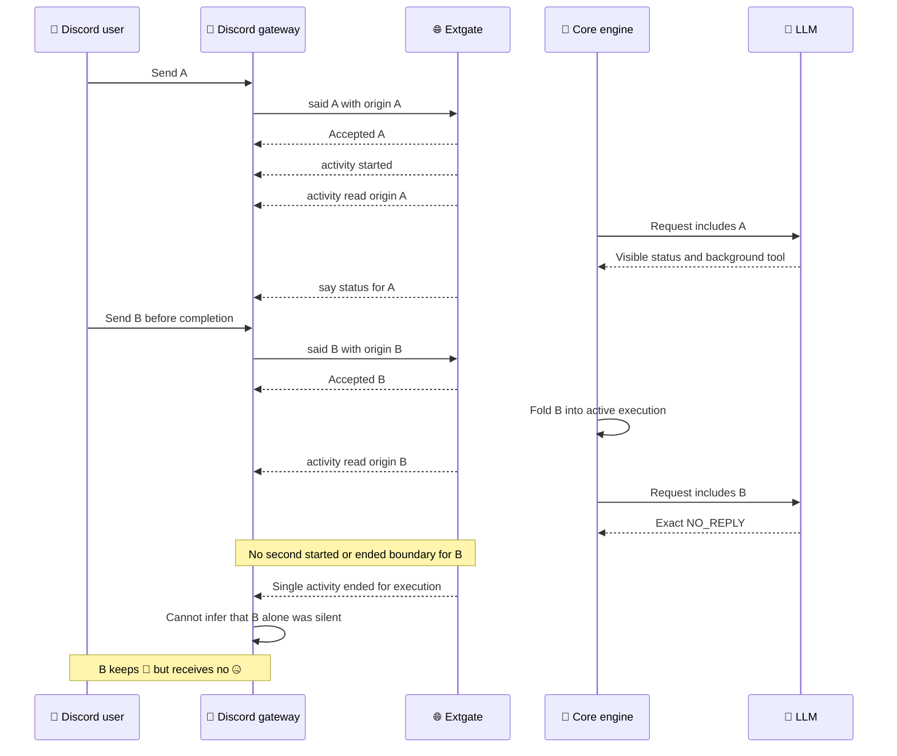
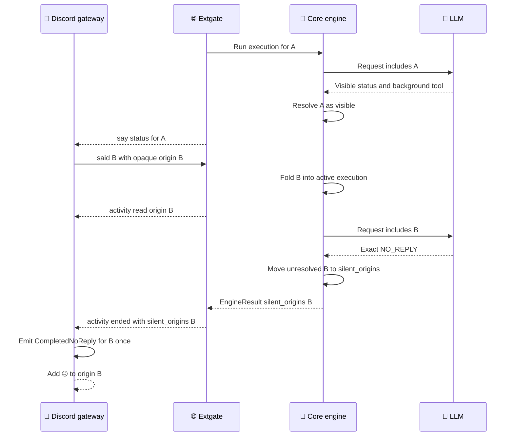

# Discord silent-origin outcome design

_実行中に取り込まれた複数のinboundへ、無発話終了の🤐を正しい発端だけに付けるための実装契約_

---

## 📋 Decision summary

この設計は、Discord gatewayが`activity ended`と`said`受理順から沈黙した発端を推測する方式を廃止する。各LLM requestへ実際に取り込んだopaque originと、そのrequest以降に確定した可視結果を知るengineを、per-inbound outcomeの正本とする。

engineは明示的な`NO_REPLY`によって無発話と確定した未解決originを、順序付き`EngineResult.silent_origins`として返す。extgateは既存の`activity state="ended"` frameへ同名のadditive fieldを載せる。gate-clientはfieldが存在するときだけその値をauthoritativeとして扱い、Discord gatewayは既存の`CompletedNoReply`を🤐へ機械的に変換する。

| Decision | Contract |
| --- | --- |
| Outcome owner | concrete `ChatRequest`と正規化済みresponseを持つcore engine |
| Transport | 既存`activity ended`のadditive `silent_origins` |
| Value type | 順序付き・重複なしのopaque string list |
| New core output | fieldを常に送る。沈黙originなしは`[]` |
| Compatibility | field欠落は旧coreとしてlegacy fallback、`[]`はauthoritative empty |
| Discord behavior | `CompletedNoReply(Some(origin))`を既存どおり🤐へ変換 |
| Persistence | 追加しない |

この文書はFIFO candidateの前提を置き換える。実装は本書のdesign reviewが完了するまで再開しない。

## 🔍 Observed failure and scope

### Observed failure

productionで「無発話終了した入力へ🤐が付かないことがある」と報告された。isolated Discord QCでは次の条件で再現した。

1. 入力Aが受理され、slow background toolを開始した
2. Aの可視statusが配送された
3. tool完了前に入力Bが受理された
4. Bを含む実LLM requestがexact `NO_REPLY`を返した
5. Bへの可視返信はなかった
6. AとBには👀が付いたが、Bに🤐が付かなかった
7. slow completionの可視結果は1回だけ配送された

実`llm_logs`、Discord reaction、tool completionを突き合わせ、LLM error、`turn_exhausted`、重複completionがないことを確認した。private channel ID、message ID、agent ID、prompt本文は本書へ記録しない。詳細な一時監査artifactはrepositoryの仕様正本ではない。

### Scope

- 1つのengine executionへ途中参加した各inboundについて、無発話結果を正しいopaque originへ対応させる
- core、extgate、gate-client、Discord gateway間の責務を固定する
- 新旧core／gatewayのwire compatibilityを維持する
- 通常turnとcompletion-resume turnの両方で同じoutcome contractを使う
- mockだけでなく実request、実UDS frame、gateway harness、isolated live Discordで退行を検出する

### Non-goals

- `NO_REPLY`の意味や明示終了契約を変更しない
- background completionのownership、turn continuation、subtask lifecycleを変更しない
- Discord以外のplatform IDやreaction vocabularyをshared layerへ導入しない
- `said` admission順からexecution順を新しく保証しない
- 新しいstandalone lifecycle eventを追加しない
- 発話内容からengine外で沈黙を推測しない
- production deployment方法やcredential管理を変更しない

明示的に、feature flag、config flag、DB state、schema migration、heuristic、待機marker、platform parsingを追加しない。`WAIT_FOR_COMPLETION`その他の新しいWAIT markerも追加しない。

## 🔄 Current event model and failure

### Current model

現在の境界は次のとおり。

| Boundary | Current fact |
| --- | --- |
| `said` | gatewayからcoreへinbound本文とopaque `origin`を渡し、admission ackを返す |
| `activity started` | 1つのexecution開始を表す |
| `activity read` | origin付き入力が次の具体的LLM requestへ初めて入る直前に送る |
| `say` / successful utterance | ユーザー可視出力を表す |
| `activity ended` | execution全体のdelivery settlement後に1回送る |
| `completed_target` | 最終可視投稿へ🏁を付けるadditive outcome |
| `CompletedNoReply` | gate-clientがexecution-level silenceを推測して生成する |

現在のgate-clientは、`activity ended`までにsay／successful utteranceを観測しなければ、pending `said` originを`CompletedNoReply`へ変換する。この推測は「accepted `said` 1件につき独立execution 1件」の場合だけ成立する。

### Exact live sequence



`said`の受理数と`activity ended`の数は一致しない。BはAのactive executionへfoldされ、独立した`started`／`ended` pairを作らない。このため、accepted originのFIFO、latest origin、単一pending originのいずれでも正しい対応は導けない。

## 🛡️ Invariants and ownership

### Outcome invariants

1. `NO_REPLY`だけが正常な無発話終了を明示する
2. originはcoreとextgateではopaque stringであり、解析・生成・Discord ID検証をしない
3. originが初めて具体的`ChatRequest`へ含まれた時点で、そのoriginはoutcome待ちになる
4. 成功した可視speechまたはsuccessful utteranceは、そのrequestまでに未解決だったoriginを可視解決する
5. non-utterance tool callだけではoriginを可視解決しない
6. visible textを伴わない明示`NO_REPLY`かつsuccessful utteranceなしの場合だけ、未解決originをsilentへ確定する
7. visible textと`NO_REPLY`が同じgenerationにある場合、そのtextは可視結果でありoriginをsilentにしない
8. LLM error、delivery error、panic、disconnect、cancellation、iteration exhaustionをsilentに偽装しない
9. 同じoriginは1 executionの`silent_origins`へ最大1回だけ現れる
10. `silent_origins`はoriginが初めて具体的requestへ入った順を保つ
11. `completed_target`と`silent_origins`は共存できる
12. authoritative fieldが存在する場合、gate-clientはadmission順やsay有無から追加の🤐を合成しない

### Authoritative owner

`crates/core/src/engine/skill_engine/run.rs`がper-consumed-inbound outcomeの正本である。この場所だけが同時に次の事実を持つ。

- どのoriginをそのexact `ChatRequest`へ新しく含めたか
- 正規化後のresponseにvisible textがあるか
- `NO_REPLY`が明示されたか
- tool callがutteranceかnon-utteranceか
- utterance executionが成功したか
- continuation speech deliveryが成功したか

`said`を受理するgate-clientはLLM requestへの取り込みを知らない。extgate outer turnはexecution全体の最終`DeliveryEffect`しか知らない。Discord gatewayはplatform reactionを実行できるが、engine outcomeを推測してはならない。

## 🧠 Engine state model

### State carried per execution

engine runは次のephemeral stateだけを持つ。

| State | Meaning |
| --- | --- |
| `pending_read_origins` | 次のrequest直前に`activity read`を通知するorigin |
| `read_emitted_origins` | 同一runでread通知済みのdeduplication set |
| `awaiting_outcome_origins` | requestへ取り込まれたが、可視またはsilentに未確定のorigin |
| `silent_origins` | 明示`NO_REPLY`でsilent確定したorigin |

これらはengine invocation内だけのbounded memoryである。DBへ保存せず、process再起動後へ持ち越さない。

### State transitions

| Trigger | Transition |
| --- | --- |
| originをexact requestへ初めて含める | `pending_read` → `awaiting_outcome`、その直前に`activity read` |
| non-utterance toolだけを実行 | `awaiting_outcome`を維持 |
| continuation speech delivery成功 | 全`awaiting_outcome`をvisible解決して除去 |
| successful utterance operation | 全`awaiting_outcome`をvisible解決して除去 |
| final visible response生成 | 全`awaiting_outcome`をvisible解決して除去 |
| exact `NO_REPLY`、visible textなし、successful utteranceなし | 全`awaiting_outcome`を順番どおり`silent_origins`へ移動 |
| late inboundを終了境界で取得 | 新originを次request用`pending_read`へ追加しrun継続 |
| error／panic／disconnect／limit | 未解決originをsilentへ移さず失敗経路へ渡す |

origin listは既存live-inbound queueとengine iteration上限によって入力数がboundedである。実装は追加時にdeduplicateし、初回request取り込み順を維持する。hash set単独を出力順の正本にせず、ordered vectorとmembership setを組み合わせる。

### Proposed flow



## 🔌 Wire contract

### Engine result

`EngineResult`へ次をadditiveに追加する。

```rust
#[serde(default)]
pub silent_origins: Vec<String>
```

全return pathは値を明示する。通常成功では確定済みlist、errorは`EngineResult`自体を返さず、limit終了はemptyを返す。既存deserializationはdefault emptyでsource compatibilityを維持する。

### Activity ended frame

既存`activity_frame` APIはstarted／read call siteと外部利用の互換のため変更しない。ended outcome専用のbuilder／emitterを追加する。

```json
{
  "m": "activity",
  "binding_id": "opaque-binding",
  "activity_id": "opaque-activity",
  "state": "ended",
  "completed_target": "optional-delivery-target",
  "silent_origins": ["opaque-origin-b"]
}
```

新coreは`activity ended`に`silent_origins`を常に含める。

| Wire shape | New gate-client behavior |
| --- | --- |
| field absent | old core。既存standalone-turn inferenceへfallback |
| `"silent_origins": []` | authoritative empty。🤐を合成しない |
| non-empty list | list順にorigin付き`CompletedNoReply`を各1回emit |
| malformed／non-string member | frameを`bad_request`相当として拒否し、推測fallbackしない |

`completed_target`とnon-empty `silent_origins`は同じended frameに共存できる。例えばBがsilent確定した後、background completion Cが可視投稿を生成する場合である。gate-clientは通常の`Activity ended`を先にqueueし、次に`Completed { target }`、最後にlist順の`CompletedNoReply { reply_origin: Some(origin) }`をqueueする。両fieldを相互排他にせず、`completed_target`処理後にearly returnしない。

`completed_target`はdelivery target、`silent_origins`はinbound originでnamespaceと意味が異なる。値が文字列として同一でもcross-deduplicateしない。`silent_origins`内部だけをdeduplicateする。

### Mixed-version compatibility

| Core | Gate-client | Result |
| --- | --- | --- |
| old | old | 現行legacy inference |
| old | new | field absentなのでlegacy fallback |
| new | old | unknown additive fieldを無視し、旧behaviorを継続 |
| new | new | authoritative per-inbound silent outcome |

mixed versionは接続を壊さないが、missing-🤐修正の完全な保証はnew coreとnew gate-clientが同時に稼働した時点から得られる。release artifactはcoreとgateway binariesを同一commitから作り、一括rolloutする。

## 🧱 Layer responsibilities

| Layer | Responsibility | Must not do |
| --- | --- | --- |
| core engine | exact requestごとのorigin outcomeを分類し、ordered `silent_origins`を返す | Discord ID／emoji／platform syntaxを解析しない |
| extgate | `EngineResult.silent_origins`をdelivery effect消費前に取り出し、ended outcomeへ載せる | admission順からoriginを推測しない |
| extgate protocol | additive fieldをserializeし、absent／emptyを区別可能にする | standalone silent lifecycleを新設しない |
| gate-client wire | `Option<Vec<String>>`としてstrict parseする | absentをemptyへ潰さない |
| gate-client handler | authoritative listをlive eventsへ変換し、absent時だけlegacy fallbackする | FIFO／latest-origin inferenceをauthoritative fieldへ重ねない |
| Discord gateway | originを既存transportで🤐 reactionへ変換する | shared outcome semanticsを再判定しない |

通常inbound pathとcompletion-resume pathは、`EngineResult`からsilent listを抽出し、同じended builderを使う。片方だけを修正してはならない。

## 🚫 Rejected approaches

### FIFO or admission-order inference

却下する。live QCでaccepted `said`数とexecution boundary数が一致しないことを確認した。reordered ack、rejection、cancellationを正しく扱っても、Bに独立endedがなければFIFOをpopする時点が存在しない。

FIFO candidateで追加した`VecDeque`、reservation、admission-order testは実装から除去し、pre-candidateのsingle pending trackingはfield欠落時のlegacy fallbackにだけ残す。

### Latest origin inference

却下する。Aが未解決のままBと同じrequestへ入る場合、latestだけでは複数silent originを表現できない。completionとlive inboundのraceでも誤対象になる。

### New standalone silent lifecycle event

却下する。`turn_silent`等の別eventは、既存`activity ended`と二重のoutcome channelを作る。順序、retry、duplicate suppression、mixed-version fallbackを別途設計する必要がある。execution outcome metadataを既存endedへadditiveに載せれば十分である。

### Discord-side content inspection

却下する。Discord gatewayには実`ChatRequest`も正規化済み`NO_REPLY`判定もない。marker文字列や会話本文をgatewayへ流すとplatform層がengine semanticsを再実装する。

### DB-backed pending state or rollout flag

却下する。outcomeは1 engine run内で確定し、永続化や段階的behavior切替を必要としない。DB、config、feature flagは新しい不整合点になる。

## ⚠️ Failure and error semantics

| Failure | Required behavior |
| --- | --- |
| LLM transport／semantic failure | `silent_origins`を確定せず既存turn failureを使う |
| continuation speech delivery failure | runを失敗させ、silentへ変換しない |
| utterance rejected／indeterminate | successful utteranceとしてoriginを解決しない。後続の明示`NO_REPLY`がある場合だけ通常規則でsilent確定 |
| extgate task panic | successful endedを送らず、既存turn-failure／close経路を使う |
| malformed `silent_origins` | frameを無効として扱い、legacy inferenceへfallbackしない |
| live queue capacity overflow | 既存fail-loud／disconnect policyを維持し、silent eventだけを黙って再構成しない |
| gateway disconnect | ephemeral pending stateを破棄。再接続後に過去🤐を推測再生しない |
| duplicate origin within run | first occurrenceだけを保持 |
| same origin in later independent execution | そのexecutionでは新しいoutcomeとして再評価可能 |

new coreが`ended`を送る場合は必ずfieldを含める。panic等でauthoritative engine resultが得られない経路ではsuccessful `ended`自体を送らず、emptyを「確認済みno silence」と偽装しない。これによりnew-core frameのfield欠落を旧core互換以外で発生させない。

## 🧪 TDD and validation plan

実装をなぞるqueue testではなく、ユーザー入力からreactionまで境界を一段ずつ固定する。

### Level 1: Core exact-request tests

`crates/core/src/engine/skill_engine/live_inbound_tests.rs`でreal `ChatRequest.messages` captureを正本にする。

1. A requestがbackground toolと可視statusを生成する
2. status配送成功でAをvisible解決する
3. A execution継続中にBをlate inboundとして注入する
4. captured next requestへBが1回だけ含まれる
5. B requestがexact `NO_REPLY`を返す
6. `EngineResult.silent_origins == [B]`、Aは含まれない

同じlevelで次を固定する。

- 1 requestに複数originが入り、全てsilentならrequest順で全originを返す
- non-utterance tool後もoriginをpendingに保ち、後続`NO_REPLY`でsilentにする
- successful continuation speechでpending originを消す
- successful utterance operationでpending originを消す
- visible text + `NO_REPLY`はsilentにしない
- errorとiteration limitはsilent listを生成しない
- duplicate originは1回だけ返す

### Level 2: Extgate real UDS frame tests

extgate conformance testは実Unix socket frameを使い、mock関数の直呼びだけで済ませない。

- accepted AとBに対し`started`／`ended`は1 pairだけ
- `activity read`はA、Bそれぞれexact request直前に1回
- ended frameは`silent_origins: [B]`を含む
- synthetic second lifecycleを送らない
- `silent_origins: []`を正常にserializeする
- `completed_target`と`silent_origins: [B]`が同一frameに共存する
- panic／errorでsuccessful endedや根拠のないauthoritative emptyを送らない

### Level 3: Gate-client real socket tests

FIFO candidateの「accepted 1件ごとにstarted／ended 1件」を作るtestは削除する。real socket peerから次のframeを送る。

- 2つの`said`を受理する
- lifecycleは1 pairだけ送る
- endedが明示したBだけ`CompletedNoReply(B)`になる
- Aのno-reply eventはない
- non-empty listの各originはlist順にexactly once
- `silent_origins: []`はlegacy inferenceを抑止する
- field absentは旧standalone-turn fallbackを維持する
- `completed_target`とsilent eventの両方をstable orderでemitする
- malformed listは接続／frame errorになり、fallback eventを出さない

### Level 4: Discord gateway harness

Discord RESTを呼ばないharnessでevent-to-reaction変換を固定する。

- Aは👀 1回、🤐 0回
- Bは👀 1回、🤐 1回
- Aの後続completion targetには🏁 1回
- Bの🤐はcompletionと共存しても増減しない
- 可視message、reaction、failure eventを余計に生成しない

### Level 5: Isolated live Discord QC

production fallbackなしで、candidate commit、process、DB、port、UDS、channel、credentialを事前に照合する。モデルへ処理方法を指定せず、固定のslow tool caseと通常の「返信不要」入力で自然な競合を作る。

合格条件は次の全て。

- Bをslow dispatch後・completion前に送る
- real `llm_logs`のB requestがexact `NO_REPLY`
- B requestの`ChatRequest.messages`にBが1回だけ存在
- Aの🤐は0
- Bの🤐はexactly 1
- slow completionの可視結果はexactly 1
- missing／duplicate reply、LLM error、`turn_exhausted`は0
- 全LLM requestのconversation-history構造は既存契約を維持

mock、unit、harnessだけではlive acceptanceを合格にしない。失敗したcandidateはmainへmergeせず、QC runtimeを事前状態へ戻す。

## 🚀 Migration, rollout, and rollback

### Migration

DB migrationとdata backfillはない。wire fieldはadditiveで、`EngineResult` fieldはserde defaultを持つ。public type identityと既存APIを維持し、明示struct literalだけをcompile errorに従って更新する。

### Rollout order

1. FIFO candidateを実装から除去する
2. core exact-request red testを追加する
3. engine-owned `silent_origins`を実装する
4. extgate ended outcomeへfieldを追加する
5. gate-client parser／handlerでpresent優先・absent fallbackを実装する
6. Discord harnessを通す
7. focused testsと独立code reviewを完了する
8. isolated live Discord QCを完了する
9. candidateとQC evidenceを提示し、人間の明示OK後にmainへmergeする
10. production deployは別承認後に同一commitのcore／gateway一式を切り替える

### Rollback

- QC失敗時はcandidateをmergeせず、isolated QCだけを事前artifactとmarkerへ戻す
- production失敗時はcoreと全gatewayを同じ前releaseへ一括rollbackする
- additive fieldを理解しない旧gatewayはfieldを無視できる
- new gate-clientを旧coreへ戻す場合、field欠落によりlegacy fallbackへ戻る
- rollbackでDB restoreやschema downgradeは不要

## ✅ Acceptance checklist

### Design and implementation

- [ ] FIFO／admission-order inferenceがauthoritative pathから除去されている
- [ ] `EngineResult.silent_origins`がopaque、ordered、deduplicated、boundedである
- [ ] exact requestへ含めたoriginだけをengineが分類する
- [ ] visible success、successful utterance、explicit silence、failureのstate transitionが本書どおりである
- [ ] started／read用の既存`activity_frame` APIを壊していない
- [ ] new-core endedは`silent_origins`をempty時も含める
- [ ] absentとemptyをgate-clientが区別する
- [ ] `completed_target`とsilent outcomesを両方emitする
- [ ] shared layerにDiscord ID、emoji、platform parsingがない
- [ ] feature／config flag、DB state／migration、heuristic、marker、WAIT markerがない

### Verification

- [ ] core exact-request live-inbound testsがA visible／B silentの実順序を再現する
- [ ] extgate real UDS testが1 lifecycleと`silent_origins: [B]`を確認する
- [ ] gate-client real socket testがpresent／empty／absent／malformedを確認する
- [ ] Discord harnessがA 🤐0、B 🤐1、completion 🏁1を確認する
- [ ] Rust 1.98.0 focused testsがPASSする
- [ ] independent code reviewがAPPROVEする
- [ ] isolated live Discord QCが実LLM・実reactionで全条件を満たす
- [ ] human QCの明示OK前にmainへmergeしていない
- [ ] production deployを別承認なしで行っていない
