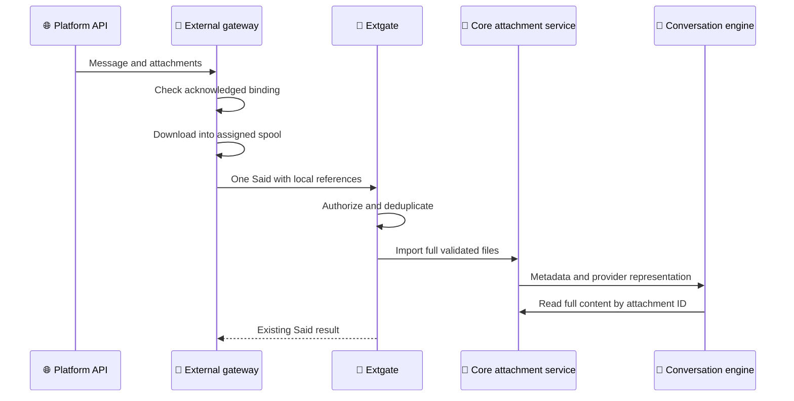

# OpenCrab 汎用受信添付設計 DC-953 v0.5

_Issue #953 — gatewayが取得した添付を、platform非依存のlocal attachmentとしてcoreへ渡す詳細設計。承認前・未実装。_

---

## 📋 設計ステータス

| 項目 | 値 |
| --- | --- |
| 対象Issue | [#953](https://github.com/kojira/opencrab/issues/953) |
| 設計版 | `DC-953 v0.5` |
| 状態 | 設計確定（要件を満たす設計判断を委任済み） |
| 実装 | 未着手 |
| v0.4からの変更 | 本筋のlocal attachment vertical sliceへ限定し、派生機能を後続候補へ分離 |

## 🎯 要件

- Discord V3経路でHTMLなどのtext添付内容をエージェントが読める
- 画像添付をmultimodal inputとして認識できる
- Discord固有の型、URL、文言、保存規則をcoreへ入れない
- gatewayが添付をdownloadし、coreへlocal file参照を渡す
- 本文のみの既存Said、認可、dedup、reaction、turn順序を変えない
- Discordが受理した添付を、OpenCrab独自のより小さい上限で拒否しない
- 原本全量を保持し、LLM/provider制限と受信可否を分離する
- 構成を必要以上に複雑にしない

## ⚙️ 設計原則

添付付きメッセージも既存どおりSaidを一回だけ送る。新しいhandshake、ticket、upload API、DB tableは追加しない。



## 📚 責務

| 層 | 責務 |
| --- | --- |
| Platform adapter | Platform eventから添付URL、名前、media type、sizeを取り出す |
| External gateway | binding確認後にdownloadし、core指定spoolへ安全に保存する |
| Gate client/wire | 汎用local attachment metadataを既存Saidへ載せる |
| Extgate | 既存認可・dedup後、path・size・hashを検証してcoreへ渡す |
| Core attachment service | durable保存、内容分類、text抽出、画像入力化を行う |
| Provider adapter | 汎用text/image partをprovider形式へ変換する |
| DB | session log metadataへ相対storage keyを保存する |

coreはDiscord SDK、Discord CDN、snowflake、Discord用添付文言を知らない。

## 💾 保存場所

coreがgateway placementへspool rootを指定する。gatewayは保存先を独自に決めない。

```text
<data_dir>/attachments/
├── inbox/
│   └── <instance_uuid>/<origin_hash>/<attachment_uuid>.bin
└── store/
    └── <agent_uuid>/<session_uuid>/<attachment_uuid>.bin
```

- gateway書込先: `<data_dir>/attachments/inbox`
- core永続先: `<data_dir>/attachments/store`
- directory mode: `0700`
- file mode: `0600`
- 元ファイル名をpathへ使わない
- wireとDBにはspool rootからの相対pathだけを載せる
- LLMへ絶対pathを見せない

Placementへの追加値は次だけとする。

```json
{
  "attachment_spool_root": "/canonical/runtime/data/attachments/inbox"
}
```

## 🔗 汎用wire契約

既存Saidの`attachments`を次の汎用形へ拡張する。

```json
{
  "m": "said",
  "binding_id": "uuid",
  "origin": "stable-platform-origin",
  "author_id": "authenticated-sender",
  "text": "添付ファイル見える？",
  "attachments": [
    {
      "id": "uuid",
      "name": "flashlips_gpu_oom_eli5.html",
      "media_type": "text/html",
      "size": 8192,
      "sha256": "64-lowercase-hex",
      "local_path": "<instance_uuid>/<origin_hash>/<attachment_uuid>.bin",
      "status": "ready"
    }
  ]
}
```

個別download失敗時は次の形にする。

```json
{
  "id": "uuid",
  "name": "example.html",
  "media_type": "text/html",
  "size": 0,
  "status": "unavailable",
  "error": "download_failed"
}
```

`unavailable`には`local_path`と`sha256`を載せない。外部URL、token、HTTP応答本文はwireへ載せない。

既存の`{kind:"image",url:"https://..."}`は後方互換のため受理を継続するが、新Discord gatewayは使用しない。

## 🔐 Downloadとpath検証

### Gateway

1. messageを汎用metadataへ変換する
2. 対象addressにacknowledged bindingがなければdownloadせず破棄する
3. 同じdirectoryへ`.part`を`create_new`で作る
4. responseをstreamしながら上限とSHA-256を検査する
5. `fsync`して`.bin`へatomic renameする
6. local attachmentを含むSaidを一回送る
7. Saidが拒否・切断・timeoutなら作成したinbox fileを削除する

OpenCrabはDiscordより小さいfile size、message合計、添付数の固定上限を設けない。Discord adapterでは、DiscordがMessage Createで通知した全添付を対象とし、各`declared_size`とdownload完了後の実byte数が完全一致することを検証する。これはOpenCrabのsize上限ではなく、破損・差替えを検出するintegrity checkである。

| 制限 | 方針 |
| --- | --- |
| 添付数 | Platform eventに含まれる全件。OpenCrab固定上限なし |
| 1 file | OpenCrab固定上限なし。Discord通知値と実byte数の完全一致を検証 |
| Message合計 | 各`declared_size`の合計。OpenCrab固定上限なし |
| Disk | Download後も設定済みdisk reserveを維持できる場合だけ開始 |
| Connect timeout | 10秒。sizeとは無関係 |
| Transfer timeout | 固定total timeoutなし。30秒無通信時だけ失敗 |
| Redirect | 最大3回、各redirect先を再検証 |

`Content-Length`がある場合は`declared_size`との一致を要求する。stream実byteが`declared_size`より大きい場合は内容差替え、小さい場合は切断・破損として拒否する。通常のDiscord CDN応答では一致する前提であり、これは容量制限ではない。運用者が任意capを設定できる拡張は本Issueに入れない。

### Extgate/core

- `local_path`は相対pathのみ許可する
- `..`、絶対path、NUL、path separatorを含む各segmentを拒否する
- canonical pathが設定済みinbox root配下であることを検証する
- symlink、directory、device、socketを拒否し、regular fileだけ許可する
- mode、size、SHA-256を再検証する
- 認可・dedup成功後にstoreへatomic renameする
- DB transaction失敗時は移動fileを削除してrollbackする

同じoriginの再送は既存dedupで同じseqへ収束する。再送で作られたinbox fileは不要fileとして削除する。

## 🧠 Core内の汎用型

```text
InboundAttachment
- id: UUID
- name: String
- media_type: Option<String>
- size: u64
- sha256: Option<String>
- storage_key: Option<RelativeStorageKey>
- status: Ready | Unavailable(code)
- content_class: Image | Text | Binary
```

`content_class`はgateway申告だけで決めない。coreがmagic bytes、media type、UTF-8妥当性を照合して決める。

### Text

対象は`text/*`、`application/json`、`application/xml`、`application/javascript`で、UTF-8検証を通るfileとする。原本は切り詰めず全量保存する。

UTF-8 textはuser bodyと分離した汎用attachment partとして会話化する。原本は切り詰めず保存し、LLMへ渡す会話量には既存のconversation budgetを適用する。新しいreader APIは本Issueでは追加しない。

HTMLはrender、script実行、外部resource取得をせずraw UTF-8 textとして読む。返却textはuser supplied attachmentとして明示delimiter内に入れる。

```text
<attachment id="a-short" name="example.html" media_type="text/html" offset="0">
...untrusted user-supplied text...
</attachment>
```

### Image

検証済みlocal fileを汎用image partとしてprovider入力へ変換する。provider側の制限はDiscordからの受信可否に使わず、原本を保持する。派生画像cache等は本Issueでは追加しない。外部URLはproviderへ渡さない。

### Binary

原本を全量保存し、name、media type、size、短縮attachment IDをuser attachment partとして渡す。内容抽出未対応形式はその旨を明示する。将来のreader/extractorは同じattachment IDを使い、gatewayやwire契約を変更しない。

## 🔄 失敗時の挙動

| 状況 | 挙動 |
| --- | --- |
| binding未ack | downloadせずmessageを破棄 |
| 一部download失敗 | 他の添付と本文は処理し、失敗metadataもエージェントへ通知 |
| 全download失敗・本文あり | 本文と失敗metadataでturnを開始 |
| 全download失敗・本文なし | 失敗metadataをuser inputとしてturnを開始 |
| Discord申告size超過・不足 | 応答不整合として当該fileを拒否し、partial fileを削除 |
| Disk reserve不足 | download開始前に`insufficient_storage`とし、他の本文・添付は継続 |
| path/hash不一致 | Saidを`bad_attachment`で拒否し、turnを開始しない |
| 未認可sender/channel | 既存admissionで拒否し、inbox fileを削除 |
| duplicate origin | 既存seqを返し、新しいinbox fileを削除 |
| LLM未対応形式 | metadataだけを渡し、turn自体は失敗させない |

添付の失敗を本文turn全体の失敗へ拡大しない。ただしpath改ざんやhash不一致はsecurity errorとしてSaid全体を拒否する。

## 📦 永続化とcleanup

session log metadataの`attachments`配列へ汎用metadataと相対`storage_key`を保存する。外部URLと絶対pathは保存しない。DB schema migrationは不要とする。

- inboxの未参照file: 1時間後に削除
- storeのfile: session log metadataから参照される間は保持
- metadata参照のないstore file: 24時間後に削除
- cleanup: startup時と日次
- cleanupはregular fileだけを対象とし、symlinkを辿らない

## 📍 変更範囲

| 領域 | 変更 |
| --- | --- |
| `crates/gateway` | Platform非依存`InboundAttachment`型 |
| `crates/gate-client` | Said local attachment wire型 |
| `crates/extgate` | parser、path/hash検証、汎用metadata引渡し |
| `crates/core` | attachment service、分類、text/image part |
| `crates/server` | data root、placement、cleanup wiring |
| `crates/discord-gateway` | Serenity添付変換とspool download |
| `crates/db` | JSON metadata queryのみ。schema変更なし |
| docs/tests | protocol、security、parity、運用説明 |

旧in-process Discord経路は壊さない。共通化はpureな汎用型・rendererに限定し、大規模な同時置換はしない。

## ✅ 受入条件

### 自動テスト

- [ ] HTML添付内容がV3経路でuser attachment partになる
- [ ] 画像添付がlocal fileからmultimodal inputになる
- [ ] 本文なし、複数、画像/text混在で順序が保たれる
- [ ] binding未ackではdownloadされない
- [ ] 未認可、duplicate、Said失敗時にinbox fileが残らない
- [ ] URL、token、署名query、絶対pathがwire、DB、LLMへ出ない
- [ ] traversal、symlink、hash差異、size差異を拒否する
- [ ] Discordが受理したsize/countをOpenCrab独自上限で拒否しない
- [ ] `declared_size`一致と無通信timeoutを境界値で検証する
- [ ] HTML/text原本と画像原本を全量保存する
- [ ] partial failureでも一つのturnとして処理する
- [ ] 旧URL image Saidと添付なしSaidの既存test/FQNを維持する
- [ ] Rust、Web、Conformance CIがgreen

### QC手動確認

1. 許可channelで本文＋HTMLを送る
2. のすたろうがHTML本文の要点を回答する
3. 本文なし画像を送る
4. のすたろうが画像内容を回答する
5. 複数添付の順序と内容を回答できることを確認する
6. 非許可channelではdownload fileが作られないことを確認する
7. dashboard `http://100.85.27.3:18701`でsessionが正常表示されることを確認する
8. reaction、reply、typing、owner-only toolが回帰していないことを確認する

## ✍️ 実装と承認ゲート

1. 汎用型とwire contract test
2. Core attachment materialization
3. Extgate validationとpersistence
4. Discord gateway download adapter
5. Provider-neutral text/image変換
6. Cleanupと非回帰test
7. QC配備とユーザー動作確認
8. PR作成前の明示OK
9. PR review、最終動作確認、マージ前の明示OK

要件を満たし、綺麗でシンプルにする範囲の設計判断はユーザーから委任済みである。本v0.5を確定版として、`origin/integration/transplant`から実装ブランチを作成する。要件外の仕様変更が必要になった場合だけ設計へ戻り、再確認する。
