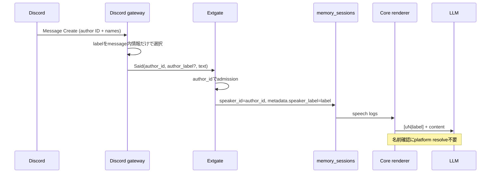

# DC-956 v0.1: 汎用話者ラベルを会話へ保持する

Issue: https://github.com/kojira/opencrab/issues/956

## 目的

Discord V3などの外部gatewayから受信した複数話者の発話について、認証済み`author_id`によるidentityを維持したまま、人間可読な表示名をLLM会話へ毎回提示する。過去発話の投稿者名を確認するたびに`resolve(eN)`やplatform API参照を行わなくてよい状態にする。

## 非目的

- 表示名を認証・owner・trusted user判定へ使わない
- Discord member/profileを受信後にHTTP取得しない
- 過去ログを一括更新しない
- `uN`、`eN`、`cN`の採番・identityを変更しない
- Discord固有型やguild/member概念をcoreへ持ち込まない
- 添付処理、reply/reaction、権限規則を変更しない

## 現状と原因

Discord gatewayはSerenity Messageから`author.id`と`author.name`を取得しているが、`MappedSaid`以降へ渡すのは`author_id`だけである。DBの`memory_sessions.speaker_id`には異なるDiscord IDが正しく保存されるため話者identityは失われない。しかしLLM会話では過去話者が`uN`だけになり、`uN`と「ぴーこ」などの表示名の対応がない。最新発話は生ID、履歴は`uN`として区別できるが、名前を答えるには外部resolveが必要になる。

## 責務

### Discord gateway

Serenity Messageだけから表示ラベルを決定する。優先順位は次のとおり。

1. messageに含まれるguild member nickname
2. Discord userのglobal display name
3. Discord username

追加のHTTP/API lookupは行わない。値が空ならlabelなしとする。

### Gate client / Extgate wire

既存Saidへoptionalなprovider-neutral fieldを追加する。

```json
{
  "author_id": "1505801361793749032",
  "author_label": "ぴーこ"
}
```

- `author_id`: 認証・権限・dedup・speaker identityの正本
- `author_label`: untrustedな表示専用metadata
- field欠落は従来挙動
- 既存`said_frame`と`post_said_with_author`の公開APIを維持し、新しいlabel対応APIからoptional fieldを追加する

### Extgate persistence

`memory_sessions.speaker_id`は従来どおり`author_id`を保存する。既存`metadata_json`へ汎用field `speaker_label`を追加し、schema migrationは行わない。絶対path、token、platform URLは追加しない。

### Core conversation renderer

各speech logの`metadata_json.speaker_label`を読み、stable refと同時に表示する。

```text
[u4|ぴーこ][2026-09-07 16:39:23]e62:
...
```

- `u4`がidentity参照の正本
- `ぴーこ`はその発話時点の表示label
- label欠落・旧ログは従来どおり`[u4]`
- agent自身の既存表示名規則は変更しない
- labelは`sanitize_embedded_field`で制御文字除去・文字数制限を行い、構造文字`[`, `]`, `|`を安全な表示へ置換する
- 同じIDが後に改名しても、各発話は受信時labelを保持する。identityは常に同じ`uN`なので別人へ分裂しない

### Live turn

記録済み履歴だけでなく、現在の`NormalizedInbound.sender_name`にも同じ`author_label`を渡す。これにより最初のターンからIDと表示名がLLM requestへ入る。

## データフロー



## 権限・信頼境界

- `author_label`は権限判定、owner判定、trusted user判定へ絶対に使用しない
- 同じlabelを複数IDが名乗ってもmergeしない
- labelがagent名やowner名と一致してもidentityは変わらない
- malformed labelはwireで拒否する。field欠落は受理する
- prompt表示前にcore共通sanitizerを必ず通す

## 状態遷移

1. Discord Message受信
2. self bot除外・snowflake検証
3. message payload内からoptional label選択
4. acknowledged binding確認
5. Said送信
6. Extgateがauthor IDで既存admission実行
7. speech rowへIDとlabelを記録
8. current turnと次ターン以降の履歴で`uN|label`表示
9. display name変更後は新しいspeechだけ新label、`uN`は同じ

## エラー処理

| 状況 | 挙動 |
| --- | --- |
| label欠落 | Saidを受理し従来どおりID/`uN`表示 |
| 空label | gatewayでNone扱い |
| 長すぎるlabel | gatewayまたはcore sanitizerで上限内へ短縮 |
| 制御文字・構造文字 | prompt境界を壊さない形へsanitize |
| wireに不正型 | `bad_request` |
| metadata_jsonが旧形式/不正 | labelなしとして従来表示 |
| 同名の別ID | 異なる`uN`を維持 |
| 同IDの改名 | 同じ`uN`、発話ごとのlabelを表示 |

## 変更範囲

- `crates/discord-gateway/src/receive.rs`: nickname/global name/username取得
- `crates/discord-gateway/src/map.rs`: generic author label mapping
- `crates/discord-gateway/src/run.rs`: label対応Said API利用
- `crates/gate-client/src/wire.rs`: optional wire fieldと後方互換builder
- `crates/gate-client/src/client/state_api.rs`: label対応post method
- `crates/extgate/src/protocol.rs`: optional label parse/validate
- `crates/extgate/src/inbound/record.rs`: metadata persistence
- `crates/extgate/src/inbound/turn.rs`: live `sender_name`
- `crates/core/src/conversation/refs.rs`, `format.rs`: retained history rendering
- focused unit/conformance/QC tests

DB schema migrationは行わない。

## 受入条件

### 自動テスト

- optional `author_label`欠落の旧Saidが従来どおり通る
- 既存public `said_frame` / `post_said_with_author`が維持される
- Discord label優先順位がnickname > global name > usernameになる
- `author_id`と`author_label`が別fieldとしてwireを通る
- admissionはlabelではなくIDだけを見る
- speech rowは`speaker_id=author_id`、metadataに`speaker_label`を持つ
- retained conversationが`[uN|label]`を出す
- current live turnにもIDとlabelが入る
- 同名別IDは別`uN`、同ID改名は同じ`uN`
- label欠落の旧ログは`[uN]`のまま
- 改行・制御文字・`[]|`を含むlabelで偽発話行を作れない
- 既存test FQNを変更しない
- Rust / Web / Conformance CIがgreen

### QC

1. ぴーこが許可channelへ識別用本文を投稿する
2. kojiraが別投稿で「直前の投稿者は誰」と質問する
3. のすたろうが外部`resolve` toolを呼ばず「ぴーこ」と答える
4. LLM requestに`uN|ぴーこ`または同等のstable ID + labelがある
5. kojira発話には別`uN|kojira`がある
6. HTML/image添付、reply/reaction/typing、Nostr、dashboard/APIが非回帰

## 停止条件

- 表示名を権限identityとして使う必要が判明した場合
- DB schema migrationが必要になった場合
- Discord APIへの追加network lookupが必要になった場合
- `uN` identity契約の変更が必要になった場合

上記はいずれも設計外なので、判明時は実装を止めて設計へ戻る。
