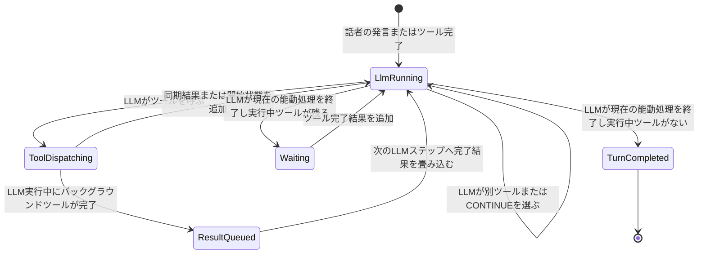

# ツール呼び出し継続と完了結果の会話ログ設計

## 1. 目的

LLM がツールを呼び出した後も、自分で現在のターンを続けるか終了するかを決められるようにする。同時に、バックグラウンド実行したツールの結果が返った時点で LLM を再度呼び出し、その結果を使って作業を継続または完了できるようにする。

会話ログは、利用者の発言、bot を含む他の話者の発言、LLM の発言、ツール呼び出し、ツール結果の因果関係を失わずに組み立てる。bot の発言を無視したり、bot 由来の入力だけを特別に応答対象外へ変更したりしない。

## 2. 背景

現行実装では、バックグラウンド実行される `execute_shell` に対して、実行結果ではない `status: spawned` が `tool_result` として LLM に返る。その後、実際の完了結果は別の `subtask_completed` として保存される。

LLM が `CONTINUE` を返すと、ターン開始時に組み立てた会話を基礎に次の LLM 呼び出しが行われる。しかし、バックグラウンド実行の完了結果がその会話へまだ取り込まれていない場合、LLM は同じ依頼と `spawned` だけを繰り返し見る。さらに、新しい LLM 呼び出しの会話組み立てで直前のツール利用履歴が欠落すると、元の利用者発言だけが最新の未処理依頼として残り、同じツール呼び出しと同じ途中報告を再実行する。

実例では、次の利用者発言は正本ログに一件だけ存在した。

```text
[u1|kojira][2026-09-08 14:47:45]e1:
要約して
https://developers.openai.com/api/docs/guides/latest-model
```

しかし、ツール呼び出し、開始状態、完了結果、直前の LLM 発言が次の入力へ正しく継承されず、LLM はこの発言を未処理の依頼として何度も処理した。

## 3. 用語

### 3.1 会話ターン

一回の LLM 呼び出しではなく、一つの入力を起点にした因果的な作業単位を指す。利用者または他の話者の発言から始まり、その処理中に呼び出したツール、その完了通知、完了通知を受けて行う追加の LLM 呼び出しを含む。

### 3.2 LLM ステップ

会話ターン内の一回の LLM 呼び出しを指す。LLM ステップは、発言、ツール呼び出し、`CONTINUE`、`NO_REPLY`のいずれか、または許可された組み合わせを生成する。

### 3.3 ツール呼び出し ID

会話セッション内で単調増加する短い ID を使用する。本書では `t32` のように表す。provider が返す長い call ID やバックグラウンド実行用 UUID は内部相関に保持するが、通常のモデル入力には露出しない。

### 3.4 ツール開始結果

ツールの実行を受理したが、実際の結果はまだ得られていない状態を指す。これはツールの完了結果ではない。

### 3.5 ツール完了結果

ツールの実行が終了した状態を指す。終了理由、終了コード、標準出力、標準エラー、または大きな結果の保存先を含む。

### 3.6 会話ターンの完了境界

LLMがツール呼び出しも`CONTINUE`も伴わない終端を選び、かつ、その因果的ターンに実行中ツール、未消費完了イベント、送信結果が未確定のLLM requestが一つもない状態を指す。外部への途中発言または最終発言を配送した時刻だけでは、会話ターンを完了扱いにしない。

## 4. 基本原則

1. 利用者または他の話者の同一発言を、同一会話ログへ重複して挿入しない。
2. bot を含む全話者の発言を、現在の admission policy に従って会話へ保持する。
3. ツール呼び出しと完了結果を、同じツール呼び出し ID で対応付ける。
4. `spawned`、`accepted`、`queued` は完了結果として表現しない。
5. ツール呼び出し後にターンを続けるかは LLM が決める。
6. LLM は同じターンで別のツールを連続して呼び出せる。
7. バックグラウンドツールの結果が返ったら、その結果を未消費イベントとして会話へ加え、LLM を再度呼び出す。
8. 同一セッションの LLM 呼び出しを並行実行しない。
9. ツール完了イベントを LLM に一度も見せずに消費済みにしない。
10. 同じツール完了イベントを複数の LLM 呼び出しで新規イベントとして消費しない。
11. 現在の会話ターンでは、ツール結果を判断に必要な形で参照できるようにする。
12. 一回のモデル入力へ載せるツール結果の上限を固定値にせず、選択されたモデルの最大入力トークン数から毎回算出する。`max_output_tokens`を最大入力トークン数の代用にしない。
13. 後続の独立した会話ターンでは、大きなツール結果本文を再注入せず、`result_omitted:true` と監査可能な参照情報を残す。
14. `CONTINUE` と `NO_REPLY` は制御記号であり、通常の会話発言として永続化または配送しない。

## 5. LLM がターン継続を決める規則

### 5.1 ツール呼び出し直後

LLM が一つ以上のツールを呼び出したら、OpenCrab は呼び出しを実行またはバックグラウンドへ dispatch し、その時点で判明している状態を同じ LLM ステップの履歴へ追加する。

同期ツールが完了していれば、実際の完了結果を追加する。バックグラウンドツールがまだ完了していなければ、完了結果ではなく開始状態を追加する。

その後、LLM を一度呼び出す。LLM は追加された状態を見て、次のいずれかを選ぶ。

- 別のツールを呼び出して作業を続ける。
- 本文と末尾の `CONTINUE` を生成して、本文を発言した後も作業を続ける。
- `CONTINUE` だけを生成して、外部へ発言せず作業を続ける。
- `NO_REPLY` を生成して、外部へ発言せず現在の能動処理を終了する。
- `CONTINUE` を伴わない本文を生成して、その本文を発言し現在の能動処理を終了する。

バックグラウンドツールが残っている状態で現在の能動処理を終了しても、ツールはキャンセルしない。完了結果が返った時点で LLM が再度呼び出される。

### 5.2 連続ツール呼び出し

LLM は、先行ツールが実行中でも、依存関係のない別のツールを呼び出せる。先行ツールの結果が必要な後続ツールは、先行ツールの完了結果を受け取るまで呼び出さない。この判断は LLM が行う。

OpenCrab は、ツール呼び出しを行ったという理由だけでターンを強制終了しない。また、バックグラウンドツールが実行中という理由だけで、結果のない同一入力を無制限に自動再実行しない。次の LLM ステップは、LLM が明示的に継続を選んだ場合、別の入力が到着した場合、またはツール状態が変化した場合に実行する。

### 5.3 進展のない`CONTINUE`

各LLM requestへ、モデル入力には露出しないセッション内の`turn_state_version`を対応付ける。新しい話者の発言、ツール呼び出しのdispatch、ツール状態の変化、完了イベントの追加、または可視本文の生成が起きたときだけversionを進める。

LLMが本文もツール呼び出しも伴わない`CONTINUE`だけを返した場合、同じversionに対する即時再呼び出しは一度だけ許す。次のLLMステップも同じversionで`CONTINUE`だけなら、実行中ツールがある場合は結果到着まで`Waiting`へ移り、実行中ツールがない場合は`no_progress_continuation`でfail-loudにする。LLMが別ツール、可視本文、`NO_REPLY`、または通常終端を選ぶ権限は変えない。

この規則はLLMの継続判断を置き換えない。同じ入力を変化なく無制限送信するbusy loopだけを止める。既存のターン全体`max_iterations`は別の最終安全弁として残す。

## 6. ツール完了時の LLM 再呼び出し

バックグラウンドツールの結果が返ったら、OpenCrab は次を行う。

1. 内部実行 ID から元のツール呼び出し ID を解決する。
2. 同じ内部実行IDの完了を一意制約で冪等化し、ツール完了結果と完了イベントを一つのDB transactionで保存する。
3. 完了イベントを`queued`として、元のツール呼び出しと同じ会話ターンへ記録する。
4. 同一セッションで LLM が実行中でなければ、完了結果を含む入力で LLM を呼び出す。
5. 同一セッションで LLM が実行中なら、その実行へ割り込まず、次の LLM ステップへ完了結果を畳み込む。
6. provider requestを確定するtransactionで、対象イベントを`included`へ遷移させ、内部request ID、digest、exact `ChatRequest` JSONを記録する。
7. provider応答、LLMログ、未適用effect outboxを永続化したtransactionで、同じイベントを`consumed`へ遷移させる。
8. tool dispatch等の内部効果を処理し、外部発話は既存V3 delivery IDをrequest IDと本文由来effect IDで安定化する。toolなしresponseはgateway ACK、toolありresponseは全tool処理後にoutboxを`applied`へ進める。
9. 畳み込んだ完了イベントに対応して既に待機している独立再開ジョブは実行しない。

`queued → included → consumed`だけをイベントの正方向状態遷移とする。process停止やprovider失敗で残った`included`は、digestだけから再構築せず、永続化したexact requestを同じrequest IDで再送する。応答commit後・効果適用前に停止した場合は、`pending` outboxの永続応答をprovider再呼び出しなしで再生する。同じ短縮tool IDの永続済みtool_resultはexecutor/dispatcherへ再投入せず、全効果適用後に`applied`へ進める。外部配送は同じrequest/effect IDの既存deliveryを再利用し、送信曖昧時は既存V3方針どおり重複再送しない。providerへ送信後、応答を受信・保存する前に停止した場合のprovider側exactly-onceまでは主張しない。

複数のツールが同一セッションでほぼ同時に完了した場合、次の LLM ステップへ未消費の完了結果をすべて`completed_at`、同値なら完了イベントIDの順で載せる。一回の LLM 呼び出しで複数結果を渡した場合も、各完了イベントの状態を個別に記録する。

## 7. モデルへ渡す会話ログ形式

### 7.1 初回入力

```text
[u1|kojira][2026-09-08 14:47:45]e1:
要約して
https://developers.openai.com/api/docs/guides/latest-model

ここから先はあなた自身の本文のみを書く。`[ID] [時刻]:` 形式の行（他の話者の発言の再現・引用・続き）を出力してはならない。
```

### 7.2 ツール開始後

```text
[u1|kojira][2026-09-08 14:47:45]e1:
要約して
https://developers.openai.com/api/docs/guides/latest-model

[のすたろう][2026-09-08 14:47:54]:
了解、そのページ読んで要約する。ちょっと取ってくる⚡

[t32>][2026-09-08 14:47:54]:
shell(timeout=60, command="curl -sL -A 'Mozilla/5.0' https://developers.openai.com/api/docs/guides/latest-model")

[<t32][2026-09-08 14:47:54]:
status:running

ここから先はあなた自身の本文のみを書く。`[ID] [時刻]:` 形式の行（他の話者の発言の再現・引用・続き）を出力してはならない。
```

`status:running` は開始状態であり、完了結果ではない。`[<t32]` は「OpenCrabから呼び出し元へ返された状態」を意味し、完了かどうかは本文の `status` で判断する。

### 7.3 ツール完了後

```text
[u1|kojira][2026-09-08 14:47:45]e1:
要約して
https://developers.openai.com/api/docs/guides/latest-model

[のすたろう][2026-09-08 14:47:54]:
了解、そのページ読んで要約する。ちょっと取ってくる⚡

[t32>][2026-09-08 14:47:54]:
shell(timeout=60, command="curl -sL -A 'Mozilla/5.0' https://developers.openai.com/api/docs/guides/latest-model")

[<t32][2026-09-08 14:47:54]:
status:running

[<t32][2026-09-08 14:47:58]:
status:completed
exit_code:0
result_path:tmp/20260908-144751.111.txt
result_bytes:382004
result_lines:2267

ここから先はあなた自身の本文のみを書く。`[ID] [時刻]:` 形式の行（他の話者の発言の再現・引用・続き）を出力してはならない。
```

完了結果が、そのLLM requestについて算出した動的な結果上限を超える場合、OpenCrabは全文をagent workspaceへ保存し、保存先、バイト数、行数を必ず記録する。LLMは同じ会話ターン内で`read`を呼び出して必要な範囲を取得する。元の`shell`を同じ引数で再実行する必要はない。

provider構造上、background dispatchの最初のtool resultは`status:running`を返した時点で完結している。後着terminalは同じprovider tool callへの二件目のtool resultにせず、短縮ID付きのlifecycle `user` messageとして渡す。これによりOpenAI/Anthropic双方の「tool callごとにtool resultは一件」というwire制約を守る。テストはassistant callのrole・短縮ID・tool名・引数、running tool resultのrole・ID、terminal lifecycleのrole・短縮ID・本文・順序をそれぞれ構造比較する。

### 7.4 保存済み結果の読取

```text
[t33>][2026-09-08 14:48:04]:
read(path="tmp/20260908-144751.111.txt", start_line=1, line_count=120)

[<t33][2026-09-08 14:48:04]:
status:completed
start_line:1
end_line:120
has_more:true
next_line:121
result:<<<EOF
取得した一行目から百二十行目までの本文をここへ一度だけ記録する。
EOF
```

上記の `result` 本文は形式例である。実行時には、実際に取得した本文を改変せずに記録する。

### 7.5 後続の独立ターン

現在の会話ターンが終了した後は、大きな結果本文を毎回のLLM入力へ再注入しない。呼び出しと結果の存在、成否、保存先、範囲情報は残す。

```text
[t32>][2026-09-08 14:47:54]:
shell(timeout=60, command="curl -sL -A 'Mozilla/5.0' https://developers.openai.com/api/docs/guides/latest-model")

[<t32][2026-09-08 14:47:58]:
status:completed
exit_code:0
result_omitted:true
result_path:tmp/20260908-144751.111.txt
result_bytes:382004
result_lines:2267

[t33>][2026-09-08 14:48:04]:
read(path="tmp/20260908-144751.111.txt", start_line=1, line_count=120)

[<t33][2026-09-08 14:48:04]:
status:completed
result_omitted:true
start_line:1
end_line:120
has_more:true
next_line:121
```

`result_omitted:true` は、ツール結果が存在しなかったことを意味しない。結果本文を現在の入力へ再掲していないことだけを意味する。

## 8. モデル入力上限から算出する結果cap

### 8.1 入力予算

選択されたモデルについて、モデルinventoryに登録された最大入力トークン数を`M`、最大出力トークン数を`O`、実際のrequestで指定する出力上限を`P`とする。

`M`と`O`は別の能力値である。`max_output_tokens`である`O`を最大入力トークン数から一律に差し引いてはならない。`P`は`0 < P <= O`を満たす必要があるが、providerが入力と出力に独立した上限を持つ場合、一回のLLM requestに使用できる最大入力トークン数`I`は次である。

```text
I = M
```

providerが入力と出力の合計に対する共有上限`W`を別に定めている場合だけ、共有上限による第二の制約を適用する。

```text
I = min(M, W - P)
```

`W - P`を使うのは、providerが共有上限を明示している場合だけである。すべてのモデルについて`context_window - max_output_tokens`を最大入力トークン数とみなす実装は禁止する。

現在の`model_pricing.context_window`が、対象providerについて最大入力トークン数と共有上限のどちらを表すか曖昧な場合、その値を`M`または`W`へ推測で割り当てない。`model_pricing`へ意味が明確な`max_input_tokens`と、共有上限がある場合だけ値を持つ`max_total_tokens`を追加する。既存の`context_window`は公開API互換のため直ちに削除または再解釈せず、新しいcap計算の正本には使わない。

migrationは既知の標準provider/model exact keyだけを根拠の確認済み値でbackfillし、operator設定済み値を上書きしない。未知モデルと意味を確定できないモデルはNULLのまま保持し、有効agentが使う場合はstartupまたはrequest境界でfail-loudにする。

候補のツール結果本文をまだ加えていないrequest全体のトークン上界を`B`とする。`B`には次をすべて含める。

- system prompt
- runtime context
- Memory Indexとタスク台帳
- 会話履歴
- ツール呼び出しと小さい結果
- 全tool schema
- provider adapterが追加するrole、区切り、画像、その他のframing
- 完了状態、終了コード、保存先、サイズ、行数、`result_omitted`を記録する制御部分

新しいツール結果本文へ使用できるトークン数`A`は次の式で求める。

```text
A = I - B
```

`A <= 0`なら、ツール結果本文を一文字も追加せず、requestも送信しない。`context_budget_exhausted`としてfail-loudにし、対象モデル、`M`、`O`、`P`、共有上限が存在する場合は`W`、`I`、`B`を秘密を含まない診断ログへ記録する。

### 8.2 トークン上界の測定

利用可能なprovider/model固有tokenizerがある場合は、そのtokenizerで最終的なprovider requestと同じrole、tool schema、framingを測定する。結果本文を何文字まで追加できるかは、UTF-8文字境界を守った二分探索で求め、request全体が`I`以下となる最大のprefixを選ぶ。

正確なtokenizerがない場合、既存の平均文字数や、根拠を登録していないUTF-8 byte数だけで上限を決めてはならない。各provider adapterは、最終wire requestに対する`ExactTokenizer`または、安全性をテスト済みの`CertifiedUpperBound`を明示する。後者は文字列のUTF-8 byte数、画像・tool schema・role・framingの上界を含むprovider/model固有の関数であり、対応範囲と根拠をコード上の能力値として持つ。

```text
upper_bound_tokens = certified_provider_request_upper_bound(final_wire_request)
```

どちらのmeterもない場合、結果本文はインライン化しない。完了状態と保存先だけを載せ、それを含むrequest全体の上界も証明できなければrequestをfail-loudで拒否する。汎用的な「1 UTF-8 byte以下なら必ず1 token以下」という未検証の仮定は置かない。

### 8.3 動的cap

ツール結果本文のcapは固定の`2500 tokens`や固定byte数にしない。各LLM requestの直前に、そのrequestで選択されたモデルと、その時点の全入力から再計算する。

正確なtokenizerがある場合、結果本文のtoken capは`A`である。正確なtokenizerがない場合、結果本文のbyte capは`A`以下とする。後者は一byteが一tokenになる場合でも`I`を超えないための保守的な制約である。

ツール結果を追加した後、完成したprovider request全体をもう一度測定する。上限を超えていた場合は送信せず、結果本文をさらに縮小して再測定する。上限内であることを確認してからのみproviderへ送信する。

### 8.4 複数結果の配分

一回のLLM requestへ未消費の完了結果が`N`件入る場合、全結果の制御部分を先に`B`へ計上する。その後、本文へ使用できる`A`を各結果へ均等に配分する。

```text
initial_cap_per_result = floor(A / N)
```

各結果が割当を使い切らなかった場合、余りを未収容の結果へ完了時刻順で再配分する。すべての完了結果について、本文が収まらなくてもツール呼び出しID、状態、成否、保存先、サイズを残す。一件の巨大結果が他の完了結果の存在を入力から追い出してはならない。

### 8.5 大きな結果とread

元結果が動的capを超える場合、全文をagent workspaceへ一度だけ保存する。モデル入力には、完了メタデータと保存先に加え、動的cap内へ収まる本文だけを載せるか、本文を載せず`result_omitted:true`を載せる。

LLMが`read`で保存済み結果を読む場合も、`line_count`だけを信用しない。読取実行後、次のLLM requestについて`A`を再計算し、読取結果を動的capへ収める。収まらない残りには`has_more:true`と次の`start_line`またはbyte offsetを付ける。巨大な`read`結果をもう一度巨大な退避ファイルへ再退避する再帰ループは作らない。

現在の会話ターンでは、読み込んだ各chunkの本文を因果関係付きで保持する。会話ターンが完了した後、chunk本文を`result_omitted:true`へ置き換えてよい。

### 8.6 再計算のタイミング

動的capは次のすべての直前に再計算する。

- 最初のLLM request
- ツール開始状態を追加した後のLLM request
- 一つ以上のツール完了結果を追加した後のLLM request
- `read`結果を追加した後のLLM request
- 新しい話者の発言を走行中ターンへ畳み込んだ後のLLM request
- `CONTINUE`による次のLLM request
- model overrideによって実効モデルが変わった後のLLM request

ターン開始時に計算したcapを、その後のツール結果や新着発言で入力サイズが増えたrequestへ使い回してはならない。

## 9. 状態遷移



## 10. 直列化と競合処理

同一セッションでは、LLM呼び出し、会話ログの確定、ツール完了イベントの消費を一つの直列化境界で扱う。

ツール完了がLLM実行中に到着しても、実行中のprovider requestを中断しない。完了イベントをキューへ追加し、現在のLLM応答を処理した後、次のLLM requestを構築する直前に取り込む。

現在のLLM応答がターン終了を選んだ場合でも、未消費のツール完了イベントが既に存在するなら、その結果を含むLLMステップを実行してから待機または完了へ遷移する。

完了イベントをLLM入力へ畳み込んだ場合、そのイベントが別途予約していた再呼び出しは抑止する。抑止はイベントIDまたは内部実行IDによって行い、時刻、コマンド文字列、結果本文の一致から推測しない。

## 11. 永続ログとターン内ログ

### 11.1 正本ログ

正本ログには次を保存する。

- 話者の発言
- LLMの発言
- ツール呼び出し
- ツール開始状態
- ツール完了結果
- provider call IDと内部実行IDをツール呼び出しIDへ対応付ける内部メタデータ
- 完了結果がどのLLM requestで初めて消費されたか

### 11.2 ターン内モデル入力

現在の会話ターンでは、まだ判断に使われていないツール完了結果を本文付きで保持する。大きな結果を退避した場合は、保存先を使った有界な読取結果を本文付きで保持する。

### 11.3 後続ターンのモデル入力

会話ターンが完了した後のモデル入力では、大きな結果本文を `result_omitted:true` へ置き換える。ただし、ツール呼び出し、成否、終了コード、保存先、サイズ、行範囲を保持し、過去に何を実行したかを捏造または消去しない。

圧縮処理はツール呼び出しと対応結果を一つの因果グループとして扱う。片方だけを残したり、最新の利用者発言だけを残して直後の未処理ツール結果を落としたりしない。

## 12. 実装境界

実装では次の責務を分離する。

1. **ツール相関管理**: provider call ID、内部実行ID、会話用ツール呼び出しIDを対応付ける。
2. **ターン状態管理**: LLM実行中、能動継続中、ツール待機中、完了を管理する。
3. **完了イベントキュー**: 未消費のツール完了イベントをセッション単位で保持する。
4. **モデル入力組み立て**: 正本ログと未消費イベントから、現在の会話ターン用入力を作る。
5. **結果縮退**: 会話ターン完了後に、大きな本文だけを `result_omitted:true` へ置き換える。
6. **外部配送**: LLMの可視発言だけをDiscord、Nostr、Webなどへ配送する。

gateway固有の語彙やDiscord固有のbot判定を、ツール状態管理または会話ログ組み立てへ持ち込まない。

## 13. 受け入れ条件

### 13.1 単一バックグラウンドツール

- 同一の利用者発言は正本ログと各LLM入力に一度だけ現れる。
- LLMが`execute_shell`を一度呼ぶ。
- 開始時には`status:running`だけが記録される。
- 完了時には同じツール呼び出しIDで`status:completed`と実結果が記録される。
- 完了結果を含むLLM呼び出しが一度発生する。
- 元の`execute_shell`は再実行されない。

### 13.2 ツール実行中のLLM継続

- ツール開始後、LLMは`CONTINUE`または別ツール呼び出しによって作業を継続できる。
- 継続中に新しい話者の発言が到着した場合、その発言を次のLLM入力へ一度だけ畳み込む。
- 継続中にツールが完了した場合、その結果を次のLLM入力へ一度だけ畳み込む。
- 実行中LLMと完了起点LLMを同一セッションで並行実行しない。

### 13.3 連続ツール呼び出し

- LLMが`t32`の実行中に、依存しない`t33`を呼び出せる。
- `t32`と`t33`の開始状態および完了結果が混線しない。
- 完了順が呼び出し順と異なっても、各結果を正しいツール呼び出しIDへ結び付ける。

### 13.4 大きな結果

- 選択モデルの最大入力トークン数から、requestごとの結果capを算出する。
- `max_output_tokens`を最大入力トークン数から一律に差し引かない。
- providerが入力と出力の共有上限を明示する場合だけ、実際のrequest出力上限を共有上限から差し引く。
- 固定のtoken数または固定byte数だけで結果capを決めない。
- 完成したprovider request全体が最大入力サイズ以下であることを送信前に検証する。
- 動的capを超えた結果全文をagent workspaceへ保存する。
- 現在の会話ターンで保存先を読み取れる。
- 読み取った範囲の実本文を現在の会話ターンへ一度だけ載せる。
- 後続ターンでは本文を`result_omitted:true`へ置き換える。
- 保存先、サイズ、行数、読取範囲を後続ターンでも保持する。

### 13.5 botを含む複数話者

- bot由来の発言を削除または一律無視しない。
- `author_id`による話者identityと`author_label`による表示名を維持する。
- 人間、bot、gatewayの種類にかかわらず、同一originの重複だけを冪等に除外する。
- 異なるoriginの発言は、それぞれ独立した正当な入力として保持する。

### 13.6 再起動と失敗

- completion保存と`queued`作成の間で片方だけが残らない。
- `queued`は再起動後に一度だけ再開される。
- `included`は永続化したexact requestを同じrequest IDで回収する。
- provider失敗時に`consumed`へ進めない。
- 応答永続化後はrequest IDで冪等化したeffect outboxを再生し、適用後に`applied`へ進める。

## 14. テスト配置

新設計を一つの巨大E2Eだけで検証しない。責務ごとに最小の観測境界を置き、production事故の因果列だけをV3 offline E2Eで結ぶ。

| 層 | 配置 | 防ぐ不具合 |
|---|---|---|
| DB schema/query | `crates/db/src/schema/tests/`、`crates/db/src/queries/` | 上限値の意味混同、相関行の欠落、completionの二重登録、状態遷移違反、再起動回収漏れ |
| cap計算 | `crates/core/src/context_budget/` | `max_output_tokens`の誤減算、共有窓の誤適用、request全費目の計上漏れ、複数結果の不公平配分 |
| 会話組み立て | `crates/core/src/conversation/` | `t32`相関崩れ、running/completed混同、因果グループ片落ち、後続turnへの巨大本文再注入 |
| SkillEngine turn | `crates/core/src/engine/skill_engine/tests/` | 固定messages再利用、完了到着の取り込み漏れ、連続tool不能、進展なし`CONTINUE`のbusy loop |
| V3直列化 | `crates/extgate/tests/conformance/` | LLM並行実行、resume二重予約、逆順完了の混線、再起動後の未消費event放置 |
| Discord offline E2E | `crates/server/tests/discord_qc_harness/` | 実事故の「元発言再処理・tool再実行・途中/最終発言重複」を実配線で再発 |

最初に追加する赤テストはproduction事故と同じ列を通す。初回LLMが一度だけ`execute_shell`をdispatchし、runningを見た二回目のLLMが`CONTINUE`を選び、その間に完了した結果を三回目の同一turn LLMが見ることを要求する。期待値はLLM 3回、tool実行1回、完了結果の新規提示1回、途中発言1回、最終発言1回である。

下位層では少なくとも次の境界値を個別に固定する。

- 独立上限: `M=100000, O=32000, P=32000`でも入力上限は`100000`。
- 共有上限: `M=100000, W=110000, P=32000`なら入力上限は`78000`。
- 実request出力: `O=32000, P=8000`では共有窓から`8000`だけを差し引く。
- metadata不足、`P > O`、`W <= P`はfail-loud。
- system、runtime、履歴、Memory Index、tool schema、framingの各費目を一つずつ増やすと結果capが同量減る。
- 二つ以上の完了結果は制御部分を全件保持し、余剰を決定的順序で再配分する。
- tokenizer/meterの最終測定が一tokenでも上限を超えたrequestは送信しない。
- 巨大結果は現在turnで有界本文を見せ、turn完了後は同じcall IDの`result_omitted:true`と参照へ縮退する。
- `read` chunkは次offsetを持ち、既読chunkを新規completionとして再提示しない。
- 同じ内部実行IDの完了を二回settleしても、正本結果、event、LLM再開は各一回。
- 二件を呼び出しと逆順に完了しても、短縮call IDと結果を取り違えない。
- LLM実行中に完了しても同一セッションのprovider同時実行数は常に一。
- 人間とbotの異なるoriginは両方残り、同一originの再送だけが一件になる。

### 14.1 状態・到着順の網羅行列

次の各行は独立したtest FQNを持つ。`DB`は正本行とevent状態、`LLM`は最終wire request、`配送`はgateway dry-run captureを意味する。

| ケース | DB | LLM | 配送 |
|---|---:|---:|---:|
| 同期toolが同じstepで完了 | call/completed同一ID | runningなし、completed一回 | 最終一回 |
| background開始、LLM継続中に完了 | queued→included→consumed | running後、次requestでcompleted | 途中/最終各一回 |
| background開始、LLMが待機後に完了 | 同上 | resume最初のrequestでcompleted | 最終一回 |
| dispatch直後、次request構築前に完了 | 同上 | runningとcompletedを矛盾なく一回ずつ | 重複なし |
| LLM応答確定直後に完了 | 同上 | 独立resumeへ一回 | 直前応答の再配送なし |
| 二件を呼び出し順に完了 | event二件 | t32/t33を個別相関 | 最終一回以上はLLM判断 |
| 二件を逆順に完了 | completed_at順 | IDを入れ替えない | 重複なし |
| 二件が同時刻に完了 | event ID tie-break | 決定的順序 | 重複なし |
| 同じexecution completionを再送 | event一件 | 新規completed一回 | resume一回 |
| 別executionだが同本文 | event二件 | 本文一致でdedupeしない | LLM判断 |
| running中にcancel | cancelled一回 | completedを捏造しない | 終了通知一回 |
| timeout/error/panic |各終了理由を保持 | 同じcall IDで失敗本文 | 再実行はLLM判断 |
| provider実行中にserver停止 | included保持＋exact request | 同じrequest ID/payloadで回収 | 未確定応答を二重配送しない |
| provider送信前に停止 | queuedまたはincluded | 再起動後に一回 | 一回 |
| provider応答永続化後に停止 | consumed＋pending outbox | provider再呼出しなしで応答効果を再生 | 適用後applied |

### 14.2 LLM選択の網羅行列

| running/completedを見たLLM出力 | 期待 |
|---|---|
| 別tool call | 同じturnでdispatchし、先行callと別IDで追跡 |
| 本文＋別tool call | 本文一回配送、toolを継続 |
| `CONTINUE` | 同じstate versionで一回だけ即時継続 |
| 本文＋`CONTINUE` | 本文一回配送後に継続 |
| 同一versionで二回目の空`CONTINUE`、実行中toolあり | busy loopせずWaiting |
| 同一versionで二回目の空`CONTINUE`、実行中toolなし | `no_progress_continuation` |
| `NO_REPLY`、実行中toolあり | 現在処理を閉じ、完了時に再開 |
| `NO_REPLY`、未消費completedあり | completedを見せるstepを先に実行 |
| 通常本文、実行中toolあり | 本文配送後にWaiting、完了時再開 |
| 通常本文、実行中toolなし | turn完了 |
| tool callと`CONTINUE`併記 | tool経路一回だけで継続し、二重再呼び出ししない |
| `NO_REPLY`と`CONTINUE`併記 | 既存契約どおり`NO_REPLY`優先 |

すべての行で`CONTINUE`と`NO_REPLY`がDB speech、LLM会話本文、外部配送へ残らないことも確認する。

### 14.3 会話ログ表現の網羅行列

- call、running、completed、error、timeout、cancelledが同じ短縮IDを使う。
- session内では`t1, t2, ...`が単調増加し、別sessionは`t1`から独立して開始できる。
- provider call ID、内部execution UUID、生のsubtask IDを通常の会話本文へ出さない。
- legacy rowは`legacy_unknown`として読め、completedを捏造しない。
- call引数を縮退するときもcall自体を消さず、監査参照を残す。
- 同名toolの複数call、同一引数の複数call、同一本文の複数resultをIDで区別する。
- 因果グループをbudget/compaction境界の直前・直後へ置き、callだけまたはresultだけを残さない。
- 現在turnでは有界本文、完了後turnでは`result_omitted:true`、path、bytes、lines、範囲を残す。
- `read`の各chunkは同じ元resultへの範囲参照を持ち、UTF-8境界と`next_byte`を保つ。

### 14.4 入力capの境界網羅

- 独立入力上限と共有総上限を別々に検証する。
- `P=1`、`P=O`、`P=O+1`、`W=P`、`W=P+1`、`B=I-1`、`B=I`、`B=I+1`を検証する。
- 空result、一token相当、上限ちょうど、上限+1、複数巨大resultを検証する。
- system、runtime、履歴、Memory Index、task ledger、tool schema、画像、provider framingを個別に増減し、結果capへの反映を確認する。
- exact tokenizerとcertified upper boundの双方を同じgolden requestで検証し、meter未登録はfail-loudにする。
- model override後は新モデルの`M/O/W/P`で再計算し、前モデルのcapを再利用しない。
- 最終wire requestを再測定し、上限ちょうどだけ送信、上限+1はprovider mockの呼び出し回数0にする。
- 複数結果の制御部分は全件残し、本文配分と余り再配分を決定的にする。

### 14.5 話者・gateway・providerの網羅

- 人間、他bot、co-agentの異なるoriginをすべて保持する。
- 同一origin再送だけを冪等化し、同本文・別originを落とさない。
- Discord、Nostr、Web/RESTで同じcore状態遷移を使い、gateway語彙をcoreへ持ち込まない。
- provider-native tool historyは監査履歴として保持し、OpenCrab toolとして再dispatchしない。
- Anthropic/OpenAI互換/ChatGPT/Codex/Googleのrole・tool framing後のwire requestをadapter testで測る。
- raw SSE、authorization header、cookie、access token、secret fieldが正本ログ・LLM入力・診断ログ・退避本文へ入らない。

### 14.6 合否の正本は実際のLLM入力

E2Eの合否は、provider mockへ実際に渡された最終`ChatRequest.messages`で判定する。DB rowや整形関数の単体出力が正しくても、会話assembly、compaction、provider adapterを経た最終入力が誤っていれば不合格である。

必須assertは次のとおり。

1. 初回requestはsystemと元発言だけを含む。
2. 2回目は初回ログを同じ順序で保持し、assistant callと同じ短縮IDの`running`だけを一回追記する。
3. 3回目は2回目までの因果ログを保持し、同じ短縮IDの`completed`と実結果本文だけを一回追記する。
4. assistant callとrunning resultについてrole、content、tool call ID、tool名、引数、tool result IDを構造比較し、後着terminalについてlifecycle user role、短縮ID、content、順序を構造比較する。単なる部分文字列検索で代用しない。
5. provider call ID、execution UUID、`CONTINUE`、`NO_REPLY`が最終`messages`へ混入しない。
6. 大きな結果では、現在turnの最終`messages`に許可された本文範囲が入り、後続turnの最終`messages`では`result_omitted:true`と参照へ縮退する。

DB state machineは耐久性・exactly-onceの別レイヤー単体テストとして検証するが、LLM入力E2Eの代用にはしない。外部配送件数も同様に補助観測点であり、LLMへ正常な会話が渡った証明には使わない。

### 14.7 実LLMを使う手動ゲート

CIでは外部providerを呼ばない。代わりにscratch QC coreと専用agentを使い、review前は`smoke`、production候補buildでは`full`を明示実行する。

```sh
LIVE_AGENT_ID=... LIVE_OWNER_ID=... \
LIVE_GATE_SOCK=/absolute/path/to/gate.sock \
OPENCRAB_GATE_OPERATOR_TOKEN=... \
scripts/run-issue975-live-qc.sh smoke

# 大容量結果を含むproduction候補ゲート
scripts/run-issue975-live-qc.sh full
```

`live_di_smoke`は実モデルの自然言語だけを合否にしない。対象turn前後の`llm_logs.prompt`から、実providerへ送った`ChatRequest`差分を回収し、成功、非zero失敗、同一応答の複数tool、大容量結果について、短縮ID、`running`、terminal status、再呼び出し、raw provider ID・制御記号の非残留を機械判定する。秘密・raw SSE・認証headerは出力しない。環境固有IDとtokenはargvやtracked sourceに置かず、呼び出し元envだけで渡す。

## 15. 非目標

本設計では次を行わない。

- bot発言を一律に無視する。
- bot同士の会話を禁止する。
- 未知のツール結果を推測して補完する。
- providerのraw response、認証header、cookie、access tokenを会話ログへ保存する。
- 時刻やコマンド文字列の一致によってツール呼び出しと結果を推測結合する。
- 大きな結果全文をすべての後続ターンへ無制限に再注入する。
- `spawned`をツールの成功完了として扱う。
