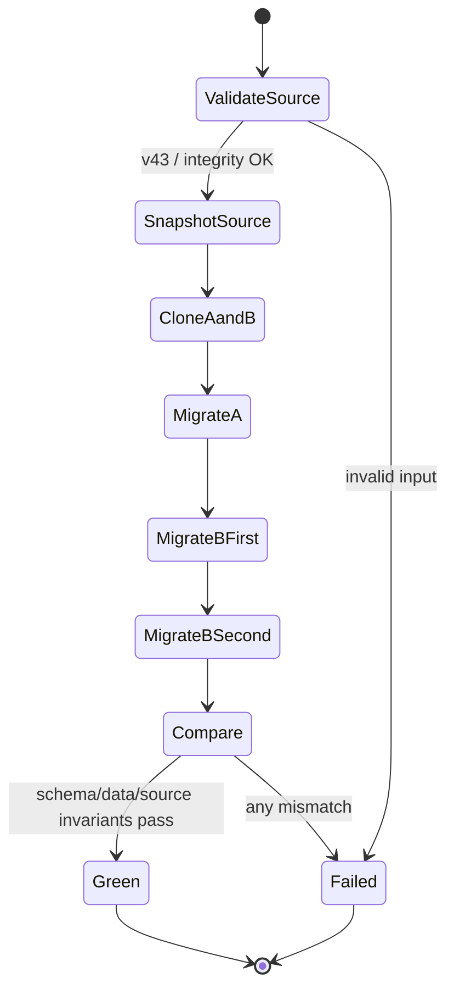

# DC-959 v0.1: v47 production-copy migration rehearsal

Issue: https://github.com/kojira/opencrab/issues/959

## 目的

`integration/transplant`から`main`への昇格前に、現行のmigration chainが代表的なv43 DB copyをv47へ安全かつ決定的に移行できることを機械検証する。古いv43専用postconditionのまま残っている`verify-v43-transplant-copy.sh`を、現行schemaと一致する監査へ更新する。

## 非目的

- production DB、production checkout、production processを変更しない
- migration本体やschema versionを変更しない
- v43以前のmigration契約を再設計しない
- データ修復、既存行の意味変更、過去backupの更新を行わない
- main昇格PR #958の機能差分へ新機能を追加しない

## 対象と責務

### 検証script

既存の`OPENCRAB_REHEARSAL_DB`入力を維持し、sourceをSQLite read-only URIで開く。最初にSQLite `.backup`で一時領域へ`pristine.db`を作り、そのcopy A/Bだけに`opencrab_db::schema::initialize`を適用する。

scriptは次を担当する。

1. sourceとpristineのversion・schema・既存データsnapshotを採取する
2. Aへ1回、Bへ2回initializeを適用する
3. v43→v47の許可済みschema deltaだけを検証する
4. 元から存在した全tableについて、元から存在した全columnのCOUNTと型付きcell digestが不変であることを検証する
5. A/Bの最終schemaとdata snapshotが一致することを検証する
6. `integrity_check`と`foreign_key_check`を検証する
7. sourceのversion・size・digestが実行前後で変わらないことを検証する

### DB test entry point

既存の環境変数付きtest entry pointは、名前とassertionをv47の実態へ合わせる。環境変数が未設定なら従来どおりno-opとし、通常のunit suiteが外部DBを開かない性質を維持する。

## 画面・API責務

UI、HTTP API、gateway wireには変更を加えない。利用者向けinterfaceはshell scriptと環境変数だけである。

```bash
OPENCRAB_REHEARSAL_DB=/path/to/isolated-v43-copy.db \
  ./scripts/verify-v47-transplant-copy.sh
```

互換性のため、旧script名を残す場合は新scriptへ明示的に委譲し、古いv43 postconditionを実行しない。曖昧な二重実装は残さない。

## 許可するschema delta

入力は`user_version=43`を要求する。出力は`latest_version()==47`を要求する。

### 新規table

- `deliveries`
- `external_origins`
- `gate_bindings`
- `gate_instances`
- `nostr_bundle_state`
- `conversation_snapshots`
- `gateway_operation_calls`

入力時点ですでに存在する`session_watches`と`tool_logs`は新規扱いにせず、既存データ不変監査の対象とする。

### 既存tableへの新規column

- `agents.subject_id`
- `gate_instances.operation_declaration_digest`

`agents.subject_id`は全既存agentでNULLでなく、正整数かつ一意であることを検証する。他の既存columnはdigest不変を要求する。v43入力には`gate_instances`が存在しないため、通常は新規tableの現行定義として検証する。

### 新規tableの状態

v43 sourceをinitializeした直後は上記新規tableが空であることを要求する。index/triggerはfresh v47 DBの該当DDLと一致することを既存unit testsまたはschema catalog比較で固定する。

## データsnapshot

各tableをprimary key順、primary keyがなければ`rowid`順で走査する。cellはNULL/integer/real/text/blobを型tag付きでSHA-256へ投入する。

移行前tableの比較では、移行後に追加されたcolumnだけを除外し、移行前から存在したcolumnを全て比較する。tableごとのCOUNTとdigestの双方を一致させる。

source不変確認には実行前後の次を使う。

- `PRAGMA user_version`
- file size
- SHA-256

sourceはread-only接続以外で開かない。

## 権限・安全境界

- PR #958検証では既存の隔離済みQC backupを入力に使う
- production DB pathをscriptや文書へ保存しない
- sourceへwrite connectionを作らない
- temporary copiesは`mktemp`配下に作り、終了時に削除する
- DB内容、token、個人識別子を標準出力へ出さない
- table名、件数、version、digest一致/不一致だけを報告する
- migration失敗時はfail closedし、main昇格を止める

## 状態遷移



## エラー処理

| 状況 | 挙動 |
| --- | --- |
| source未指定・不存在 | exit 2 |
| sourceがv43でない | failしてcopy適用前に停止 |
| source integrity不良 | failして停止 |
| initialize失敗 | failして一時copyを削除 |
| user_versionが47でない | fail |
| 既存COUNT/digest差分 | table名だけ示してfail |
| unexpected table/column | schema名を示してfail |
| 新規tableに行がある | table名と件数を示してfail |
| A/B不一致 | deterministic/no-op違反としてfail |
| source hash/version変化 | source mutationとしてfail |

## 変更範囲

- `scripts/verify-v43-transplant-copy.sh`の置換または新しい`verify-v47-transplant-copy.sh`へのcompatibility shim化
- `crates/db/src/schema/tests/transplant_migration_v43.rs`の外部copy適用test名・環境変数・v47 assertion更新
- 必要最小限のscript/test documentation

migration SQL、production runtime、gateway、webには変更しない。

## 検証

1. synthetic v43 fixtureでfocused DB unit tests
2. script static/shell syntax check
3. 既存の隔離済み代表QC backupを使った実rehearsal
4. source hash/version不変確認
5. A/B deterministic・second initialize no-op確認
6. workspace CI
7. 独立review
8. PR #958のmerge simulation tree再確認

## 受入条件

- sourceへwriteせずv43→v47 rehearsalがgreen
- sourceのSHA-256、size、user_versionが不変
- 既存tableの既存columnにCOUNT/digest差分ゼロ
- 許可したtable/column以外のschema deltaゼロ
- `agents.subject_id`のNOT NULL相当・正整数・一意性を確認
- 全新規tableが0行
- AとBが一致し、Bの2回目initializeがno-op
- integrity/foreign key check合格
- test entry pointがlatest v47を正しくassert
- 通常testは外部DBへ接続しない
- CI・独立review合格
- production checkout/DB/process/dashboard `:3000`は未変更

## 停止条件

- v43入力に想定外のtable/columnがある
- 既存columnのCOUNT/digestが変化する
- migration本体の変更が必要になる
- production DBへのwriteが必要になる
- sourceが代表copyではなく機密情報の出力が必要になる

いずれかが発生した場合は実装・昇格を止め、Issueへ差分と選択肢を記録して設計改訂へ戻る。
