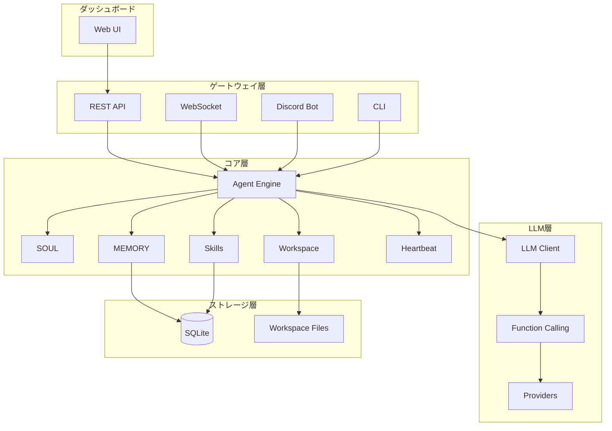
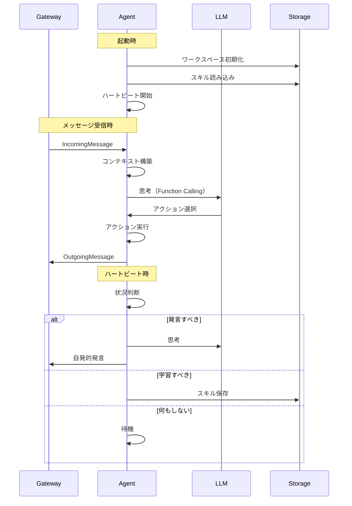
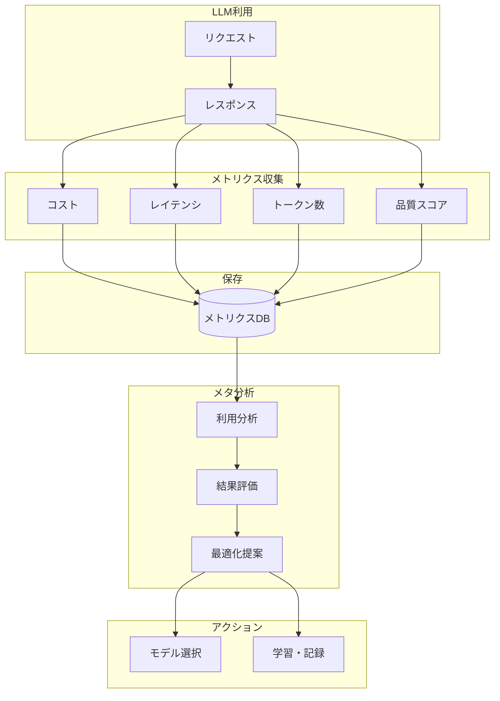

# OpenCrab - 自律エージェントフレームワーク

## 概要

**OpenCrab**は、自律的に思考・学習・成長するエージェントを構築するためのRust製フレームワーク。ゲートウェイ抽象化により、あらゆる入出力プラットフォームに対応可能。

## プロジェクト構造

```
opencrab/
├── Cargo.toml                    # ワークスペース定義
├── README.md
├── crates/
│   ├── core/                     # コアエンジン
│   │   ├── src/
│   │   │   ├── lib.rs
│   │   │   ├── agent.rs          # エージェント本体
│   │   │   ├── soul.rs           # SOUL（性格・価値観）
│   │   │   ├── memory.rs         # MEMORY（記憶システム）
│   │   │   ├── skill.rs          # スキル管理
│   │   │   ├── workspace.rs      # ワークスペース管理
│   │   │   └── heartbeat.rs      # ハートビート（自発的行動）
│   │   └── Cargo.toml
│   │
│   ├── llm/                      # LLM連携（プロバイダー抽象化）
│   │   ├── src/
│   │   │   ├── lib.rs
│   │   │   ├── traits.rs         # LlmProvider trait定義
│   │   │   ├── router.rs         # LLMルーター（動的切り替え）
│   │   │   ├── function_calling.rs
│   │   │   ├── message.rs        # 統一メッセージ形式
│   │   │   └── providers/        # プロバイダー別実装
│   │   │       ├── mod.rs
│   │   │       ├── openai.rs     # OpenAI / Azure OpenAI
│   │   │       ├── anthropic.rs  # Anthropic Claude
│   │   │       ├── google.rs     # Google Gemini
│   │   │       ├── ollama.rs     # Ollama（ローカル）
│   │   │       └── llamacpp.rs   # llama.cpp（ローカル）
│   │   └── Cargo.toml
│   │
│   ├── gateway/                  # ゲートウェイ抽象化
│   │   ├── src/
│   │   │   ├── lib.rs
│   │   │   ├── traits.rs         # Gateway trait定義
│   │   │   ├── message.rs        # 統一メッセージ形式
│   │   │   └── adapters/         # 各プラットフォーム実装
│   │   │       ├── rest.rs       # REST API
│   │   │       ├── websocket.rs  # WebSocket
│   │   │       ├── discord.rs    # Discord Bot
│   │   │       ├── slack.rs      # Slack Bot（将来）
│   │   │       ├── cli.rs        # CLI
│   │   │       └── line.rs       # LINE Bot（将来）
│   │   └── Cargo.toml
│   │
│   ├── actions/                  # アクション定義
│   │   ├── src/
│   │   │   ├── lib.rs
│   │   │   ├── common.rs         # 共通アクション
│   │   │   ├── workspace.rs      # ワークスペース操作
│   │   │   ├── learning.rs       # 学習アクション
│   │   │   ├── search.rs         # 検索アクション
│   │   │   └── web.rs            # Web検索
│   │   └── Cargo.toml
│   │
│   ├── db/                       # データベース
│   │   ├── src/
│   │   │   ├── lib.rs
│   │   │   ├── schema.rs
│   │   │   ├── queries.rs
│   │   │   └── migrations/
│   │   └── Cargo.toml
│   │
│   ├── server/                   # APIサーバー
│   │   ├── src/
│   │   │   ├── main.rs
│   │   │   ├── api/
│   │   │   │   ├── mod.rs
│   │   │   │   ├── agents.rs     # エージェント管理API
│   │   │   │   ├── sessions.rs   # セッション管理API
│   │   │   │   ├── skills.rs     # スキル管理API
│   │   │   │   ├── memory.rs     # 記憶管理API
│   │   │   │   └── workspace.rs  # ワークスペースAPI
│   │   │   └── ws.rs             # WebSocket
│   │   └── Cargo.toml
│   │
│   └── cli/                      # CLIツール
│       ├── src/
│       │   └── main.rs
│       └── Cargo.toml
│
├── dashboard/                    # Webダッシュボード（Dioxus）
│   ├── Cargo.toml
│   ├── Dioxus.toml               # Dioxus CLI設定
│   ├── src/
│   │   ├── main.rs               # エントリーポイント
│   │   ├── app.rs                # ルートコンポーネント
│   │   ├── routes/
│   │   │   ├── mod.rs
│   │   │   ├── home.rs           # ホーム
│   │   │   ├── agents.rs         # エージェント管理
│   │   │   ├── personas.rs       # ペルソナ編集
│   │   │   ├── skills.rs         # スキル管理
│   │   │   ├── memory.rs         # 記憶閲覧
│   │   │   ├── sessions.rs       # セッション監視
│   │   │   ├── workspace.rs      # ワークスペースブラウザ
│   │   │   └── analytics.rs      # 分析・統計
│   │   ├── components/
│   │   │   ├── mod.rs
│   │   │   ├── sidebar.rs
│   │   │   ├── header.rs
│   │   │   ├── agent_card.rs
│   │   │   ├── skill_editor.rs
│   │   │   └── ...
│   │   └── api.rs                # サーバー関数（Axum統合）
│   ├── public/                   # 静的アセット
│   └── tailwind.config.js        # TailwindCSS設定
│
├── skills/                       # 標準スキル
│   ├── autonomous.skill.md
│   ├── self-learning.skill.md
│   ├── workspace-management.skill.md
│   └── ...
│
└── config/
    └── default.toml              # デフォルト設定
```

## アーキテクチャ




## ゲートウェイ抽象化

### Gateway Trait

```rust
// crates/gateway/src/traits.rs

#[async_trait]
pub trait Gateway: Send + Sync {
    /// ゲートウェイの名前
    fn name(&self) -> &str;
    
    /// メッセージを受信
    async fn receive(&mut self) -> Result<IncomingMessage>;
    
    /// メッセージを送信
    async fn send(&self, message: OutgoingMessage) -> Result<()>;
    
    /// 接続を開始
    async fn connect(&mut self) -> Result<()>;
    
    /// 接続を終了
    async fn disconnect(&mut self) -> Result<()>;
    
    /// ゲートウェイ固有の設定
    fn config(&self) -> &GatewayConfig;
}
```

### 統一メッセージ形式

```rust
// crates/gateway/src/message.rs

/// 受信メッセージ（プラットフォーム非依存）
pub struct IncomingMessage {
    pub id: String,
    pub source: MessageSource,
    pub content: MessageContent,
    pub sender: Sender,
    pub channel: Option<Channel>,
    pub timestamp: DateTime<Utc>,
    pub metadata: HashMap<String, Value>,
}

/// メッセージソース
pub enum MessageSource {
    Rest { request_id: String },
    WebSocket { connection_id: String },
    Discord { guild_id: String, channel_id: String },
    Cli { session_id: String },
    // 将来の拡張
    Slack { workspace_id: String, channel_id: String },
    Line { user_id: String },
}

/// 送信メッセージ
pub struct OutgoingMessage {
    pub content: MessageContent,
    pub target: MessageTarget,
    pub reply_to: Option<String>,
    pub metadata: HashMap<String, Value>,
}
```

### ゲートウェイ実装例（Discord）

```rust
// crates/gateway/src/adapters/discord.rs

pub struct DiscordGateway {
    client: serenity::Client,
    config: DiscordConfig,
    tx: mpsc::Sender<IncomingMessage>,
    rx: mpsc::Receiver<OutgoingMessage>,
}

#[async_trait]
impl Gateway for DiscordGateway {
    fn name(&self) -> &str { "discord" }
    
    async fn receive(&mut self) -> Result<IncomingMessage> {
        // Discordイベントを統一形式に変換
    }
    
    async fn send(&self, message: OutgoingMessage) -> Result<()> {
        // 統一形式をDiscordメッセージに変換して送信
    }
    
    // ...
}
```

## ダッシュボード機能（Dioxus 0.7）

### 技術スタック

- **Dioxus 0.7.3** - Rust製フルスタックフレームワーク
- **Axum統合** - サーバー関数でバックエンドと直接通信
- **TailwindCSS** - 自動セットアップ済み
- **Subsecond** - ホットパッチングで高速イテレーション

### 開発コマンド

```bash
cd dashboard
dx serve  # ホットリロード付き開発サーバー
dx build --release  # 本番ビルド
```

### 1. ペルソナ編集

- 性格（Big Five）のスライダー調整
- 思考スタイルの設定
- 価値観の定義
- プレビュー（サンプル会話）

### 2. スキル管理

- 標準スキルの有効/無効切り替え
- 獲得スキルの一覧・詳細
- 自作スキルの作成・編集
- スキルの有効性スコア表示

### 3. 記憶閲覧・検索

- セッション履歴の検索
- キュレーション記憶の閲覧・編集
- 心象（他者への印象）の確認
- 記憶のエクスポート

### 4. セッション監視

- リアルタイム会話表示（WebSocket）
- 心の声の表示
- アクション実行ログ
- 介入機能（メンター指示）

### 5. ワークスペースブラウザ

- ファイルツリー表示
- ファイル内容のプレビュー・編集
- 自作スキルのシンタックスハイライト
- ファイルのアップロード・ダウンロード

### 6. 分析・統計

- 発言数・発言頻度
- スキル使用率
- 学習の進捗
- 他エージェントとの関係性グラフ
- LLMコスト・品質ダッシュボード

## エージェントのライフサイクル




## LLM抽象化レイヤー

### LlmProvider Trait

```rust
// crates/llm/src/traits.rs

#[async_trait]
pub trait LlmProvider: Send + Sync {
    /// プロバイダー名
    fn name(&self) -> &str;
    
    /// 対応モデル一覧
    fn available_models(&self) -> Vec<ModelInfo>;
    
    /// チャット補完（Function Calling対応）
    async fn chat_completion(
        &self,
        request: ChatRequest,
    ) -> Result<ChatResponse>;
    
    /// ストリーミング補完
    async fn chat_completion_stream(
        &self,
        request: ChatRequest,
    ) -> Result<impl Stream<Item = Result<ChatChunk>>>;
    
    /// Function Callingをサポートしているか
    fn supports_function_calling(&self) -> bool;
    
    /// Vision（画像入力）をサポートしているか
    fn supports_vision(&self) -> bool;
    
    /// ヘルスチェック
    async fn health_check(&self) -> Result<bool>;
}
```

### 統一メッセージ形式

```rust
// crates/llm/src/message.rs

/// チャットリクエスト（プロバイダー非依存）
pub struct ChatRequest {
    pub model: String,
    pub messages: Vec<Message>,
    pub functions: Option<Vec<FunctionDefinition>>,
    pub function_call: Option<FunctionCallBehavior>,
    pub temperature: Option<f32>,
    pub max_tokens: Option<u32>,
    pub stop: Option<Vec<String>>,
    pub metadata: HashMap<String, Value>,
}

/// メッセージ
pub struct Message {
    pub role: Role,
    pub content: MessageContent,
    pub name: Option<String>,
    pub function_call: Option<FunctionCall>,
}

/// メッセージ内容（テキスト、画像、複合）
pub enum MessageContent {
    Text(String),
    Image { url: String, detail: Option<String> },
    Multi(Vec<ContentPart>),
}

/// チャットレスポンス
pub struct ChatResponse {
    pub id: String,
    pub model: String,
    pub choices: Vec<Choice>,
    pub usage: Usage,
}

/// Function定義
pub struct FunctionDefinition {
    pub name: String,
    pub description: String,
    pub parameters: serde_json::Value,  // JSON Schema
}
```

### LLMルーター

```rust
// crates/llm/src/router.rs

/// LLMルーター - 動的にプロバイダーを切り替え
pub struct LlmRouter {
    providers: HashMap<String, Arc<dyn LlmProvider>>,
    default_provider: String,
    fallback_chain: Vec<String>,
    model_mapping: HashMap<String, (String, String)>, // alias -> (provider, model)
}

impl LlmRouter {
    /// プロバイダーを追加
    pub fn register_provider(&mut self, provider: Arc<dyn LlmProvider>);
    
    /// モデルエイリアスを設定
    /// 例: "fast" -> ("openai", "gpt-4o-mini")
    ///     "smart" -> ("anthropic", "claude-3-opus")
    pub fn set_model_alias(&mut self, alias: &str, provider: &str, model: &str);
    
    /// フォールバックチェーンを設定
    /// 例: ["openai", "anthropic", "ollama"]
    pub fn set_fallback_chain(&mut self, chain: Vec<String>);
    
    /// チャット補完（自動ルーティング）
    pub async fn chat(&self, request: ChatRequest) -> Result<ChatResponse> {
        // 1. モデル名からプロバイダーを特定
        // 2. 失敗したらフォールバックチェーンを試行
        // 3. 全て失敗したらエラー
    }
    
    /// 特定のプロバイダーを指定して実行
    pub async fn chat_with_provider(
        &self,
        provider: &str,
        request: ChatRequest,
    ) -> Result<ChatResponse>;
}
```

### 対応プロバイダー


| プロバイダー         | 実装ファイル          | 特徴                                      |
| -------------- | --------------- | --------------------------------------- |
| OpenAI         | `openai.rs`     | GPT-4o, GPT-4o-mini, o1等。Azure OpenAI対応 |
| Anthropic      | `anthropic.rs`  | Claude 3.5 Sonnet, Claude 3 Opus等       |
| Google         | `google.rs`     | Gemini 2.0, Gemini 1.5 Pro等             |
| **OpenRouter** | `openrouter.rs` | **多数のモデルに一括アクセス（100+モデル）**              |
| Ollama         | `ollama.rs`     | ローカルLLM（Llama, Mistral, Qwen等）          |
| llama.cpp      | `llamacpp.rs`   | 直接llama.cppサーバーに接続                      |


### プロバイダー実装例（OpenAI）

```rust
// crates/llm/src/providers/openai.rs

pub struct OpenAiProvider {
    client: reqwest::Client,
    config: OpenAiConfig,
}

pub struct OpenAiConfig {
    pub api_key: String,
    pub base_url: String,  // Azure対応
    pub organization: Option<String>,
    pub default_model: String,
}

#[async_trait]
impl LlmProvider for OpenAiProvider {
    fn name(&self) -> &str { "openai" }
    
    fn available_models(&self) -> Vec<ModelInfo> {
        vec![
            ModelInfo { id: "gpt-4o".into(), context_window: 128000, supports_vision: true, supports_functions: true },
            ModelInfo { id: "gpt-4o-mini".into(), context_window: 128000, supports_vision: true, supports_functions: true },
            ModelInfo { id: "o1".into(), context_window: 200000, supports_vision: true, supports_functions: false },
            // ...
        ]
    }
    
    async fn chat_completion(&self, request: ChatRequest) -> Result<ChatResponse> {
        // OpenAI API形式に変換して送信
        let openai_request = self.convert_request(request)?;
        let response = self.client.post(&self.endpoint())
            .json(&openai_request)
            .send()
            .await?;
        // レスポンスを統一形式に変換
        self.convert_response(response.json().await?)
    }
    
    fn supports_function_calling(&self) -> bool { true }
    fn supports_vision(&self) -> bool { true }
}
```

### プロバイダー実装例（Ollama）

```rust
// crates/llm/src/providers/ollama.rs

pub struct OllamaProvider {
    client: reqwest::Client,
    config: OllamaConfig,
}

pub struct OllamaConfig {
    pub base_url: String,  // デフォルト: http://localhost:11434
    pub default_model: String,
}

#[async_trait]
impl LlmProvider for OllamaProvider {
    fn name(&self) -> &str { "ollama" }
    
    fn available_models(&self) -> Vec<ModelInfo> {
        // Ollama APIから動的に取得
        // GET /api/tags
    }
    
    async fn chat_completion(&self, request: ChatRequest) -> Result<ChatResponse> {
        // Ollama API形式に変換
        // POST /api/chat
    }
    
    fn supports_function_calling(&self) -> bool {
        // モデルによる（Llama 3.1以降は対応）
        true
    }
}
```

### プロバイダー実装例（OpenRouter）

```rust
// crates/llm/src/providers/openrouter.rs

pub struct OpenRouterProvider {
    client: reqwest::Client,
    config: OpenRouterConfig,
}

pub struct OpenRouterConfig {
    pub api_key: String,
    pub base_url: String,  // https://openrouter.ai/api/v1
    pub site_url: Option<String>,   // HTTP-Referer ヘッダー
    pub app_name: Option<String>,   // X-Title ヘッダー
    pub default_model: String,
}

#[async_trait]
impl LlmProvider for OpenRouterProvider {
    fn name(&self) -> &str { "openrouter" }
    
    fn available_models(&self) -> Vec<ModelInfo> {
        // OpenRouter APIから動的に取得
        // GET /api/v1/models
        // 100+モデルが利用可能:
        // - anthropic/claude-3.5-sonnet
        // - google/gemini-pro
        // - meta-llama/llama-3.1-405b
        // - mistralai/mistral-large
        // - deepseek/deepseek-chat
        // など
    }
    
    async fn chat_completion(&self, request: ChatRequest) -> Result<ChatResponse> {
        // OpenAI互換API
        // モデル名は "provider/model" 形式
    }
    
    fn supports_function_calling(&self) -> bool {
        // モデルによる（多くのモデルが対応）
        true
    }
}
```

**OpenRouterの利点:**

- 1つのAPIキーで100+モデルにアクセス
- 自動フォールバック機能
- 使用量ベースの課金
- モデル比較が容易
- 新モデルへの即座のアクセス

### エージェントごとのLLM設定

```rust
// エージェントごとに異なるLLMを使用可能
pub struct AgentLlmConfig {
    /// デフォルトプロバイダー
    pub default_provider: String,
    /// デフォルトモデル
    pub default_model: String,
    /// 用途別モデル設定
    pub models: AgentModels,
    /// エージェント自身によるLLM切り替えを許可
    pub allow_self_selection: bool,
    /// 切り替え可能なモデルのホワイトリスト
    pub selectable_models: Vec<ModelRef>,
}

pub struct AgentModels {
    /// 思考・推論用（高性能）
    pub thinking: Option<ModelRef>,
    /// 会話生成用（バランス）
    pub conversation: Option<ModelRef>,
    /// 要約・分析用（高速）
    pub analysis: Option<ModelRef>,
    /// **ツールコーリング専用**（Function Calling対応必須）
    pub tool_calling: Option<ModelRef>,
    /// エンベディング用
    pub embedding: Option<ModelRef>,
}

pub struct ModelRef {
    pub provider: String,
    pub model: String,
}
```

### ツールコーリング専用LLM

Function Callingの精度が重要な場面では、専用のモデルを使用可能：

```rust
// crates/core/src/agent.rs

impl Agent {
    /// ツールコーリングを実行
    async fn execute_with_tools(&self, context: &Context) -> Result<Action> {
        // ツールコーリング専用モデルを使用
        let model = self.llm_config.models.tool_calling
            .as_ref()
            .unwrap_or(&self.llm_config.default_model());
        
        let request = ChatRequest {
            model: model.model.clone(),
            messages: context.messages.clone(),
            functions: Some(self.available_functions()),
            function_call: Some(FunctionCallBehavior::Auto),
            ..Default::default()
        };
        
        let response = self.llm_router
            .chat_with_provider(&model.provider, request)
            .await?;
        
        self.parse_tool_call(response)
    }
}
```

**ツールコーリングに適したモデル:**

- GPT-4o / GPT-4o-mini（高精度）
- Claude 3.5 Sonnet（tool_use対応）
- Llama 3.1 70B+（ローカルで高精度）

---

## エージェント自身によるLLM選択

### 概要

エージェントが状況に応じて自律的にLLMを切り替える機能。タスクの複雑さ、コスト、速度のバランスを自分で判断。

### select_llm アクション

```rust
// crates/actions/src/llm_selection.rs

/// エージェントがLLMを選択するアクション
pub struct SelectLlmAction;

impl Action for SelectLlmAction {
    fn name(&self) -> &str { "select_llm" }
    
    fn description(&self) -> &str {
        "タスクに応じて使用するLLMを選択する"
    }
    
    fn parameters(&self) -> serde_json::Value {
        json!({
            "type": "object",
            "properties": {
                "purpose": {
                    "type": "string",
                    "description": "LLMの用途",
                    "enum": ["thinking", "conversation", "analysis", "tool_calling", "creative"]
                },
                "model_alias": {
                    "type": "string",
                    "description": "使用するモデルのエイリアス（fast, smart, reasoning, local等）"
                },
                "reason": {
                    "type": "string",
                    "description": "このモデルを選んだ理由"
                },
                "duration": {
                    "type": "string",
                    "description": "この設定の有効期間",
                    "enum": ["this_turn", "this_session", "permanent"]
                }
            },
            "required": ["purpose", "model_alias", "reason"]
        })
    }
    
    async fn execute(&self, args: &Value, ctx: &ActionContext) -> ActionResult {
        let purpose = args["purpose"].as_str().unwrap();
        let model_alias = args["model_alias"].as_str().unwrap();
        let reason = args["reason"].as_str().unwrap();
        let duration = args["duration"].as_str().unwrap_or("this_turn");
        
        // ホワイトリストチェック
        if !ctx.agent.llm_config.selectable_models.contains(model_alias) {
            return ActionResult::error("このモデルは選択できません");
        }
        
        // LLM設定を更新
        ctx.agent.set_llm_for_purpose(purpose, model_alias, duration)?;
        
        ActionResult::success(json!({
            "selected": model_alias,
            "purpose": purpose,
            "reason": reason,
            "duration": duration
        }))
    }
}
```

### LLM選択スキル

```markdown
---
name: llm-selection
description: "LLM選択スキル - タスクに応じて最適なLLMを自分で選ぶ"
version: 1
actions:
  - select_llm
  - get_available_models
  - get_current_llm_config
---

# LLM選択マニュアル

あなたは状況に応じて使用するLLMを自分で選択できます。

## 1. いつLLMを切り替えるか

### 高性能モデルに切り替える場合
- 複雑な推論が必要なとき
- 重要な判断を下すとき
- 創造的なアイデアが必要なとき
- 長文の分析・要約が必要なとき

### 高速モデルに切り替える場合
- 単純な応答で十分なとき
- 素早い反応が求められるとき
- コストを抑えたいとき

### ローカルモデルに切り替える場合
- プライバシーが重要なとき
- オフラインで動作させたいとき
- APIコストを完全に避けたいとき

## 2. 利用可能なモデルエイリアス

| エイリアス | 用途 | 特徴 |
|-----------|------|------|
| `fast` | 高速応答 | 低コスト、シンプルなタスク向け |
| `smart` | 高性能 | 複雑な推論、高品質な出力 |
| `reasoning` | 深い推論 | 数学、論理、複雑な問題解決 |
| `creative` | 創造的 | アイデア生成、ライティング |
| `local` | ローカル | プライバシー重視、オフライン |
| `cheap` | 低コスト | 大量処理、コスト最小化 |

## 3. 選択の例

### 例1: 複雑な分析タスク
```

select_llm(
    purpose: "thinking",
    model_alias: "reasoning",
    reason: "複雑な問題を分析するため、深い推論能力が必要",
    duration: "this_turn"
)

```

### 例2: 大量の要約タスク
```

select_llm(
    purpose: "analysis",
    model_alias: "fast",
    reason: "多数のドキュメントを素早く要約するため",
    duration: "this_session"
)

```

### 例3: プライバシー重視
```

select_llm(
    purpose: "conversation",
    model_alias: "local",
    reason: "機密情報を含む会話のため、ローカルで処理",
    duration: "this_session"
)

```

## 4. 注意事項

- 切り替えには若干のオーバーヘッドがある
- 頻繁な切り替えは避ける
- 不明な場合はデフォルトのまま使用
- ツールコーリングはFunction Calling対応モデルが必須
```

### LLMコンテキストへの注入

エージェントが現在のLLM設定を認識できるよう、コンテキストに含める：

```rust
// crates/core/src/context_builder.rs

fn build_llm_context(agent: &Agent) -> String {
    let config = &agent.llm_config;
    
    format!(
        "【現在のLLM設定】
- デフォルト: {}/{}
- 思考用: {}
- 会話用: {}
- ツールコーリング用: {}
- 分析用: {}

【選択可能なモデル】
{}

LLMを切り替えたい場合は select_llm アクションを使用してください。",
        config.default_provider,
        config.default_model,
        format_model_ref(&config.models.thinking),
        format_model_ref(&config.models.conversation),
        format_model_ref(&config.models.tool_calling),
        format_model_ref(&config.models.analysis),
        format_selectable_models(&config.selectable_models),
    )
}
```

---

## LLMメタ分析・最適化システム

### 概要

エージェントが自分のLLM利用を**メタ視点で分析**し、コスト・品質・速度のバランスを自律的に最適化する仕組み。




### LLM利用メトリクスの収集

```rust
// crates/llm/src/metrics.rs

/// LLM利用メトリクス
#[derive(Debug, Clone, Serialize, Deserialize)]
pub struct LlmUsageMetrics {
    pub id: String,
    pub timestamp: DateTime<Utc>,
    pub agent_id: String,
    pub session_id: Option<String>,
    
    // リクエスト情報
    pub provider: String,
    pub model: String,
    pub purpose: String,  // thinking, conversation, tool_calling, etc.
    
    // コスト関連
    pub input_tokens: u32,
    pub output_tokens: u32,
    pub total_tokens: u32,
    pub estimated_cost_usd: f64,
    
    // パフォーマンス
    pub latency_ms: u64,
    pub time_to_first_token_ms: Option<u64>,
    
    // 品質評価（後から追加）
    pub quality_score: Option<f32>,      // 0.0-1.0
    pub self_evaluation: Option<String>, // エージェント自身の評価コメント
    pub task_success: Option<bool>,      // タスクが成功したか
    
    // コンテキスト
    pub task_type: String,               // 何のタスクだったか
    pub complexity: Option<String>,      // simple, medium, complex
}

/// メトリクス収集ミドルウェア
pub struct MetricsCollector {
    db: Arc<Connection>,
    pricing: HashMap<String, ModelPricing>,
}

impl MetricsCollector {
    /// LLM呼び出しをラップしてメトリクスを収集
    pub async fn track<F, T>(&self, 
        agent_id: &str,
        purpose: &str,
        task_type: &str,
        f: F
    ) -> Result<(T, LlmUsageMetrics)>
    where
        F: Future<Output = Result<T>>,
    {
        let start = Instant::now();
        let result = f.await;
        let latency = start.elapsed().as_millis() as u64;
        
        // メトリクスを記録
        let metrics = LlmUsageMetrics {
            latency_ms: latency,
            // ... 他のフィールド
        };
        
        self.save_metrics(&metrics).await?;
        
        Ok((result?, metrics))
    }
}
```

### モデル価格情報

```rust
// crates/llm/src/pricing.rs

/// モデル価格情報
pub struct ModelPricing {
    pub provider: String,
    pub model: String,
    pub input_price_per_1m: f64,   // $X per 1M input tokens
    pub output_price_per_1m: f64,  // $X per 1M output tokens
    pub context_window: u32,
    pub updated_at: DateTime<Utc>,
}

/// 価格計算
impl ModelPricing {
    pub fn calculate_cost(&self, input_tokens: u32, output_tokens: u32) -> f64 {
        let input_cost = (input_tokens as f64 / 1_000_000.0) * self.input_price_per_1m;
        let output_cost = (output_tokens as f64 / 1_000_000.0) * self.output_price_per_1m;
        input_cost + output_cost
    }
}

// 価格テーブル（2026年2月時点・定期的に更新）
pub fn default_pricing() -> HashMap<String, ModelPricing> {
    hashmap! {
        // OpenAI
        "openai/gpt-5.2".into() => ModelPricing {
            input_price_per_1m: 1.75,
            output_price_per_1m: 14.00,
            context_window: 256000,
            ..
        },
        "openai/gpt-5.2-pro".into() => ModelPricing {
            input_price_per_1m: 21.00,
            output_price_per_1m: 168.00,
            context_window: 256000,
            ..
        },
        "openai/gpt-5-mini".into() => ModelPricing {
            input_price_per_1m: 0.25,
            output_price_per_1m: 2.00,
            context_window: 128000,
            ..
        },
        // Anthropic Claude
        "anthropic/claude-opus-4.6".into() => ModelPricing {
            input_price_per_1m: 5.00,
            output_price_per_1m: 25.00,
            context_window: 1000000,
            ..
        },
        "anthropic/claude-sonnet-4.5".into() => ModelPricing {
            input_price_per_1m: 3.00,
            output_price_per_1m: 15.00,
            context_window: 1000000,
            ..
        },
        "anthropic/claude-haiku-4.5".into() => ModelPricing {
            input_price_per_1m: 1.00,
            output_price_per_1m: 5.00,
            context_window: 200000,
            ..
        },
        // Google Gemini
        "google/gemini-3-pro".into() => ModelPricing {
            input_price_per_1m: 2.00,
            output_price_per_1m: 12.00,
            context_window: 1000000,
            ..
        },
        "google/gemini-3-flash".into() => ModelPricing {
            input_price_per_1m: 0.50,
            output_price_per_1m: 3.00,
            context_window: 1000000,
            ..
        },
        "google/gemini-2.5-flash-lite".into() => ModelPricing {
            input_price_per_1m: 0.10,
            output_price_per_1m: 0.40,
            context_window: 128000,
            ..
        },
        // DeepSeek（コスパ最強）
        "deepseek/deepseek-v3.2".into() => ModelPricing {
            input_price_per_1m: 0.25,
            output_price_per_1m: 0.38,
            context_window: 128000,
            ..
        },
        // ローカル（無料）
        "ollama/*".into() => ModelPricing {
            input_price_per_1m: 0.0,
            output_price_per_1m: 0.0,
            ..
        },
        // OpenRouter無料モデル
        "openrouter/free/*".into() => ModelPricing {
            input_price_per_1m: 0.0,
            output_price_per_1m: 0.0,
            ..
        },
    }
}
```

### 推論結果の自己評価

```rust
// crates/actions/src/llm_evaluation.rs

/// 推論結果を自己評価するアクション
pub struct EvaluateResponseAction;

impl Action for EvaluateResponseAction {
    fn name(&self) -> &str { "evaluate_response" }
    
    fn description(&self) -> &str {
        "直前のLLM応答の品質を自己評価し、メトリクスに記録する"
    }
    
    fn parameters(&self) -> serde_json::Value {
        json!({
            "type": "object",
            "properties": {
                "metrics_id": {
                    "type": "string",
                    "description": "評価対象のメトリクスID"
                },
                "quality_score": {
                    "type": "number",
                    "description": "品質スコア（0.0-1.0）",
                    "minimum": 0.0,
                    "maximum": 1.0
                },
                "task_success": {
                    "type": "boolean",
                    "description": "タスクが成功したか"
                },
                "evaluation": {
                    "type": "string",
                    "description": "評価コメント（何が良かった/悪かったか）"
                },
                "would_use_again": {
                    "type": "boolean",
                    "description": "同じタスクで同じモデルを使うか"
                },
                "better_model_suggestion": {
                    "type": "string",
                    "description": "より適切だったと思うモデル（オプション）"
                }
            },
            "required": ["quality_score", "task_success", "evaluation"]
        })
    }
}
```

### LLM利用分析アクション

```rust
// crates/actions/src/llm_analysis.rs

/// LLM利用状況を分析するアクション
pub struct AnalyzeLlmUsageAction;

impl Action for AnalyzeLlmUsageAction {
    fn name(&self) -> &str { "analyze_llm_usage" }
    
    fn description(&self) -> &str {
        "自分のLLM利用状況をメタ視点で分析する"
    }
    
    fn parameters(&self) -> serde_json::Value {
        json!({
            "type": "object",
            "properties": {
                "period": {
                    "type": "string",
                    "description": "分析期間",
                    "enum": ["last_hour", "last_day", "last_week", "last_month", "all"]
                },
                "group_by": {
                    "type": "string",
                    "description": "グループ化の軸",
                    "enum": ["model", "purpose", "task_type", "complexity"]
                },
                "focus": {
                    "type": "string",
                    "description": "分析の焦点",
                    "enum": ["cost", "quality", "latency", "efficiency", "all"]
                }
            }
        })
    }
    
    async fn execute(&self, args: &Value, ctx: &ActionContext) -> ActionResult {
        let period = args["period"].as_str().unwrap_or("last_week");
        let group_by = args["group_by"].as_str().unwrap_or("model");
        let focus = args["focus"].as_str().unwrap_or("all");
        
        // メトリクスを集計
        let metrics = ctx.db.get_llm_metrics(
            &ctx.agent_id,
            period,
        ).await?;
        
        // 分析結果を生成
        let analysis = LlmUsageAnalysis {
            total_cost: metrics.iter().map(|m| m.estimated_cost_usd).sum(),
            total_tokens: metrics.iter().map(|m| m.total_tokens).sum(),
            avg_latency: metrics.iter().map(|m| m.latency_ms).sum::<u64>() / metrics.len() as u64,
            avg_quality: calculate_avg_quality(&metrics),
            by_model: group_metrics_by_model(&metrics),
            by_purpose: group_metrics_by_purpose(&metrics),
            cost_efficiency: calculate_cost_efficiency(&metrics),
            quality_by_model: calculate_quality_by_model(&metrics),
            recommendations: generate_recommendations(&metrics),
        };
        
        ActionResult::success(serde_json::to_value(analysis)?)
    }
}

/// 分析結果
#[derive(Serialize)]
pub struct LlmUsageAnalysis {
    pub total_cost: f64,
    pub total_tokens: u64,
    pub avg_latency: u64,
    pub avg_quality: f32,
    pub by_model: HashMap<String, ModelStats>,
    pub by_purpose: HashMap<String, PurposeStats>,
    pub cost_efficiency: f64,  // quality / cost
    pub quality_by_model: HashMap<String, f32>,
    pub recommendations: Vec<Recommendation>,
}

/// モデル別統計
#[derive(Serialize)]
pub struct ModelStats {
    pub usage_count: u32,
    pub total_cost: f64,
    pub avg_latency: u64,
    pub avg_quality: f32,
    pub success_rate: f32,
}

/// 最適化推奨
#[derive(Serialize)]
pub struct Recommendation {
    pub category: String,      // cost, quality, latency
    pub current: String,       // 現状
    pub suggestion: String,    // 提案
    pub expected_improvement: String,
    pub confidence: f32,
}
```

### モデル選択最適化アクション

```rust
// crates/actions/src/llm_optimizer.rs

/// モデル選択を最適化するアクション
pub struct OptimizeModelSelectionAction;

impl Action for OptimizeModelSelectionAction {
    fn name(&self) -> &str { "optimize_model_selection" }
    
    fn description(&self) -> &str {
        "過去の利用データに基づいて、タスク別の最適なモデルを提案する"
    }
    
    fn parameters(&self) -> serde_json::Value {
        json!({
            "type": "object",
            "properties": {
                "optimization_goal": {
                    "type": "string",
                    "description": "最適化の目標",
                    "enum": ["minimize_cost", "maximize_quality", "balance", "minimize_latency"]
                },
                "budget_limit_usd": {
                    "type": "number",
                    "description": "1日あたりの予算上限（USD）"
                },
                "min_quality_threshold": {
                    "type": "number",
                    "description": "最低品質スコア（0.0-1.0）"
                },
                "apply_immediately": {
                    "type": "boolean",
                    "description": "提案を即座に適用するか"
                }
            }
        })
    }
    
    async fn execute(&self, args: &Value, ctx: &ActionContext) -> ActionResult {
        let goal = args["optimization_goal"].as_str().unwrap_or("balance");
        let budget = args["budget_limit_usd"].as_f64();
        let min_quality = args["min_quality_threshold"].as_f64().unwrap_or(0.7);
        
        // 過去のメトリクスを分析
        let metrics = ctx.db.get_llm_metrics(&ctx.agent_id, "last_month").await?;
        
        // タスク別の最適モデルを計算
        let optimizations = calculate_optimal_models(
            &metrics,
            goal,
            budget,
            min_quality,
        );
        
        // 結果を返す
        ActionResult::success(json!({
            "current_config": ctx.agent.llm_config,
            "optimized_config": optimizations.suggested_config,
            "expected_savings": optimizations.expected_cost_reduction,
            "expected_quality_change": optimizations.expected_quality_change,
            "task_specific_recommendations": optimizations.by_task,
        }))
    }
}

/// 最適化結果
struct OptimizationResult {
    suggested_config: AgentLlmConfig,
    expected_cost_reduction: f64,      // 予想コスト削減率
    expected_quality_change: f64,      // 予想品質変化
    by_task: HashMap<String, TaskOptimization>,
}

/// タスク別最適化
struct TaskOptimization {
    task_type: String,
    current_model: String,
    suggested_model: String,
    reason: String,
    expected_improvement: String,
}
```

### LLMメタ分析スキル

```markdown
---
name: llm-meta-analysis
description: "LLMメタ分析スキル - 自分のLLM利用をメタ視点で分析・最適化する"
version: 1
actions:
  - analyze_llm_usage
  - evaluate_response
  - optimize_model_selection
  - get_llm_metrics
  - compare_models
---

# LLMメタ分析マニュアル

あなたは自分のLLM利用を**メタ視点で分析**し、最適化する能力を持っています。

## 1. メトリクスの自動収集

すべてのLLM呼び出しで以下が自動的に記録されます：
- コスト（入力/出力トークン数、推定費用）
- レイテンシ（応答時間）
- 用途（thinking, conversation, tool_calling等）
- タスクタイプ

## 2. 推論結果の自己評価

重要なタスクの後は `evaluate_response` で自己評価してください：

```

evaluate_response(
    quality_score: 0.85,
    task_success: true,
    evaluation: "複雑な推論を正確に行えた。ただし応答が少し冗長だった。",
    would_use_again: true
)

```

### 評価の観点
- **品質**: 出力の正確さ、有用さ
- **効率**: トークン数に対する価値
- **適切さ**: このタスクにこのモデルは適切だったか

## 3. 利用状況の分析

定期的に `analyze_llm_usage` で自分の利用パターンを分析：

```

analyze_llm_usage(
    period: "last_week",
    group_by: "model",
    focus: "cost_efficiency"
)

```

### 分析で得られる情報
- モデル別のコスト・品質・速度
- タスク別の最適モデル
- コスト効率（品質/コスト比）
- 改善の推奨事項

## 4. モデル選択の最適化

`optimize_model_selection` で最適なモデル構成を提案：

```

optimize_model_selection(
    optimization_goal: "balance",
    budget_limit_usd: 10.0,
    min_quality_threshold: 0.8,
    apply_immediately: false
)

```

### 最適化の目標
- **minimize_cost**: コスト最小化（品質を維持しつつ）
- **maximize_quality**: 品質最大化（予算内で）
- **balance**: コストと品質のバランス
- **minimize_latency**: 応答速度優先

## 5. 学習と適応

分析結果に基づいて、以下を学習・記録してください：

### タスク別の最適モデル
- 「複雑な推論 → reasoning モデルが最適」
- 「単純な応答 → fast モデルで十分」
- 「創造的タスク → creative モデルが高品質」

### コスト意識
- 「このタスクは fast で十分だった。次回から切り替える」
- 「品質が重要な場面では smart を使う価値がある」

### 失敗からの学習
- 「このモデルはツールコーリングが不安定だった」
- 「長文生成では別のモデルの方が良い」

## 6. 定期的な振り返り

ハートビート時や議論の合間に、以下を確認：

1. 今日のコストは予算内か？
2. 品質スコアは目標を達成しているか？
3. 非効率なモデル選択はなかったか？
4. 最適化の余地はあるか？

## 7. 自動最適化の例

### 例1: コスト削減
```

分析結果: 「単純な応答に smart モデルを使用、コスト効率が低い」
アクション: select_llm(purpose: "conversation", model_alias: "fast")
結果: コスト50%削減、品質維持

```

### 例2: 品質向上
```

分析結果: 「複雑な推論で fast モデルを使用、成功率が低い」
アクション: select_llm(purpose: "thinking", model_alias: "reasoning")
結果: 成功率30%向上、コスト増加は許容範囲

```

### 例3: バランス調整
```

分析結果: 「全体的にコストが高い、品質は十分」
アクション: optimize_model_selection(goal: "minimize_cost", min_quality: 0.8)
結果: タスク別に最適モデルを再配置、コスト30%削減

```

```

### DBスキーマ（メトリクス用）

```sql
-- LLM利用メトリクス
CREATE TABLE llm_usage_metrics (
    id TEXT PRIMARY KEY,
    agent_id TEXT NOT NULL,
    session_id TEXT,
    timestamp TEXT NOT NULL,
    
    -- リクエスト情報
    provider TEXT NOT NULL,
    model TEXT NOT NULL,
    purpose TEXT NOT NULL,
    task_type TEXT,
    complexity TEXT,
    
    -- コスト関連
    input_tokens INTEGER NOT NULL,
    output_tokens INTEGER NOT NULL,
    total_tokens INTEGER NOT NULL,
    estimated_cost_usd REAL NOT NULL,
    
    -- パフォーマンス
    latency_ms INTEGER NOT NULL,
    time_to_first_token_ms INTEGER,
    
    -- 品質評価
    quality_score REAL,
    self_evaluation TEXT,
    task_success INTEGER,
    would_use_again INTEGER,
    better_model_suggestion TEXT,
    
    -- インデックス
    created_at TEXT NOT NULL
);

CREATE INDEX idx_llm_metrics_agent ON llm_usage_metrics(agent_id);
CREATE INDEX idx_llm_metrics_model ON llm_usage_metrics(model);
CREATE INDEX idx_llm_metrics_purpose ON llm_usage_metrics(purpose);
CREATE INDEX idx_llm_metrics_timestamp ON llm_usage_metrics(timestamp);

-- モデル価格情報（定期更新）
CREATE TABLE model_pricing (
    provider TEXT NOT NULL,
    model TEXT NOT NULL,
    input_price_per_1m REAL NOT NULL,
    output_price_per_1m REAL NOT NULL,
    context_window INTEGER,
    updated_at TEXT NOT NULL,
    PRIMARY KEY (provider, model)
);
```

### ダッシュボードでのLLM分析

#### LLMコスト・品質ダッシュボード

- **コスト推移グラフ**: 日別/週別のLLMコスト
- **モデル別使用率**: 円グラフでモデル使用比率
- **品質スコア推移**: 時系列での品質変化
- **コスト効率マップ**: モデル×タスクのヒートマップ
- **最適化提案**: AIによる改善提案の表示
- **予算アラート**: 予算超過の警告

## 設定ファイル

```toml
# config/default.toml

[agent]
heartbeat_interval_secs = 29  # 素数
workspace_path = "data/agents/{agent_id}/workspace"
max_workspace_size_mb = 100

# デフォルトLLM設定
[llm]
default_provider = "openai"
default_model = "gpt-4o"

# 用途別モデル設定（オプション）- 2026年2月時点
[llm.models]
thinking = { provider = "anthropic", model = "claude-opus-4.6" }      # 最高品質の推論
conversation = { provider = "openai", model = "gpt-5.2" }             # バランス
analysis = { provider = "openai", model = "gpt-5-mini" }              # 高速・低コスト
# ツールコーリング専用（Function Calling精度重視）
tool_calling = { provider = "openai", model = "gpt-5.2" }             # 高精度
creative = { provider = "anthropic", model = "claude-sonnet-4.5" }    # 創造的タスク
embedding = { provider = "openai", model = "text-embedding-3-large" }

# エージェント自身によるLLM選択
[llm.self_selection]
enabled = true  # エージェントがLLMを自分で切り替えることを許可
# 選択可能なモデルのホワイトリスト（エイリアス名）
allowed_aliases = ["fast", "smart", "reasoning", "creative", "local", "cheap"]

# フォールバックチェーン
[llm.fallback]
chain = ["openai", "anthropic", "openrouter", "ollama"]

# OpenAI設定
[llm.providers.openai]
api_key = "${OPENAI_API_KEY}"
base_url = "https://api.openai.com/v1"  # Azure使用時は変更
organization = ""

# Anthropic設定
[llm.providers.anthropic]
api_key = "${ANTHROPIC_API_KEY}"

# Google設定
[llm.providers.google]
api_key = "${GOOGLE_API_KEY}"

# OpenRouter設定（100+モデルに一括アクセス）
[llm.providers.openrouter]
api_key = "${OPENROUTER_API_KEY}"
base_url = "https://openrouter.ai/api/v1"
site_url = "https://your-app.com"  # オプション: リファラー
app_name = "OpenCrab"              # オプション: アプリ名

# Ollama設定（ローカル）
[llm.providers.ollama]
base_url = "http://localhost:11434"
default_model = "llama3.1:8b"

# llama.cpp設定（ローカル）
[llm.providers.llamacpp]
base_url = "http://localhost:8080"

# モデルエイリアス（ショートカット）- 2026年2月時点
[llm.aliases]
# OpenAI
fast = { provider = "openai", model = "gpt-5-mini" }           # $0.25/$2.00 per 1M tokens
smart = { provider = "openai", model = "gpt-5.2" }             # $1.75/$14.00 - コーディング・エージェント向け
reasoning = { provider = "openai", model = "gpt-5.2-pro" }     # $21/$168 - 最高精度
codex = { provider = "openrouter", model = "openai/gpt-5.3-codex" }  # 最新の自己改善モデル

# Anthropic Claude
claude_fast = { provider = "anthropic", model = "claude-haiku-4.5" }   # $1.00/$5.00 - 高速
claude_smart = { provider = "anthropic", model = "claude-sonnet-4.5" } # $3.00/$15.00 - バランス
claude_best = { provider = "anthropic", model = "claude-opus-4.6" }    # $5.00/$25.00 - 最高品質

# Google Gemini
gemini_fast = { provider = "google", model = "gemini-2.5-flash-lite" } # $0.10/$0.40 - 最安
gemini_smart = { provider = "google", model = "gemini-3-flash" }       # $0.50/$3.00 - 高速
gemini_best = { provider = "google", model = "gemini-3-pro" }          # $2.00/$12.00 - 高性能

# ローカル（無料）
local = { provider = "ollama", model = "llama3.3:70b" }        # 汎用
local_fast = { provider = "ollama", model = "qwen3:8b" }       # 高速
local_code = { provider = "ollama", model = "qwen3-coder" }    # コーディング特化

# OpenRouter経由（コスパ最強）
deepseek = { provider = "openrouter", model = "deepseek/deepseek-v3.2" }  # $0.25/$0.38 - フロンティア性能の1/100コスト
deepseek_r1 = { provider = "openrouter", model = "deepseek/deepseek-r1-0528" }  # 推論特化（無料枠あり）

# 無料モデル（OpenRouter経由）
free_code = { provider = "openrouter", model = "qwen/qwen3-coder-80b" }   # 無料・コーディング
free_general = { provider = "openrouter", model = "meta-llama/llama-3.3-70b" }  # 無料・汎用

[gateway.rest]
enabled = true
port = 8080

[gateway.discord]
enabled = false
token = "${DISCORD_TOKEN}"
guild_ids = []

[gateway.cli]
enabled = true

[dashboard]
enabled = true
port = 3000

[database]
path = "data/opencrab.db"
```

## ダッシュボードでのLLM管理

### LLM設定画面

- プロバイダーの有効/無効切り替え
- APIキーの設定（暗号化保存）
- モデルエイリアスの編集
- フォールバックチェーンの設定
- エージェントごとのLLM設定

### LLMモニタリング

- プロバイダー別の使用量
- レスポンス時間の統計
- エラー率
- コスト推計

## 新規ファイル一覧

### Rust (crates/)


| ファイル                        | 説明             |
| --------------------------- | -------------- |
| `core/src/agent.rs`         | エージェント本体       |
| `core/src/soul.rs`          | SOUL（性格・価値観）   |
| `core/src/memory.rs`        | MEMORY（記憶システム） |
| `core/src/skill.rs`         | スキル管理          |
| `core/src/workspace.rs`     | ワークスペース管理      |
| `core/src/heartbeat.rs`     | ハートビート         |
| `gateway/src/traits.rs`     | Gateway trait  |
| `gateway/src/message.rs`    | 統一メッセージ形式      |
| `gateway/src/adapters/*.rs` | 各ゲートウェイ実装      |
| `actions/src/*.rs`          | アクション実装        |
| `llm/src/*.rs`              | LLM連携          |
| `db/src/*.rs`               | データベース         |
| `server/src/*.rs`           | APIサーバー        |
| `cli/src/main.rs`           | CLIツール         |


### Dashboard (Dioxus 0.7)


| ファイル                                | 説明          |
| ----------------------------------- | ----------- |
| `dashboard/src/main.rs`             | エントリーポイント   |
| `dashboard/src/app.rs`              | ルートコンポーネント  |
| `dashboard/src/routes/agents.rs`    | エージェント一覧    |
| `dashboard/src/routes/personas.rs`  | ペルソナ編集      |
| `dashboard/src/routes/skills.rs`    | スキル管理       |
| `dashboard/src/routes/memory.rs`    | 記憶閲覧        |
| `dashboard/src/routes/sessions.rs`  | セッション監視     |
| `dashboard/src/routes/workspace.rs` | ワークスペースブラウザ |
| `dashboard/src/routes/analytics.rs` | 分析・統計       |
| `dashboard/src/api.rs`              | サーバー関数      |


### Skills


| ファイル                                   | 説明           |
| -------------------------------------- | ------------ |
| `skills/autonomous.skill.md`           | 自律モードスキル     |
| `skills/self-learning.skill.md`        | 自己学習スキル      |
| `skills/workspace-management.skill.md` | ワークスペース管理スキル |


---

## 詳細実装ガイド（別セッション用）

以下は、別のセッションでも迷わず実装を開始できるよう、詳細な実装パターンと参照コードを含む。

### 参照プロジェクト

既存の `a2a-discussion/backend-v2` プロジェクトが参考になる。特に以下のファイル:

- `backend-v2/crates/agent/src/core/mod.rs` - AgentCore構造
- `backend-v2/crates/agent/src/db/schema.rs` - DBスキーマ
- `backend-v2/crates/agent/src/engine/skill_engine.rs` - スキルエンジン
- `backend-v2/crates/agent/src/llm/function_calling.rs` - Function Calling定義
- `backend-v2/crates/agent/src/gateway/channel_client.rs` - WebSocket接続
- `backend-v2/crates/agent/src/main.rs` - 起動フロー

---

### Core Crate 詳細設計

#### Agent構造体

```rust
// crates/core/src/agent.rs

use std::sync::Arc;
use tokio::sync::RwLock;

/// エージェント本体
pub struct Agent {
    pub id: String,
    pub soul: Soul,
    pub identity: Identity,
    pub memory: MemoryManager,
    pub skills: SkillManager,
    pub workspace: Workspace,
    pub llm_config: AgentLlmConfig,
    pub heartbeat: HeartbeatConfig,
}

impl Agent {
    /// 新規エージェントを作成
    pub async fn new(
        id: String,
        config: AgentConfig,
        db: Arc<Connection>,
    ) -> Result<Self> {
        // 1. SOUL初期化
        let soul = Soul::from_config(&config.persona)?;
        soul.save(&db).await?;
        
        // 2. IDENTITY初期化
        let identity = Identity::from_config(&config.identity)?;
        identity.save(&db).await?;
        
        // 3. MEMORY初期化
        let memory = MemoryManager::new(&id, db.clone());
        
        // 4. SKILLS初期化
        let skills = SkillManager::new(&id, db.clone());
        skills.ensure_default_skills().await?;
        
        // 5. WORKSPACE初期化
        let workspace = Workspace::new(&id, &config.workspace_path)?;
        
        Ok(Self {
            id,
            soul,
            identity,
            memory,
            skills,
            workspace,
            llm_config: config.llm,
            heartbeat: config.heartbeat,
        })
    }
    
    /// 既存エージェントを読み込み
    pub async fn load(id: &str, db: Arc<Connection>) -> Result<Option<Self>> {
        // DBから各コンポーネントを読み込み
    }
}
```

#### Soul（性格・価値観）

```rust
// crates/core/src/soul.rs

/// ペルソナの核心
#[derive(Debug, Clone, Serialize, Deserialize)]
pub struct Soul {
    pub agent_id: String,
    pub persona_name: String,
    pub social_style: SocialStyle,
    pub personality: Personality,
    pub thinking_style: ThinkingStyle,
    pub custom_traits: Option<serde_json::Value>,
}

/// ソーシャルスタイル（4象限）
#[derive(Debug, Clone, Serialize, Deserialize)]
pub struct SocialStyle {
    pub assertiveness: f32,  // -1.0（質問型）〜 1.0（主張型）
    pub responsiveness: f32, // -1.0（思考型）〜 1.0（感情型）
    pub style_name: String,  // Driving, Expressive, Amiable, Analytical
}

/// Big Five性格特性
#[derive(Debug, Clone, Serialize, Deserialize)]
pub struct Personality {
    pub openness: f32,          // 開放性
    pub conscientiousness: f32, // 誠実性
    pub extraversion: f32,      // 外向性
    pub agreeableness: f32,     // 協調性
    pub neuroticism: f32,       // 神経症傾向
}

/// 思考スタイル
#[derive(Debug, Clone, Serialize, Deserialize)]
pub struct ThinkingStyle {
    pub primary: String,    // 主要な思考傾向（論理的、直感的、分析的、創造的）
    pub secondary: String,  // 副次的な思考傾向
    pub description: String, // 自由記述
}

impl Soul {
    /// コンテキスト文字列を構築
    pub fn build_context(&self) -> String {
        format!(
            "【SOUL】
ペルソナ: {persona}
ソーシャルスタイル: {style}（主張性: {assert:.1}, 感情性: {resp:.1}）
性格特性:
  - 開放性: {open:.1}
  - 誠実性: {consc:.1}
  - 外向性: {extra:.1}
  - 協調性: {agree:.1}
  - 神経症傾向: {neuro:.1}
思考スタイル: {think_primary}（副: {think_secondary}）
{think_desc}",
            persona = self.persona_name,
            style = self.social_style.style_name,
            assert = self.social_style.assertiveness,
            resp = self.social_style.responsiveness,
            open = self.personality.openness,
            consc = self.personality.conscientiousness,
            extra = self.personality.extraversion,
            agree = self.personality.agreeableness,
            neuro = self.personality.neuroticism,
            think_primary = self.thinking_style.primary,
            think_secondary = self.thinking_style.secondary,
            think_desc = self.thinking_style.description,
        )
    }
}
```

#### Identity（役割・立場）

```rust
// crates/core/src/identity.rs

/// 役割・立場
#[derive(Debug, Clone, Serialize, Deserialize)]
pub struct Identity {
    pub agent_id: String,
    pub name: String,
    pub role: AgentRole,
    pub job_title: Option<String>,
    pub organization: Option<String>,
    pub image_url: Option<String>,
}

#[derive(Debug, Clone, Serialize, Deserialize)]
pub enum AgentRole {
    Discussant,     // 議論参加者
    Facilitator,    // ファシリテーター
    Observer,       // オブザーバー
    Custom(String), // カスタム役割
}

impl Identity {
    pub fn build_context(&self) -> String {
        let mut ctx = format!(
            "【IDENTITY】
名前: {name}
役割: {role:?}",
            name = self.name,
            role = self.role,
        );
        
        if let Some(job) = &self.job_title {
            ctx.push_str(&format!("\n職種: {job}"));
        }
        if let Some(org) = &self.organization {
            ctx.push_str(&format!("\n所属: {org}"));
        }
        
        ctx
    }
}
```

#### Memory（記憶システム）

```rust
// crates/core/src/memory.rs

/// 記憶マネージャー
pub struct MemoryManager {
    agent_id: String,
    db: Arc<Connection>,
}

impl MemoryManager {
    /// キュレーション記憶を取得
    pub async fn get_curated(&self, category: &str) -> Result<Vec<CuratedMemory>> {
        // SELECT * FROM memory_curated WHERE agent_id = ? AND category = ?
    }
    
    /// キュレーション記憶を保存
    pub async fn save_curated(&self, memory: &CuratedMemory) -> Result<()> {
        // UPSERT
    }
    
    /// セッションログを追加
    pub async fn append_session_log(&self, log: &SessionLog) -> Result<()> {
        // INSERT INTO memory_sessions
    }
    
    /// セッションログを検索（FTS）
    pub async fn search(&self, query: &str, limit: usize) -> Result<Vec<SearchResult>> {
        // FTS5検索
    }
    
    /// コンテキスト文字列を構築
    pub async fn build_context(&self) -> Result<String> {
        let curated = self.get_curated("core").await?;
        // フォーマットして返す
    }
}

#[derive(Debug, Clone, Serialize, Deserialize)]
pub struct CuratedMemory {
    pub id: String,
    pub category: String,
    pub content: String,
    pub updated_at: DateTime<Utc>,
}

#[derive(Debug, Clone, Serialize, Deserialize)]
pub struct SessionLog {
    pub session_id: String,
    pub log_type: LogType,
    pub content: String,
    pub speaker_id: Option<String>,
    pub turn_number: Option<i32>,
    pub metadata: Option<serde_json::Value>,
}

#[derive(Debug, Clone, Serialize, Deserialize)]
pub enum LogType {
    Speech,
    InnerVoice,
    Action,
    System,
}
```

#### Skill（スキル管理）

```rust
// crates/core/src/skill.rs

/// スキルマネージャー
pub struct SkillManager {
    agent_id: String,
    db: Arc<Connection>,
    skills_dir: PathBuf,
}

impl SkillManager {
    /// 有効なスキルを取得
    pub async fn get_active_skills(&self) -> Result<Vec<Skill>> {
        // 標準スキル（ファイルから）+ 獲得スキル（DBから）
    }
    
    /// スキルを獲得
    pub async fn acquire_skill(&self, skill: &AcquiredSkill) -> Result<()> {
        // INSERT INTO skills
    }
    
    /// スキルの使用回数を更新
    pub async fn increment_usage(&self, skill_id: &str) -> Result<()> {
        // UPDATE skills SET usage_count = usage_count + 1
    }
    
    /// スキルからアクション定義を構築
    pub fn build_action_definitions(&self, skills: &[Skill]) -> Vec<ActionDefinition> {
        // スキルのactionsフィールドからFunction Calling定義を構築
    }
    
    /// コンテキスト文字列を構築
    pub fn build_context(&self, skills: &[Skill]) -> String {
        let mut ctx = String::from("【利用可能なスキル】\n");
        for skill in skills {
            ctx.push_str(&format!(
                "\n## {name}\n{description}\n",
                name = skill.name,
                description = skill.description,
            ));
        }
        ctx
    }
}

/// スキル定義
#[derive(Debug, Clone, Serialize, Deserialize)]
pub struct Skill {
    pub id: String,
    pub name: String,
    pub description: String,
    pub version: u32,
    pub actions: Vec<String>,
    pub guidance: String,
    pub source: SkillSource,
    pub usage_count: u32,
    pub effectiveness: Option<f32>,
}

#[derive(Debug, Clone, Serialize, Deserialize)]
pub enum SkillSource {
    Standard { file_path: String },
    Acquired { 
        source_type: String,  // experience, peer, research, reflection
        source_context: String,
    },
}
```

#### Workspace（ワークスペース）

```rust
// crates/core/src/workspace.rs

use std::path::{Path, PathBuf};
use tokio::fs;

/// エージェント専用ワークスペース
pub struct Workspace {
    agent_id: String,
    root_path: PathBuf,
    max_size_bytes: u64,
}

impl Workspace {
    pub fn new(agent_id: &str, base_path: &str) -> Result<Self> {
        let root_path = PathBuf::from(base_path)
            .join("agents")
            .join(agent_id)
            .join("workspace");
        
        // ディレクトリ作成
        std::fs::create_dir_all(&root_path)?;
        
        Ok(Self {
            agent_id: agent_id.to_string(),
            root_path,
            max_size_bytes: 100 * 1024 * 1024, // 100MB
        })
    }
    
    /// ファイル読み取り
    pub async fn read(&self, path: &str) -> Result<String> {
        let full_path = self.resolve_path(path)?;
        Ok(fs::read_to_string(full_path).await?)
    }
    
    /// ファイル書き込み
    pub async fn write(&self, path: &str, content: &str) -> Result<()> {
        let full_path = self.resolve_path(path)?;
        
        // 親ディレクトリ作成
        if let Some(parent) = full_path.parent() {
            fs::create_dir_all(parent).await?;
        }
        
        fs::write(full_path, content).await?;
        Ok(())
    }
    
    /// 差分編集
    pub async fn edit(&self, path: &str, old: &str, new: &str) -> Result<()> {
        let content = self.read(path).await?;
        let updated = content.replace(old, new);
        self.write(path, &updated).await
    }
    
    /// ファイル一覧
    pub async fn list(&self, path: &str) -> Result<Vec<FileEntry>> {
        let full_path = self.resolve_path(path)?;
        let mut entries = Vec::new();
        
        let mut dir = fs::read_dir(full_path).await?;
        while let Some(entry) = dir.next_entry().await? {
            let metadata = entry.metadata().await?;
            entries.push(FileEntry {
                name: entry.file_name().to_string_lossy().to_string(),
                is_dir: metadata.is_dir(),
                size: metadata.len(),
            });
        }
        
        Ok(entries)
    }
    
    /// ファイル削除
    pub async fn delete(&self, path: &str) -> Result<()> {
        let full_path = self.resolve_path(path)?;
        if full_path.is_dir() {
            fs::remove_dir_all(full_path).await?;
        } else {
            fs::remove_file(full_path).await?;
        }
        Ok(())
    }
    
    /// ディレクトリ作成
    pub async fn mkdir(&self, path: &str) -> Result<()> {
        let full_path = self.resolve_path(path)?;
        fs::create_dir_all(full_path).await?;
        Ok(())
    }
    
    /// パス解決（セキュリティチェック込み）
    fn resolve_path(&self, path: &str) -> Result<PathBuf> {
        let full_path = self.root_path.join(path);
        
        // パストラバーサル防止
        let canonical = full_path.canonicalize()
            .unwrap_or_else(|_| full_path.clone());
        
        if !canonical.starts_with(&self.root_path) {
            return Err(anyhow!("Path traversal detected"));
        }
        
        Ok(full_path)
    }
}

#[derive(Debug, Clone, Serialize, Deserialize)]
pub struct FileEntry {
    pub name: String,
    pub is_dir: bool,
    pub size: u64,
}
```

#### Heartbeat（ハートビート）

```rust
// crates/core/src/heartbeat.rs

use tokio::time::{interval, Duration};

/// ハートビート設定
#[derive(Debug, Clone, Serialize, Deserialize)]
pub struct HeartbeatConfig {
    pub interval_secs: u64,  // 素数推奨（29, 31, 37, 41, 43...）
    pub enabled: bool,
}

/// ハートビートループ
pub async fn heartbeat_loop(
    agent: Arc<RwLock<Agent>>,
    executor: Arc<dyn ActionExecutor>,
    shutdown: tokio::sync::broadcast::Receiver<()>,
) {
    let config = agent.read().await.heartbeat.clone();
    if !config.enabled {
        return;
    }
    
    let mut interval = interval(Duration::from_secs(config.interval_secs));
    let mut shutdown = shutdown;
    
    loop {
        tokio::select! {
            _ = interval.tick() => {
                let agent = agent.read().await;
                
                // ハートビート時の判断ロジック
                let decision = evaluate_heartbeat_action(&agent).await;
                
                match decision {
                    HeartbeatDecision::Speak(content) => {
                        executor.execute("send_speech", &json!({ "content": content })).await;
                    }
                    HeartbeatDecision::Learn => {
                        executor.execute("reflect_and_learn", &json!({})).await;
                    }
                    HeartbeatDecision::Idle => {
                        // 何もしない
                    }
                }
                
                // ログ記録
                log_heartbeat(&agent.id, &decision).await;
            }
            _ = shutdown.recv() => {
                break;
            }
        }
    }
}

#[derive(Debug)]
pub enum HeartbeatDecision {
    Speak(String),
    Learn,
    Idle,
}

/// ハートビート時の判断
async fn evaluate_heartbeat_action(agent: &Agent) -> HeartbeatDecision {
    // 1. 最後の発言からの経過時間を確認
    // 2. 他のエージェントの発言状況を確認
    // 3. 議論の状態を確認
    // 4. LLMに判断を委ねる
    
    // 素数間隔 + この判断ロジックで、エージェント同士の同期を避ける
    HeartbeatDecision::Idle
}
```

---

### Action Crate 詳細設計

#### Action Trait

```rust
// crates/actions/src/traits.rs

use async_trait::async_trait;

/// アクション実行結果
#[derive(Debug, Clone, Serialize, Deserialize)]
pub struct ActionResult {
    pub success: bool,
    pub data: Option<serde_json::Value>,
    pub error: Option<String>,
    pub side_effects: Vec<SideEffect>,
}

impl ActionResult {
    pub fn success(data: serde_json::Value) -> Self {
        Self {
            success: true,
            data: Some(data),
            error: None,
            side_effects: vec![],
        }
    }
    
    pub fn error(msg: &str) -> Self {
        Self {
            success: false,
            data: None,
            error: Some(msg.to_string()),
            side_effects: vec![],
        }
    }
}

#[derive(Debug, Clone, Serialize, Deserialize)]
pub enum SideEffect {
    MessageSent { channel: String, content: String },
    SkillAcquired { skill_id: String },
    FileWritten { path: String },
    LlmSwitched { purpose: String, model: String },
}

/// アクション実行コンテキスト
pub struct ActionContext {
    pub agent_id: String,
    pub agent_name: String,
    pub session_id: Option<String>,
    pub db: Arc<Connection>,
    pub http_client: reqwest::Client,
    pub llm_router: Arc<LlmRouter>,
    pub workspace: Arc<Workspace>,
    pub gateway: Arc<dyn Gateway>,
}

/// アクション定義
#[derive(Debug, Clone, Serialize, Deserialize)]
pub struct ActionDefinition {
    pub name: String,
    pub description: String,
    pub parameters: serde_json::Value,  // JSON Schema
}

/// アクション実行トレイト
#[async_trait]
pub trait Action: Send + Sync {
    fn name(&self) -> &str;
    fn description(&self) -> &str;
    fn parameters(&self) -> serde_json::Value;
    
    async fn execute(
        &self,
        args: &serde_json::Value,
        ctx: &ActionContext,
    ) -> ActionResult;
}
```

#### アクションディスパッチャー

```rust
// crates/actions/src/dispatcher.rs

use std::collections::HashMap;

/// アクションディスパッチャー
pub struct ActionDispatcher {
    actions: HashMap<String, Arc<dyn Action>>,
}

impl ActionDispatcher {
    pub fn new() -> Self {
        let mut dispatcher = Self {
            actions: HashMap::new(),
        };
        
        // 共通アクション登録
        dispatcher.register(Arc::new(SendSpeechAction));
        dispatcher.register(Arc::new(SendNoreactAction));
        dispatcher.register(Arc::new(UpdateImpressionAction));
        dispatcher.register(Arc::new(GenerateInnerVoiceAction));
        
        // ワークスペースアクション登録
        dispatcher.register(Arc::new(WsReadAction));
        dispatcher.register(Arc::new(WsWriteAction));
        dispatcher.register(Arc::new(WsEditAction));
        dispatcher.register(Arc::new(WsListAction));
        dispatcher.register(Arc::new(WsDeleteAction));
        dispatcher.register(Arc::new(WsMkdirAction));
        
        // 学習アクション登録
        dispatcher.register(Arc::new(LearnFromExperienceAction));
        dispatcher.register(Arc::new(LearnFromPeerAction));
        dispatcher.register(Arc::new(ReflectAndLearnAction));
        
        // LLM関連アクション登録
        dispatcher.register(Arc::new(SelectLlmAction));
        dispatcher.register(Arc::new(EvaluateResponseAction));
        dispatcher.register(Arc::new(AnalyzeLlmUsageAction));
        dispatcher.register(Arc::new(OptimizeModelSelectionAction));
        
        // 検索アクション登録
        dispatcher.register(Arc::new(SearchMyHistoryAction));
        dispatcher.register(Arc::new(SummarizeAndSaveAction));
        dispatcher.register(Arc::new(CreateMySkillAction));
        
        dispatcher
    }
    
    pub fn register(&mut self, action: Arc<dyn Action>) {
        self.actions.insert(action.name().to_string(), action);
    }
    
    /// アクションを実行
    pub async fn execute(
        &self,
        name: &str,
        args: &serde_json::Value,
        ctx: &ActionContext,
    ) -> ActionResult {
        match self.actions.get(name) {
            Some(action) => action.execute(args, ctx).await,
            None => ActionResult::error(&format!("Unknown action: {name}")),
        }
    }
    
    /// 利用可能なアクション定義を取得
    pub fn get_definitions(&self, filter: &[String]) -> Vec<ActionDefinition> {
        self.actions
            .values()
            .filter(|a| filter.is_empty() || filter.contains(&a.name().to_string()))
            .map(|a| ActionDefinition {
                name: a.name().to_string(),
                description: a.description().to_string(),
                parameters: a.parameters(),
            })
            .collect()
    }
}
```

#### ワークスペースアクション実装例

```rust
// crates/actions/src/workspace.rs

pub struct WsReadAction;

#[async_trait]
impl Action for WsReadAction {
    fn name(&self) -> &str { "ws_read" }
    
    fn description(&self) -> &str {
        "ワークスペース内のファイルを読み取る"
    }
    
    fn parameters(&self) -> serde_json::Value {
        json!({
            "type": "object",
            "required": ["path"],
            "properties": {
                "path": {
                    "type": "string",
                    "description": "読み取るファイルのパス（ワークスペースルートからの相対パス）"
                }
            }
        })
    }
    
    async fn execute(&self, args: &Value, ctx: &ActionContext) -> ActionResult {
        let path = args["path"].as_str()
            .ok_or_else(|| "path is required")?;
        
        match ctx.workspace.read(path).await {
            Ok(content) => ActionResult::success(json!({
                "path": path,
                "content": content,
            })),
            Err(e) => ActionResult::error(&e.to_string()),
        }
    }
}

pub struct WsEditAction;

#[async_trait]
impl Action for WsEditAction {
    fn name(&self) -> &str { "ws_edit" }
    
    fn description(&self) -> &str {
        "ワークスペース内のファイルを差分編集する"
    }
    
    fn parameters(&self) -> serde_json::Value {
        json!({
            "type": "object",
            "required": ["path", "old_string", "new_string"],
            "properties": {
                "path": {
                    "type": "string",
                    "description": "編集するファイルのパス"
                },
                "old_string": {
                    "type": "string",
                    "description": "置換対象の文字列（ユニークである必要がある）"
                },
                "new_string": {
                    "type": "string",
                    "description": "置換後の文字列"
                }
            }
        })
    }
    
    async fn execute(&self, args: &Value, ctx: &ActionContext) -> ActionResult {
        let path = args["path"].as_str().ok_or("path required")?;
        let old = args["old_string"].as_str().ok_or("old_string required")?;
        let new = args["new_string"].as_str().ok_or("new_string required")?;
        
        match ctx.workspace.edit(path, old, new).await {
            Ok(_) => ActionResult::success(json!({
                "path": path,
                "edited": true,
            })),
            Err(e) => ActionResult::error(&e.to_string()),
        }
    }
}
```

#### 学習アクション実装例

```rust
// crates/actions/src/learning.rs

pub struct LearnFromExperienceAction;

#[async_trait]
impl Action for LearnFromExperienceAction {
    fn name(&self) -> &str { "learn_from_experience" }
    
    fn description(&self) -> &str {
        "成功/失敗した経験から新しいスキルを抽出して学習する"
    }
    
    fn parameters(&self) -> serde_json::Value {
        json!({
            "type": "object",
            "required": ["experience", "outcome", "lesson"],
            "properties": {
                "experience": {
                    "type": "string",
                    "description": "どのような経験だったか"
                },
                "outcome": {
                    "type": "string",
                    "enum": ["success", "failure", "partial"],
                    "description": "結果（成功/失敗/部分的成功）"
                },
                "lesson": {
                    "type": "string",
                    "description": "この経験から学んだこと"
                },
                "skill_name": {
                    "type": "string",
                    "description": "抽出するスキルの名前"
                },
                "situation_pattern": {
                    "type": "string",
                    "description": "このスキルが適用できる状況パターン"
                },
                "guidance": {
                    "type": "string",
                    "description": "具体的な行動指針"
                }
            }
        })
    }
    
    async fn execute(&self, args: &Value, ctx: &ActionContext) -> ActionResult {
        let skill = AcquiredSkill {
            id: uuid::Uuid::new_v4().to_string(),
            agent_id: ctx.agent_id.clone(),
            name: args["skill_name"].as_str().unwrap_or("unnamed").to_string(),
            description: args["lesson"].as_str().unwrap_or("").to_string(),
            situation_pattern: args["situation_pattern"].as_str().unwrap_or("").to_string(),
            guidance: args["guidance"].as_str().unwrap_or("").to_string(),
            source: SkillSource::Acquired {
                source_type: "experience".to_string(),
                source_context: args["experience"].as_str().unwrap_or("").to_string(),
            },
            effectiveness: None,
            usage_count: 0,
        };
        
        // DBに保存
        save_acquired_skill(&ctx.db, &skill).await?;
        
        ActionResult::success(json!({
            "skill_id": skill.id,
            "skill_name": skill.name,
            "message": "新しいスキルを獲得しました",
        }))
    }
}

pub struct SearchMyHistoryAction;

#[async_trait]
impl Action for SearchMyHistoryAction {
    fn name(&self) -> &str { "search_my_history" }
    
    fn description(&self) -> &str {
        "自分の過去のやりとりを検索する"
    }
    
    fn parameters(&self) -> serde_json::Value {
        json!({
            "type": "object",
            "required": ["query"],
            "properties": {
                "query": {
                    "type": "string",
                    "description": "検索クエリ"
                },
                "limit": {
                    "type": "integer",
                    "description": "取得件数（デフォルト: 10）",
                    "default": 10
                },
                "session_id": {
                    "type": "string",
                    "description": "特定セッションに限定（オプション）"
                }
            }
        })
    }
    
    async fn execute(&self, args: &Value, ctx: &ActionContext) -> ActionResult {
        let query = args["query"].as_str().ok_or("query required")?;
        let limit = args["limit"].as_u64().unwrap_or(10) as usize;
        
        // FTS検索
        let results = search_session_logs(&ctx.db, &ctx.agent_id, query, limit).await?;
        
        ActionResult::success(json!({
            "query": query,
            "count": results.len(),
            "results": results,
        }))
    }
}
```

---

### DB Crate 詳細設計

#### 完全なDBスキーマ

```sql
-- crates/db/src/schema.sql

-- ============================================
-- SOUL: ペルソナの核心
-- ============================================
CREATE TABLE IF NOT EXISTS soul (
    agent_id TEXT PRIMARY KEY,
    persona_name TEXT NOT NULL,
    social_style_json TEXT NOT NULL DEFAULT '{}',
    personality_json TEXT NOT NULL DEFAULT '{}',
    thinking_style_json TEXT NOT NULL DEFAULT '{}',
    custom_traits_json TEXT,
    updated_at TEXT NOT NULL
);

-- ============================================
-- IDENTITY: 役割・立場
-- ============================================
CREATE TABLE IF NOT EXISTS identity (
    agent_id TEXT PRIMARY KEY,
    name TEXT NOT NULL,
    role TEXT NOT NULL DEFAULT 'discussant',
    job_title TEXT,
    organization TEXT,
    image_url TEXT,
    metadata_json TEXT,
    updated_at TEXT NOT NULL
);

-- ============================================
-- MEMORY: キュレーション記憶
-- ============================================
CREATE TABLE IF NOT EXISTS memory_curated (
    id TEXT PRIMARY KEY,
    agent_id TEXT NOT NULL,
    category TEXT NOT NULL,
    content TEXT NOT NULL,
    updated_at TEXT NOT NULL
);
CREATE INDEX IF NOT EXISTS idx_memory_curated_agent ON memory_curated(agent_id);
CREATE INDEX IF NOT EXISTS idx_memory_curated_category ON memory_curated(agent_id, category);

-- ============================================
-- MEMORY: セッションログ
-- ============================================
CREATE TABLE IF NOT EXISTS memory_sessions (
    id INTEGER PRIMARY KEY AUTOINCREMENT,
    agent_id TEXT NOT NULL,
    session_id TEXT NOT NULL,
    log_type TEXT NOT NULL,
    content TEXT NOT NULL,
    speaker_id TEXT,
    turn_number INTEGER,
    metadata_json TEXT,
    created_at TEXT NOT NULL
);
CREATE INDEX IF NOT EXISTS idx_memory_sessions_agent ON memory_sessions(agent_id);
CREATE INDEX IF NOT EXISTS idx_memory_sessions_session ON memory_sessions(agent_id, session_id);

-- ============================================
-- MEMORY: FTS5全文検索
-- ============================================
CREATE VIRTUAL TABLE IF NOT EXISTS memory_sessions_fts USING fts5(
    content,
    agent_id UNINDEXED,
    session_id UNINDEXED,
    log_type UNINDEXED
);

-- ============================================
-- Skills: スキル管理
-- ============================================
CREATE TABLE IF NOT EXISTS skills (
    id TEXT PRIMARY KEY,
    agent_id TEXT NOT NULL,
    name TEXT NOT NULL,
    description TEXT NOT NULL,
    situation_pattern TEXT NOT NULL,
    guidance TEXT NOT NULL,
    source_type TEXT NOT NULL DEFAULT 'standard',
    source_context TEXT,
    file_path TEXT,
    effectiveness REAL,
    usage_count INTEGER NOT NULL DEFAULT 0,
    is_active INTEGER NOT NULL DEFAULT 1,
    last_used_at TEXT,
    created_at TEXT NOT NULL,
    updated_at TEXT NOT NULL
);
CREATE INDEX IF NOT EXISTS idx_skills_agent ON skills(agent_id);
CREATE INDEX IF NOT EXISTS idx_skills_active ON skills(agent_id, is_active);

-- ============================================
-- Impressions: 心象
-- ============================================
CREATE TABLE IF NOT EXISTS impressions (
    id TEXT PRIMARY KEY,
    agent_id TEXT NOT NULL,
    session_id TEXT NOT NULL,
    target_id TEXT NOT NULL,
    target_name TEXT NOT NULL,
    personality TEXT DEFAULT '',
    communication_style TEXT DEFAULT '',
    recent_behavior TEXT DEFAULT '',
    agreement TEXT DEFAULT '中立',
    notes TEXT DEFAULT '',
    last_updated_turn INTEGER DEFAULT 0,
    created_at TEXT NOT NULL,
    updated_at TEXT NOT NULL,
    UNIQUE(agent_id, session_id, target_id)
);
CREATE INDEX IF NOT EXISTS idx_impressions_session ON impressions(agent_id, session_id);

-- ============================================
-- LLM利用メトリクス
-- ============================================
CREATE TABLE IF NOT EXISTS llm_usage_metrics (
    id TEXT PRIMARY KEY,
    agent_id TEXT NOT NULL,
    session_id TEXT,
    timestamp TEXT NOT NULL,
    
    provider TEXT NOT NULL,
    model TEXT NOT NULL,
    purpose TEXT NOT NULL,
    task_type TEXT,
    complexity TEXT,
    
    input_tokens INTEGER NOT NULL,
    output_tokens INTEGER NOT NULL,
    total_tokens INTEGER NOT NULL,
    estimated_cost_usd REAL NOT NULL,
    
    latency_ms INTEGER NOT NULL,
    time_to_first_token_ms INTEGER,
    
    quality_score REAL,
    self_evaluation TEXT,
    task_success INTEGER,
    would_use_again INTEGER,
    better_model_suggestion TEXT,
    
    created_at TEXT NOT NULL
);
CREATE INDEX IF NOT EXISTS idx_llm_metrics_agent ON llm_usage_metrics(agent_id);
CREATE INDEX IF NOT EXISTS idx_llm_metrics_model ON llm_usage_metrics(model);
CREATE INDEX IF NOT EXISTS idx_llm_metrics_timestamp ON llm_usage_metrics(timestamp);

-- ============================================
-- モデル価格情報
-- ============================================
CREATE TABLE IF NOT EXISTS model_pricing (
    provider TEXT NOT NULL,
    model TEXT NOT NULL,
    input_price_per_1m REAL NOT NULL,
    output_price_per_1m REAL NOT NULL,
    context_window INTEGER,
    updated_at TEXT NOT NULL,
    PRIMARY KEY (provider, model)
);

-- ============================================
-- ハートビートログ
-- ============================================
CREATE TABLE IF NOT EXISTS heartbeat_log (
    id INTEGER PRIMARY KEY AUTOINCREMENT,
    agent_id TEXT NOT NULL,
    decision TEXT NOT NULL,
    result_json TEXT,
    created_at TEXT NOT NULL
);
CREATE INDEX IF NOT EXISTS idx_heartbeat_agent ON heartbeat_log(agent_id);

-- ============================================
-- セッション状態
-- ============================================
CREATE TABLE IF NOT EXISTS sessions (
    id TEXT PRIMARY KEY,
    mode TEXT NOT NULL DEFAULT 'facilitated',
    theme TEXT NOT NULL,
    phase TEXT NOT NULL DEFAULT 'divergent',
    turn_number INTEGER NOT NULL DEFAULT 0,
    status TEXT NOT NULL DEFAULT 'active',
    participant_ids_json TEXT NOT NULL DEFAULT '[]',
    facilitator_id TEXT,
    done_count INTEGER NOT NULL DEFAULT 0,
    max_turns INTEGER,
    created_at TEXT NOT NULL,
    updated_at TEXT NOT NULL
);

-- ============================================
-- エージェントのセッション参加状態
-- ============================================
CREATE TABLE IF NOT EXISTS agent_sessions (
    agent_id TEXT NOT NULL,
    session_id TEXT NOT NULL,
    last_speech_at TEXT,
    done_declared INTEGER NOT NULL DEFAULT 0,
    PRIMARY KEY (agent_id, session_id)
);
```

#### クエリ関数

```rust
// crates/db/src/queries.rs

use rusqlite::{params, Connection, Result};

// ============================================
// SOUL
// ============================================

pub fn upsert_soul(conn: &Connection, soul: &Soul) -> Result<()> {
    conn.execute(
        "INSERT INTO soul (agent_id, persona_name, social_style_json, personality_json, thinking_style_json, custom_traits_json, updated_at)
         VALUES (?1, ?2, ?3, ?4, ?5, ?6, ?7)
         ON CONFLICT(agent_id) DO UPDATE SET
            persona_name = excluded.persona_name,
            social_style_json = excluded.social_style_json,
            personality_json = excluded.personality_json,
            thinking_style_json = excluded.thinking_style_json,
            custom_traits_json = excluded.custom_traits_json,
            updated_at = excluded.updated_at",
        params![
            soul.agent_id,
            soul.persona_name,
            serde_json::to_string(&soul.social_style)?,
            serde_json::to_string(&soul.personality)?,
            serde_json::to_string(&soul.thinking_style)?,
            soul.custom_traits.as_ref().map(|v| v.to_string()),
            Utc::now().to_rfc3339(),
        ],
    )?;
    Ok(())
}

pub fn get_soul(conn: &Connection, agent_id: &str) -> Result<Option<Soul>> {
    let result = conn.query_row(
        "SELECT persona_name, social_style_json, personality_json, thinking_style_json, custom_traits_json
         FROM soul WHERE agent_id = ?1",
        params![agent_id],
        |row| {
            Ok(Soul {
                agent_id: agent_id.to_string(),
                persona_name: row.get(0)?,
                social_style: serde_json::from_str(&row.get::<_, String>(1)?).unwrap_or_default(),
                personality: serde_json::from_str(&row.get::<_, String>(2)?).unwrap_or_default(),
                thinking_style: serde_json::from_str(&row.get::<_, String>(3)?).unwrap_or_default(),
                custom_traits: row.get::<_, Option<String>>(4)?.map(|s| serde_json::from_str(&s).unwrap_or_default()),
            })
        },
    );
    
    match result {
        Ok(soul) => Ok(Some(soul)),
        Err(rusqlite::Error::QueryReturnedNoRows) => Ok(None),
        Err(e) => Err(e),
    }
}

// ============================================
// Skills
// ============================================

pub fn list_skills(conn: &Connection, agent_id: &str, active_only: bool) -> Result<Vec<SkillRow>> {
    let sql = if active_only {
        "SELECT id, name, description, situation_pattern, guidance, source_type, source_context, file_path, effectiveness, usage_count, is_active
         FROM skills WHERE agent_id = ?1 AND is_active = 1 ORDER BY usage_count DESC"
    } else {
        "SELECT id, name, description, situation_pattern, guidance, source_type, source_context, file_path, effectiveness, usage_count, is_active
         FROM skills WHERE agent_id = ?1 ORDER BY usage_count DESC"
    };
    
    let mut stmt = conn.prepare(sql)?;
    let rows = stmt.query_map(params![agent_id], |row| {
        Ok(SkillRow {
            id: row.get(0)?,
            name: row.get(1)?,
            description: row.get(2)?,
            situation_pattern: row.get(3)?,
            guidance: row.get(4)?,
            source_type: row.get(5)?,
            source_context: row.get(6)?,
            file_path: row.get(7)?,
            effectiveness: row.get(8)?,
            usage_count: row.get(9)?,
            is_active: row.get(10)?,
        })
    })?;
    
    Ok(rows.collect::<std::result::Result<_, _>>()?)
}

pub fn insert_skill(conn: &Connection, skill: &AcquiredSkill) -> Result<()> {
    conn.execute(
        "INSERT INTO skills (id, agent_id, name, description, situation_pattern, guidance, source_type, source_context, file_path, effectiveness, usage_count, is_active, created_at, updated_at)
         VALUES (?1, ?2, ?3, ?4, ?5, ?6, ?7, ?8, ?9, ?10, ?11, ?12, ?13, ?14)",
        params![
            skill.id,
            skill.agent_id,
            skill.name,
            skill.description,
            skill.situation_pattern,
            skill.guidance,
            skill.source_type,
            skill.source_context,
            skill.file_path,
            skill.effectiveness,
            skill.usage_count,
            1,
            Utc::now().to_rfc3339(),
            Utc::now().to_rfc3339(),
        ],
    )?;
    Ok(())
}

pub fn increment_skill_usage(conn: &Connection, skill_id: &str) -> Result<()> {
    conn.execute(
        "UPDATE skills SET usage_count = usage_count + 1, last_used_at = ?1 WHERE id = ?2",
        params![Utc::now().to_rfc3339(), skill_id],
    )?;
    Ok(())
}

// ============================================
// Memory Sessions (FTS検索)
// ============================================

pub fn search_session_logs(
    conn: &Connection,
    agent_id: &str,
    query: &str,
    limit: usize,
) -> Result<Vec<SessionLogResult>> {
    // トークン分割
    let tokens: Vec<String> = query
        .split_whitespace()
        .map(|t| format!("\"{}\"", t.replace("\"", "\"\"")))
        .collect();
    let fts_query = tokens.join(" AND ");
    
    let mut stmt = conn.prepare(
        "SELECT ms.id, ms.session_id, ms.log_type, ms.content, ms.created_at, bm25(memory_sessions_fts) as score
         FROM memory_sessions_fts fts
         JOIN memory_sessions ms ON fts.rowid = ms.id
         WHERE fts.agent_id = ?1 AND memory_sessions_fts MATCH ?2
         ORDER BY score
         LIMIT ?3"
    )?;
    
    let rows = stmt.query_map(params![agent_id, fts_query, limit as i64], |row| {
        Ok(SessionLogResult {
            id: row.get(0)?,
            session_id: row.get(1)?,
            log_type: row.get(2)?,
            content: row.get(3)?,
            created_at: row.get(4)?,
            score: row.get(5)?,
        })
    })?;
    
    Ok(rows.collect::<std::result::Result<_, _>>()?)
}

// ============================================
// LLM Metrics
// ============================================

pub fn insert_llm_metrics(conn: &Connection, metrics: &LlmUsageMetrics) -> Result<()> {
    conn.execute(
        "INSERT INTO llm_usage_metrics (id, agent_id, session_id, timestamp, provider, model, purpose, task_type, complexity, input_tokens, output_tokens, total_tokens, estimated_cost_usd, latency_ms, time_to_first_token_ms, created_at)
         VALUES (?1, ?2, ?3, ?4, ?5, ?6, ?7, ?8, ?9, ?10, ?11, ?12, ?13, ?14, ?15, ?16)",
        params![
            metrics.id,
            metrics.agent_id,
            metrics.session_id,
            metrics.timestamp.to_rfc3339(),
            metrics.provider,
            metrics.model,
            metrics.purpose,
            metrics.task_type,
            metrics.complexity,
            metrics.input_tokens,
            metrics.output_tokens,
            metrics.total_tokens,
            metrics.estimated_cost_usd,
            metrics.latency_ms,
            metrics.time_to_first_token_ms,
            Utc::now().to_rfc3339(),
        ],
    )?;
    Ok(())
}

pub fn update_llm_metrics_evaluation(
    conn: &Connection,
    metrics_id: &str,
    quality_score: f32,
    task_success: bool,
    self_evaluation: &str,
) -> Result<()> {
    conn.execute(
        "UPDATE llm_usage_metrics SET quality_score = ?1, task_success = ?2, self_evaluation = ?3 WHERE id = ?4",
        params![quality_score, task_success as i32, self_evaluation, metrics_id],
    )?;
    Ok(())
}

pub fn get_llm_metrics_summary(
    conn: &Connection,
    agent_id: &str,
    period: &str,
) -> Result<LlmMetricsSummary> {
    let since = match period {
        "last_hour" => Utc::now() - chrono::Duration::hours(1),
        "last_day" => Utc::now() - chrono::Duration::days(1),
        "last_week" => Utc::now() - chrono::Duration::weeks(1),
        "last_month" => Utc::now() - chrono::Duration::days(30),
        _ => Utc::now() - chrono::Duration::weeks(1),
    };
    
    let row = conn.query_row(
        "SELECT 
            COUNT(*) as count,
            SUM(total_tokens) as total_tokens,
            SUM(estimated_cost_usd) as total_cost,
            AVG(latency_ms) as avg_latency,
            AVG(quality_score) as avg_quality
         FROM llm_usage_metrics
         WHERE agent_id = ?1 AND timestamp >= ?2",
        params![agent_id, since.to_rfc3339()],
        |row| {
            Ok(LlmMetricsSummary {
                count: row.get(0)?,
                total_tokens: row.get(1)?,
                total_cost: row.get(2)?,
                avg_latency: row.get(3)?,
                avg_quality: row.get(4)?,
            })
        },
    )?;
    
    Ok(row)
}
```

---

### Engine（スキルエンジン）詳細設計

```rust
// crates/core/src/engine.rs

use crate::actions::{ActionContext, ActionDispatcher, ActionResult};

/// スキルエンジン - LLM駆動のアクションループ
pub struct SkillEngine {
    llm_router: Arc<LlmRouter>,
    dispatcher: ActionDispatcher,
    max_iterations: usize,
}

impl SkillEngine {
    pub fn new(llm_router: Arc<LlmRouter>) -> Self {
        Self {
            llm_router,
            dispatcher: ActionDispatcher::new(),
            max_iterations: 10,
        }
    }
    
    /// メッセージを処理
    pub async fn process(
        &self,
        agent: &Agent,
        message: &IncomingMessage,
        ctx: &ActionContext,
    ) -> Result<Vec<ActionResult>> {
        let mut results = Vec::new();
        
        // 1. コンテキスト構築
        let context = self.build_context(agent, message).await?;
        
        // 2. 利用可能なアクションを取得
        let skills = agent.skills.get_active_skills().await?;
        let action_names: Vec<String> = skills
            .iter()
            .flat_map(|s| s.actions.clone())
            .collect();
        let tools = self.dispatcher.get_definitions(&action_names);
        
        // 3. LLMループ
        let mut messages = vec![
            Message::system(&context),
            Message::user(&format!("受信メッセージ: {}", message.content)),
        ];
        
        for _ in 0..self.max_iterations {
            // LLM呼び出し（Function Calling）
            let response = self.llm_router.chat(ChatRequest {
                model: agent.llm_config.models.tool_calling
                    .as_ref()
                    .map(|m| m.model.clone())
                    .unwrap_or_else(|| agent.llm_config.default_model.clone()),
                messages: messages.clone(),
                functions: Some(tools.clone()),
                function_call: Some(FunctionCallBehavior::Auto),
                ..Default::default()
            }).await?;
            
            // ツール呼び出しがなければ終了
            let tool_calls = match &response.choices[0].message.tool_calls {
                Some(calls) if !calls.is_empty() => calls,
                _ => break,
            };
            
            // アクション実行
            for call in tool_calls {
                let args: serde_json::Value = serde_json::from_str(&call.function.arguments)?;
                let result = self.dispatcher.execute(&call.function.name, &args, ctx).await;
                
                results.push(result.clone());
                
                // 結果をメッセージに追加
                messages.push(Message::assistant_tool_call(&call));
                messages.push(Message::tool_result(&call.id, &serde_json::to_string(&result)?));
                
                // 発言系アクションなら終了
                if matches!(call.function.name.as_str(), "send_speech" | "broadcast_guidance") {
                    return Ok(results);
                }
            }
        }
        
        Ok(results)
    }
    
    /// コンテキスト文字列を構築
    async fn build_context(&self, agent: &Agent, message: &IncomingMessage) -> Result<String> {
        let mut ctx = String::new();
        
        // IDENTITY
        ctx.push_str(&agent.identity.build_context());
        ctx.push_str("\n\n");
        
        // SOUL
        ctx.push_str(&agent.soul.build_context());
        ctx.push_str("\n\n");
        
        // MEMORY
        let memory_ctx = agent.memory.build_context().await?;
        if !memory_ctx.is_empty() {
            ctx.push_str(&memory_ctx);
            ctx.push_str("\n\n");
        }
        
        // Skills
        let skills = agent.skills.get_active_skills().await?;
        ctx.push_str(&agent.skills.build_context(&skills));
        ctx.push_str("\n\n");
        
        // LLM設定
        ctx.push_str(&build_llm_context(&agent.llm_config));
        ctx.push_str("\n\n");
        
        // 指示
        ctx.push_str("【指示】\n");
        ctx.push_str("上記のスキルマニュアルに従って、次に取るべきアクションを選択してください。\n");
        ctx.push_str("必ず1つ以上のアクションを呼び出してください。\n");
        
        Ok(ctx)
    }
}
```

---

### 標準スキル完全版

#### autonomous.skill.md

```markdown
---
name: autonomous
description: "自律モードスキル - ファシリテーターなしで自発的に議論に参加する"
version: 1
actions:
  - send_speech
  - send_noreact
  - declare_done
---

# 自律モードマニュアル

あなたは自律的に議論に参加するエージェントです。ファシリテーターの指示を待たず、自分の判断で発言します。

## 1. 発言の判断基準

### 発言する場合
- 議論に新しい視点を追加できる時
- 他の参加者の意見に建設的なフィードバックができる時
- 質問や懸念点がある時
- 議論が停滞している時

### 発言しない場合（send_noreact）
- 直前に自分が発言した（連続発言を避ける）
- 他の参加者が発言した直後（反応の連鎖を避ける）
- 追加する価値のある意見がない時
- 議論が十分に進んでいる時

## 2. 連続発言の防止

**重要**: 自分の直前の発言から十分な時間が経過していない場合は、必ず `send_noreact` を選択してください。

目安:
- 最後の発言から30秒未満 → 発言しない
- 他の参加者が2人以上発言するまで → 発言を控える

## 3. 議論の終了判断

以下の条件を満たした場合、`declare_done` を呼び出してください:

- 議論のテーマについて十分な結論が出た
- 自分が追加できる意見がなくなった
- 他の参加者も同様に終了を示唆している

**注意**: 全員が `declare_done` を呼び出すと議論が終了します。

## 4. 発言のスタイル

- 1〜2文、80文字程度で簡潔に
- 自分の性格・思考スタイルに基づいた言葉遣い
- 他の参加者への敬意を忘れない
- 建設的な議論を心がける
```

#### self-learning.skill.md

```markdown
---
name: self-learning
description: "自己学習スキル - 経験から学び、新しいスキルを獲得する"
version: 1
actions:
  - learn_from_experience
  - learn_from_peer
  - reflect_and_learn
  - search_my_history
  - summarize_and_save
  - create_my_skill
---

# 自己学習マニュアル

あなたは経験から学び、成長する能力を持っています。

## 1. 経験からの学習

### learn_from_experience

成功または失敗した経験から、再利用可能なスキルを抽出します。

**いつ使うか:**
- タスクが成功した後、その要因を記録したい時
- 失敗した後、同じ失敗を繰り返さないために学びを記録したい時
- 新しいパターンを発見した時

**例:**
```

learn_from_experience(
    experience: "複雑な技術的議論で、具体例を使って説明したら理解が深まった",
    outcome: "success",
    lesson: "抽象的な概念は具体例で説明すると効果的",
    skill_name: "具体例による説明",
    situation_pattern: "技術的な概念を説明する場面",
    guidance: "抽象的な概念を説明する際は、身近な具体例を1つ以上挙げる"
)

```

## 2. 他者からの学習

### learn_from_peer

他のエージェントの効果的なコミュニケーションパターンを観察し、学びます。

**いつ使うか:**
- 他の参加者の発言が特に効果的だった時
- 自分にはない視点やアプローチを発見した時

**注意:** 学んだスキルは自分の言葉で再解釈し、自分の性格に合った形で適用してください。

## 3. 振り返りによる学習

### reflect_and_learn

セッション終了時や定期的に、過去のやりとりを振り返って学びを抽出します。

**いつ使うか:**
- セッションが終了した時
- ハートビート時に余裕がある時
- 同じような状況が繰り返されていると感じた時

## 4. 自己検索と要約

### search_my_history

過去の自分のやりとりを検索します。

**例:**
```

search_my_history(
    query: "技術的な説明",
    limit: 10
)

```

### summarize_and_save

検索結果や議論の内容を要約し、ワークスペースに保存します。

**例:**
```

summarize_and_save(
    content: "今日の議論では...",
    filename: "notes/2026-02-17-discussion.md",
    summary_type: "session"
)

```

## 5. 自作スキルの作成

### create_my_skill

学んだことを正式なスキルファイルとして保存します。

**例:**
```

create_my_skill(
    name: "効果的な質問",
    description: "議論を深めるための質問テクニック",
    situation_pattern: "議論が表面的になっている時",
    guidance: "「なぜ」「どのように」で始まる質問を投げかける",
    actions: []
)

```

## 6. 学習のタイミング

- **即時学習**: 重要な成功/失敗の直後
- **セッション終了時**: 全体を振り返って学びを抽出
- **ハートビート時**: 余裕があれば過去を振り返る
- **定期的**: 蓄積した経験を整理・統合
```

#### workspace-management.skill.md

```markdown
---
name: workspace-management
description: "ワークスペース管理スキル - 自分専用のファイル空間を管理する"
version: 1
actions:
  - ws_read
  - ws_write
  - ws_edit
  - ws_list
  - ws_delete
  - ws_mkdir
---

# ワークスペース管理マニュアル

あなたは自分専用のワークスペースを持っています。ここにメモ、要約、自作スキルなどを自由に保存できます。

## 1. ワークスペースの構造

推奨ディレクトリ構造:
```

workspace/
├── notes/           # メモ・ノート
├── summaries/       # 要約
├── skills/          # 自作スキル
├── drafts/          # 下書き
└── data/            # その他のデータ

```

## 2. ファイル操作

### ws_read(path)
ファイルの内容を読み取ります。

### ws_write(path, content)
ファイルに内容を書き込みます（上書き）。

### ws_edit(path, old_string, new_string)
ファイルの一部を差分編集します。`old_string` は一意である必要があります。

### ws_list(path)
ディレクトリの内容を一覧表示します。

### ws_delete(path)
ファイルまたはディレクトリを削除します。

### ws_mkdir(path)
ディレクトリを作成します。

## 3. 使用例

### メモを保存
```

ws_write(
    path: "notes/meeting-2026-02-17.md",
    content: "# 会議メモ\n\n## 議題\n- ..."
)

```

### 既存ファイルを編集
```

ws_edit(
    path: "notes/meeting-2026-02-17.md",
    old_string: "## 議題\n- ...",
    new_string: "## 議題\n- 新しい項目\n- ..."
)

```

### 自作スキルを保存
```

ws_write(
    path: "skills/my-custom-skill.skill.md",
    content: "---\nname: my-custom-skill\n..."
)

```

## 4. 注意事項

- パスはワークスペースルートからの相対パス
- 親ディレクトリは自動作成されます
- ファイルサイズには制限があります（100MB）
- 機密情報の保存には注意してください
```

---

### Server Crate（APIエンドポイント）

```rust
// crates/server/src/api/mod.rs

use axum::{
    routing::{get, post, put, delete},
    Router,
    Json,
    extract::{Path, State},
};

pub fn routes() -> Router<AppState> {
    Router::new()
        // エージェント管理
        .route("/agents", get(list_agents).post(create_agent))
        .route("/agents/:id", get(get_agent).put(update_agent).delete(delete_agent))
        
        // ペルソナ管理
        .route("/agents/:id/soul", get(get_soul).put(update_soul))
        .route("/agents/:id/identity", get(get_identity).put(update_identity))
        
        // スキル管理
        .route("/agents/:id/skills", get(list_skills).post(add_skill))
        .route("/agents/:id/skills/:skill_id", get(get_skill).put(update_skill).delete(delete_skill))
        .route("/agents/:id/skills/:skill_id/toggle", post(toggle_skill))
        
        // 記憶管理
        .route("/agents/:id/memory/curated", get(list_curated_memory))
        .route("/agents/:id/memory/search", post(search_memory))
        .route("/agents/:id/memory/sessions", get(list_sessions))
        .route("/agents/:id/memory/sessions/:session_id", get(get_session_logs))
        
        // ワークスペース管理
        .route("/agents/:id/workspace", get(list_workspace))
        .route("/agents/:id/workspace/*path", get(read_file).put(write_file).delete(delete_file))
        
        // セッション管理
        .route("/sessions", get(list_sessions).post(create_session))
        .route("/sessions/:id", get(get_session).delete(end_session))
        .route("/sessions/:id/messages", get(get_messages).post(send_message))
        
        // LLM管理
        .route("/llm/providers", get(list_providers))
        .route("/llm/models", get(list_models))
        .route("/agents/:id/llm/config", get(get_llm_config).put(update_llm_config))
        .route("/agents/:id/llm/metrics", get(get_llm_metrics))
        .route("/agents/:id/llm/metrics/summary", get(get_llm_metrics_summary))
        
        // 分析
        .route("/agents/:id/analytics/usage", get(get_usage_analytics))
        .route("/agents/:id/analytics/skills", get(get_skill_analytics))
        .route("/agents/:id/analytics/llm", get(get_llm_analytics))
}
```

---

## 実装フェーズ

### Phase 1: 基盤構築

- プロジェクト構造作成
- Core crate（Agent, Soul, Memory, Skill）
- DB crate（スキーマ、基本クエリ）
- LLM crate
  - LlmProvider trait定義
  - 統一メッセージ形式
  - OpenAIプロバイダー実装
  - LLMルーター実装

### Phase 1.5: LLMプロバイダー拡充

- Anthropic Claude対応
- Google Gemini対応
- Ollama対応（ローカルLLM）
- llama.cpp対応
- フォールバック機能

### Phase 2: ゲートウェイ

- Gateway trait定義
- REST API実装
- CLI実装
- Server crate

### Phase 3: 自律機能

- ハートビート実装
- ワークスペース実装
- 学習アクション実装
- 標準スキル作成

### Phase 4: Discord対応

- Discord Gateway実装
- Bot設定・認証
- メッセージ変換

### Phase 5: ダッシュボード（Dioxus）

- Dioxusプロジェクト作成（`dx new dashboard --fullstack`）
- TailwindCSS設定
- ルーティング設定
- ペルソナ編集UI
- スキル管理UI
- 記憶閲覧UI
- セッション監視UI（WebSocket）
- ワークスペースブラウザ
- 分析・統計UI
- LLMコストダッシュボード

---

## Dioxusダッシュボード詳細設計

### Dioxus.toml設定

```toml
[application]
name = "opencrab-dashboard"
default_platform = "fullstack"

[web.app]
title = "OpenCrab Dashboard"

[web.watcher]
reload_html = true
watch_path = ["src", "public"]

[web.resource]
style = ["public/tailwind.css"]

[server]
port = 3000
```

### エントリーポイント

```rust
// dashboard/src/main.rs

use dioxus::prelude::*;

mod app;
mod routes;
mod components;
mod api;

fn main() {
    dioxus::launch(app::App);
}
```

### ルートコンポーネント

```rust
// dashboard/src/app.rs

use dioxus::prelude::*;
use crate::routes::*;
use crate::components::{Sidebar, Header};

#[derive(Routable, Clone, PartialEq)]
pub enum Route {
    #[route("/")]
    Home {},
    #[route("/agents")]
    Agents {},
    #[route("/agents/:id")]
    AgentDetail { id: String },
    #[route("/agents/:id/persona")]
    PersonaEdit { id: String },
    #[route("/skills")]
    Skills {},
    #[route("/memory")]
    Memory {},
    #[route("/sessions")]
    Sessions {},
    #[route("/sessions/:id")]
    SessionDetail { id: String },
    #[route("/workspace/:agent_id")]
    Workspace { agent_id: String },
    #[route("/analytics")]
    Analytics {},
}

#[component]
pub fn App() -> Element {
    rsx! {
        div { class: "flex h-screen bg-gray-100 dark:bg-gray-900",
            Sidebar {}
            div { class: "flex-1 flex flex-col overflow-hidden",
                Header {}
                main { class: "flex-1 overflow-y-auto p-6",
                    Router::<Route> {}
                }
            }
        }
    }
}
```

### サーバー関数（Axum統合）

```rust
// dashboard/src/api.rs

use dioxus::prelude::*;
use serde::{Deserialize, Serialize};

// エージェント一覧取得
#[server(GetAgents)]
pub async fn get_agents() -> Result<Vec<AgentSummary>, ServerFnError> {
    // Axumのエクストラクターを使用可能
    let db = extract::<Extension<Arc<Connection>>>().await?;
    
    let agents = db::queries::list_agents(&db)?;
    Ok(agents)
}

// エージェント詳細取得
#[server(GetAgent)]
pub async fn get_agent(id: String) -> Result<Agent, ServerFnError> {
    let db = extract::<Extension<Arc<Connection>>>().await?;
    
    db::queries::get_agent(&db, &id)?
        .ok_or_else(|| ServerFnError::new("Agent not found"))
}

// ペルソナ更新
#[server(UpdateSoul)]
pub async fn update_soul(agent_id: String, soul: Soul) -> Result<(), ServerFnError> {
    let db = extract::<Extension<Arc<Connection>>>().await?;
    
    db::queries::upsert_soul(&db, &soul)?;
    Ok(())
}

// スキル一覧取得
#[server(GetSkills)]
pub async fn get_skills(agent_id: String) -> Result<Vec<Skill>, ServerFnError> {
    let db = extract::<Extension<Arc<Connection>>>().await?;
    
    let skills = db::queries::list_skills(&db, &agent_id, false)?;
    Ok(skills)
}

// スキル有効/無効切り替え
#[server(ToggleSkill)]
pub async fn toggle_skill(skill_id: String, active: bool) -> Result<(), ServerFnError> {
    let db = extract::<Extension<Arc<Connection>>>().await?;
    
    db::queries::set_skill_active(&db, &skill_id, active)?;
    Ok(())
}

// セッションログをWebSocketでストリーミング
#[server(StreamSessionLogs)]
pub async fn stream_session_logs(
    session_id: String,
) -> Result<impl Stream<Item = SessionLog>, ServerFnError> {
    // WebSocketストリーミング
    let rx = subscribe_to_session(&session_id).await?;
    Ok(rx)
}

// LLMメトリクス取得
#[server(GetLlmMetrics)]
pub async fn get_llm_metrics(
    agent_id: String,
    period: String,
) -> Result<LlmMetricsSummary, ServerFnError> {
    let db = extract::<Extension<Arc<Connection>>>().await?;
    
    let summary = db::queries::get_llm_metrics_summary(&db, &agent_id, &period)?;
    Ok(summary)
}
```

### コンポーネント例

```rust
// dashboard/src/components/agent_card.rs

use dioxus::prelude::*;

#[derive(Props, Clone, PartialEq)]
pub struct AgentCardProps {
    agent: AgentSummary,
}

#[component]
pub fn AgentCard(props: AgentCardProps) -> Element {
    let agent = props.agent;
    
    rsx! {
        div { class: "bg-white dark:bg-gray-800 rounded-lg shadow p-6 hover:shadow-lg transition-shadow",
            div { class: "flex items-center space-x-4",
                // アバター
                if let Some(image) = &agent.image_url {
                    img { 
                        class: "w-12 h-12 rounded-full",
                        src: "{image}",
                        alt: "{agent.name}"
                    }
                } else {
                    div { class: "w-12 h-12 rounded-full bg-blue-500 flex items-center justify-center text-white font-bold",
                        "{agent.name.chars().next().unwrap_or('?')}"
                    }
                }
                
                div { class: "flex-1",
                    h3 { class: "text-lg font-semibold text-gray-900 dark:text-white",
                        "{agent.name}"
                    }
                    p { class: "text-sm text-gray-500 dark:text-gray-400",
                        "{agent.persona_name}"
                    }
                }
                
                // ステータスバッジ
                span { class: "px-2 py-1 text-xs rounded-full {status_class(&agent.status)}",
                    "{agent.status}"
                }
            }
            
            // スキル数・セッション数
            div { class: "mt-4 flex justify-between text-sm text-gray-500",
                span { "スキル: {agent.skill_count}" }
                span { "セッション: {agent.session_count}" }
            }
            
            // 詳細リンク
            Link { 
                to: Route::AgentDetail { id: agent.id.clone() },
                class: "mt-4 block text-center text-blue-600 hover:text-blue-800",
                "詳細を見る →"
            }
        }
    }
}

fn status_class(status: &str) -> &'static str {
    match status {
        "active" => "bg-green-100 text-green-800",
        "idle" => "bg-gray-100 text-gray-800",
        "error" => "bg-red-100 text-red-800",
        _ => "bg-gray-100 text-gray-800",
    }
}
```

### ペルソナ編集ページ

```rust
// dashboard/src/routes/personas.rs

use dioxus::prelude::*;
use crate::api::*;

#[component]
pub fn PersonaEdit(id: String) -> Element {
    let agent = use_server_future(move || get_agent(id.clone()))?;
    let mut soul = use_signal(|| None::<Soul>);
    
    // 初期データ読み込み
    use_effect(move || {
        if let Some(Ok(agent)) = agent.read().as_ref() {
            soul.set(Some(agent.soul.clone()));
        }
    });
    
    let save = move |_| {
        spawn(async move {
            if let Some(s) = soul.read().as_ref() {
                let _ = update_soul(id.clone(), s.clone()).await;
            }
        });
    };
    
    rsx! {
        div { class: "max-w-4xl mx-auto",
            h1 { class: "text-2xl font-bold mb-6", "ペルソナ編集" }
            
            if let Some(s) = soul.read().as_ref() {
                // Big Five スライダー
                div { class: "bg-white rounded-lg shadow p-6 mb-6",
                    h2 { class: "text-lg font-semibold mb-4", "性格特性 (Big Five)" }
                    
                    PersonalitySlider {
                        label: "開放性",
                        value: s.personality.openness,
                        on_change: move |v| {
                            soul.write().as_mut().map(|s| s.personality.openness = v);
                        }
                    }
                    PersonalitySlider {
                        label: "誠実性",
                        value: s.personality.conscientiousness,
                        on_change: move |v| {
                            soul.write().as_mut().map(|s| s.personality.conscientiousness = v);
                        }
                    }
                    PersonalitySlider {
                        label: "外向性",
                        value: s.personality.extraversion,
                        on_change: move |v| {
                            soul.write().as_mut().map(|s| s.personality.extraversion = v);
                        }
                    }
                    PersonalitySlider {
                        label: "協調性",
                        value: s.personality.agreeableness,
                        on_change: move |v| {
                            soul.write().as_mut().map(|s| s.personality.agreeableness = v);
                        }
                    }
                    PersonalitySlider {
                        label: "神経症傾向",
                        value: s.personality.neuroticism,
                        on_change: move |v| {
                            soul.write().as_mut().map(|s| s.personality.neuroticism = v);
                        }
                    }
                }
                
                // 思考スタイル
                div { class: "bg-white rounded-lg shadow p-6 mb-6",
                    h2 { class: "text-lg font-semibold mb-4", "思考スタイル" }
                    
                    select { 
                        class: "w-full p-2 border rounded",
                        value: "{s.thinking_style.primary}",
                        onchange: move |e| {
                            soul.write().as_mut().map(|s| {
                                s.thinking_style.primary = e.value().clone();
                            });
                        },
                        option { value: "論理的", "論理的" }
                        option { value: "直感的", "直感的" }
                        option { value: "分析的", "分析的" }
                        option { value: "創造的", "創造的" }
                    }
                }
                
                // 保存ボタン
                button {
                    class: "w-full bg-blue-600 text-white py-3 rounded-lg hover:bg-blue-700",
                    onclick: save,
                    "保存"
                }
            } else {
                div { class: "text-center py-12", "読み込み中..." }
            }
        }
    }
}

#[component]
fn PersonalitySlider(
    label: &'static str,
    value: f32,
    on_change: EventHandler<f32>,
) -> Element {
    rsx! {
        div { class: "mb-4",
            div { class: "flex justify-between mb-1",
                span { class: "text-sm font-medium", "{label}" }
                span { class: "text-sm text-gray-500", "{value:.1}" }
            }
            input {
                r#type: "range",
                class: "w-full",
                min: "-1",
                max: "1",
                step: "0.1",
                value: "{value}",
                oninput: move |e| {
                    if let Ok(v) = e.value().parse::<f32>() {
                        on_change.call(v);
                    }
                }
            }
        }
    }
}
```

### セッション監視（WebSocket）

```rust
// dashboard/src/routes/sessions.rs

use dioxus::prelude::*;
use futures::StreamExt;

#[component]
pub fn SessionDetail(id: String) -> Element {
    let logs = use_signal(Vec::<SessionLog>::new);
    
    // WebSocketでリアルタイム受信
    use_future(move || {
        let id = id.clone();
        async move {
            let mut stream = stream_session_logs(id).await.unwrap();
            while let Some(log) = stream.next().await {
                logs.write().push(log);
            }
        }
    });
    
    rsx! {
        div { class: "h-full flex flex-col",
            // ヘッダー
            div { class: "bg-white shadow p-4 mb-4",
                h1 { class: "text-xl font-bold", "セッション: {id}" }
            }
            
            // ログ表示
            div { class: "flex-1 overflow-y-auto space-y-2 p-4",
                for log in logs.read().iter() {
                    SessionLogItem { log: log.clone() }
                }
            }
            
            // 介入入力
            div { class: "bg-white shadow p-4",
                input {
                    class: "w-full p-2 border rounded",
                    placeholder: "メンター指示を入力...",
                    onkeypress: move |e| {
                        if e.key() == Key::Enter {
                            // 送信処理
                        }
                    }
                }
            }
        }
    }
}

#[component]
fn SessionLogItem(log: SessionLog) -> Element {
    let bg_class = match log.log_type.as_str() {
        "speech" => "bg-blue-50 border-blue-200",
        "inner_voice" => "bg-purple-50 border-purple-200 italic",
        "action" => "bg-green-50 border-green-200",
        "system" => "bg-gray-50 border-gray-200",
        _ => "bg-white border-gray-200",
    };
    
    rsx! {
        div { class: "p-3 rounded border {bg_class}",
            div { class: "flex justify-between text-sm text-gray-500 mb-1",
                span { "{log.speaker_id.unwrap_or_default()}" }
                span { "{log.created_at}" }
            }
            p { "{log.content}" }
        }
    }
}
```

